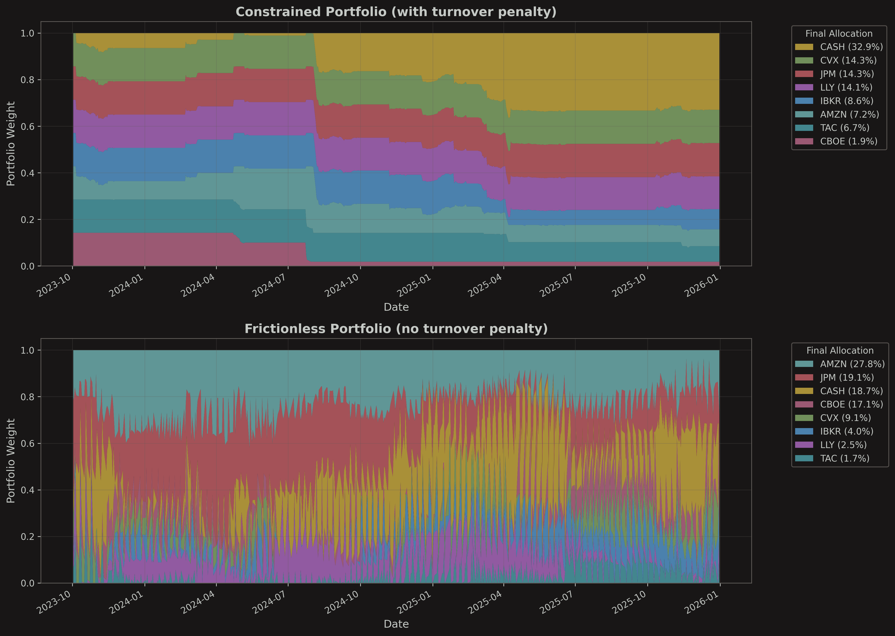
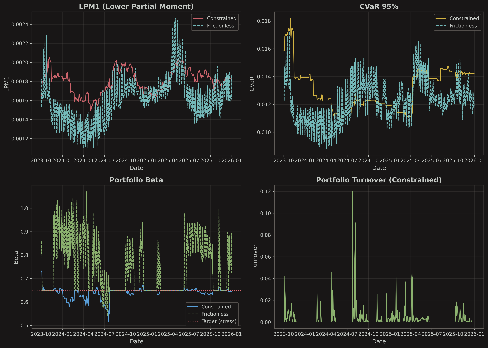
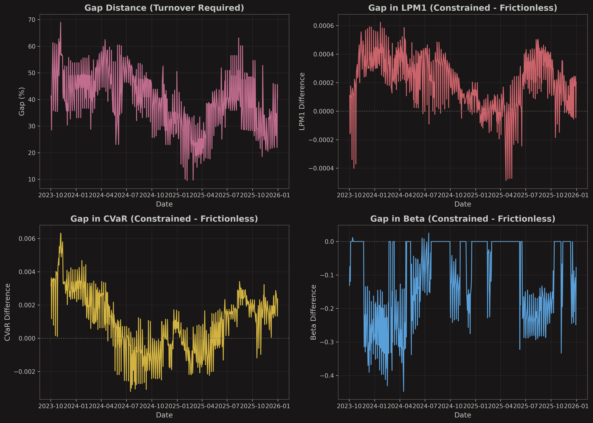
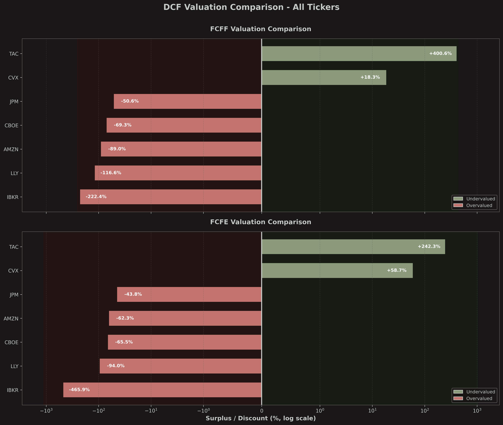
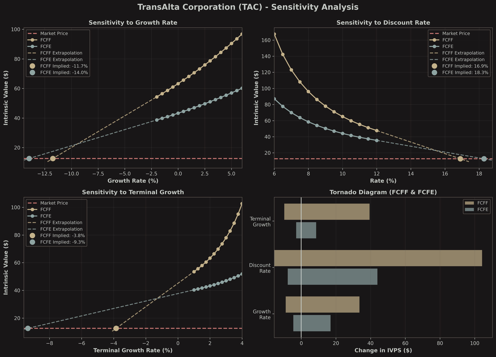
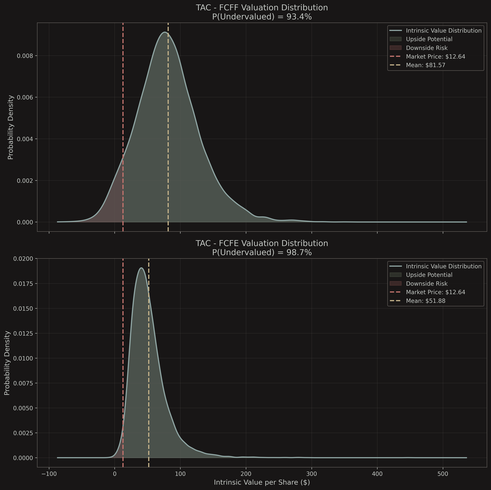
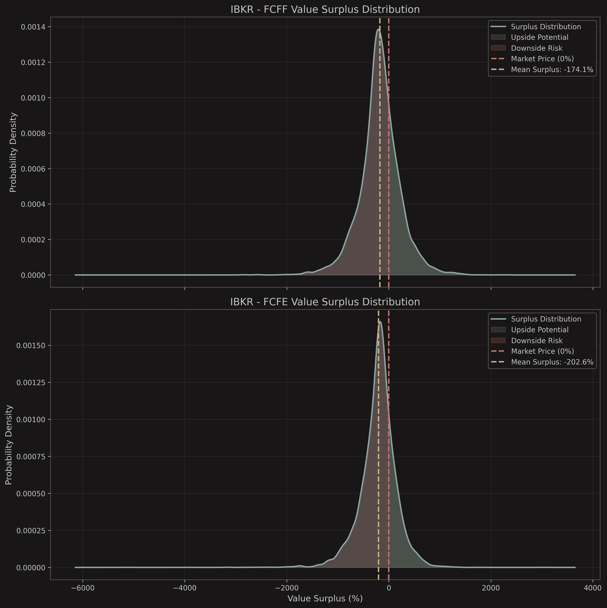
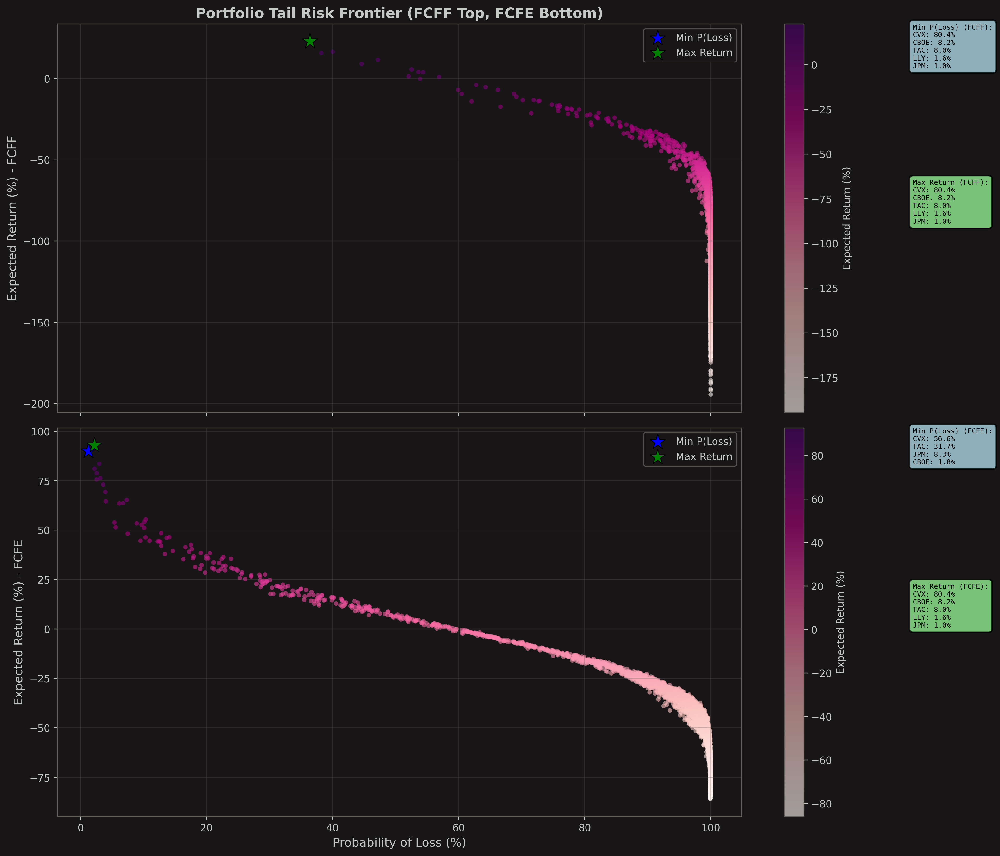
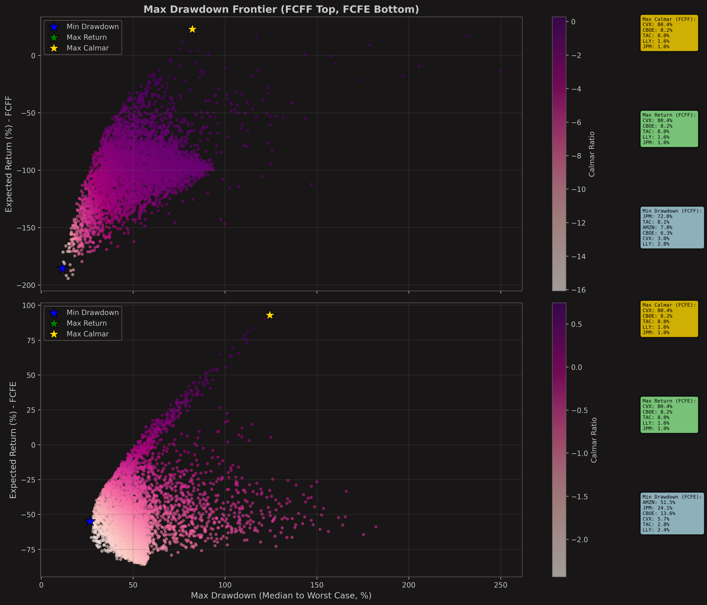

# Atemoya - Quantitative Finance Models

A collection of quantitative finance models for investment analysis. Built with OCaml (computation) + Python (data/viz).

## Getting Started

### Option 1: Docker (Recommended for Easy Setup)

**Prerequisites:** Docker and Docker Compose installed ([Install Docker](https://docs.docker.com/get-docker/))

**Interactive Menu (Recommended):**
```bash
cd atemoya/
./docker-run.sh

# Interactive menu appears:
# 1) Build Docker image
# 2) Start container
# 3) Open shell in container
# 4) Run quickstart menu
# 5) Stop container
# 6) View logs
# 7) Clean up
# 8) Quit
```

**Quick Workflow:**
1. Run `./docker-run.sh` → Choose **1) Build** (first time only, ~5-10 min)
2. Choose **2) Start container**
3. Choose **4) Run quickstart menu** → Navigate to your model

**Command-Line Mode (Advanced):**
```bash
./docker-run.sh build   # Build image (first time)
./docker-run.sh up      # Start container
./docker-run.sh exec    # Run quickstart menu
# or
./docker-run.sh shell   # Open shell, then run ./quickstart.sh
./docker-run.sh down    # Stop container
./docker-run.sh clean   # Remove everything
```

**What's included:**
- ✅ OCaml environment (OPAM, Dune) pre-installed
- ✅ Python environment (uv, dependencies) pre-installed
- ✅ All models pre-built and tested
- ✅ Persistent outputs (saved to host)
- ✅ Multi-architecture support (ARM64 and x86_64)
- ✅ No local setup required

### Option 2: Native Installation

```bash
cd atemoya/
./quickstart.sh
```

The interactive quickstart script guides you through installation, compilation, and running any model.

---

## Models Overview

Atemoya contains three models organized into two paradigms:

### Quick Comparison

| Model | Type | Use Case | Execution Time |
|-------|------|----------|----------------|
| **[Regime Downside](#regime-downside)** | Portfolio Optimization | Beat S&P 500 with controlled downside risk | 2-30s |
| **[DCF Deterministic](#dcf-deterministic)** | Equity Valuation | Find intrinsic value per share | 1-3s per stock |
| **[DCF Probabilistic](#dcf-probabilistic)** | Equity Valuation | Estimate valuation distribution | 5-60s per stock |

### Which Model to Use?

```
Do you want to value individual stocks?
├─ YES → Valuation
│   └─ Do you need probability distributions?
│       ├─ YES → DCF Probabilistic (Monte Carlo, uncertainty quantification)
│       └─ NO  → DCF Deterministic (Quick screening, single-point estimates)
│
└─ NO → Want to build a portfolio?
    └─ YES → Regime Downside (Benchmark-relative optimization)
```

---

## Regime Downside

**Portfolio Optimization | Benchmark-Relative**

Beat the S&P 500 while controlling downside and tail risk through regime-aware optimization.

**Key Features:**
- Minimizes persistent underperformance (LPM1) and tail risk (CVaR)
- Detects volatility regimes, compresses beta in stress (target: 0.65)
- Trades infrequently (~30% annual turnover) with transaction cost penalties
- Spec-compliant LP solver (CVXPY) with weekly scenarios

**Status:** ✅ Complete

**Quick Start:**
```bash
./quickstart.sh
# → Run (3) → Pricing (1) → Regime Downside (1) → Run Full Workflow (5)
```

**Documentation:** [`pricing/regime_downside/README.md`](pricing/regime_downside/README.md)

**Example Output:**

**Portfolio Weights (Constrained vs Frictionless):**



Shows actual portfolio allocation (with transaction costs) vs ideal frictionless allocation.

**Risk Metrics Comparison:**



Tracks LPM1, CVaR, Beta, and Turnover for both constrained and frictionless portfolios.

**Gap Analysis (Convergence Tracking):**



Monitors the gap between actual and frictionless portfolios: distance, LPM1 difference, CVaR difference, and Beta difference.

---

## DCF Deterministic

**Equity Valuation | Traditional DCF**

Deterministic discounted cash flow valuation using FCFE and FCFF methods.

**Key Features:**
- Dual valuation: Free Cash Flow to Equity (FCFE) and Free Cash Flow to Firm (FCFF)
- 9-category investment signals (Strong Buy → Avoid/Sell)
- CAPM cost of equity, WACC with leveraged beta (Hamada formula)
- Implied growth solver (what growth is the market pricing in?)
- Sensitivity analysis (growth, discount rate, terminal growth)
- Multi-country support (20+ countries with RFR, ERP, tax rates)

**Status:** ✅ Complete

**Quick Start:**
```bash
./quickstart.sh
# → Run (3) → Valuation (2) → DCF Deterministic (1) → Do Everything (5)
```

**Documentation:** [`valuation/dcf_deterministic/README.md`](valuation/dcf_deterministic/README.md)

**Example Output:**

**Valuation Comparison (All Tickers):**



Comprehensive comparison across all analyzed tickers showing surplus/discount percentages (FCFF top, FCFE bottom, vertically stacked with shared x-axis for direct comparison).

**Sensitivity Analysis (Single Ticker):**



Four-panel sensitivity analysis showing parameter impact on valuation: growth rate, discount rate, terminal growth, and tornado chart (FCFF shown first in all legends and charts).

---

## DCF Probabilistic

**Equity Valuation | Monte Carlo Simulation**

Advanced DCF with Monte Carlo simulation for uncertainty quantification.

**Key Features:**
- Monte Carlo simulation (100-10,000 iterations)
- Stochastic discount rates (samples RFR, beta, ERP each iteration)
- Time-varying growth rates (exponential mean reversion)
- Bayesian priors for ROE/ROIC smoothing
- Portfolio efficient frontier (multi-asset optimization)
- Distribution statistics (mean, median, percentiles, probability of undervaluation)

**Status:** ✅ Complete

**Quick Start:**
```bash
./quickstart.sh
# → Run (3) → Valuation (2) → DCF Probabilistic (2) → Do Everything (5)
```

**Documentation:** [`valuation/dcf_probabilistic/README.md`](valuation/dcf_probabilistic/README.md)

**Example Output:**

**Intrinsic Value Distribution (KDE):**



Probability distribution of intrinsic values from Monte Carlo simulation with market price comparison, showing upside potential (green) and downside risk (red) regions (FCFF top, FCFE bottom, shared x-axis for direct comparison).

**Surplus Distribution:**



Distribution of valuation surplus (intrinsic value - market price) showing upside potential (green) and downside risk (red) regions (FCFF top, FCFE bottom, shared x-axis for direct comparison).

**Portfolio Efficient Frontier (Tail Risk):**



Multi-asset portfolio optimization showing expected return vs probability of loss across 5,000 random portfolios, with portfolio compositions for Min P(Loss) and Max Return strategies (FCFF top, FCFE bottom, vertically stacked with shared x-axis for direct comparison).

**Portfolio Efficient Frontier (Calmar Ratio):**



Multi-asset portfolio optimization showing expected return vs maximum drawdown across 5,000 random portfolios, with portfolio compositions for Max Calmar, Max Return, and Min Drawdown strategies (FCFF top, FCFE bottom, vertically stacked with shared x-axis for direct comparison).

---

## Project Structure

```
atemoya/
├── README.md                      # This file
├── ARCHITECTURE.md                # Design principles, tech stack
├── quickstart.sh                  # Interactive setup and run script
│
├── pricing/                       # Short-term pricing models
│   └── regime_downside/           # Regime-aware downside optimization
│       ├── README.md              # Complete guide (what/how/interpret)
│       └── TROUBLESHOOTING.md     # Common issues
│
└── valuation/                     # Long-term valuation models
    ├── dcf_deterministic/         # Traditional DCF valuation
    │   ├── README.md              # Complete guide
    │   ├── TROUBLESHOOTING.md     # Common issues
    │   └── data/
    │       └── DATA_SOURCES.md    # Config data sources reference
    │
    └── dcf_probabilistic/         # Monte Carlo DCF valuation
        ├── README.md              # Complete guide (includes portfolio theory)
        └── TROUBLESHOOTING.md     # Common issues
```

**Documentation Philosophy:** Each model has ONE comprehensive README (what it is, how to use it, how to interpret results) plus a TROUBLESHOOTING guide for practical issues.

---

## Technology Stack

**OCaml (Computation)**
- Core algorithms and optimizations
- Functional programming paradigm
- Type-safe, fast execution

**Python (Data & Visualization)**
- Data fetching (yfinance and free sources)
- Visualization and plotting (matplotlib, seaborn)
- Can use OOP where appropriate

**Build System**
- Dune (OCaml build system)
- UV (Python package manager)
- OPAM (OCaml package manager)

---

## Model Maturity & Testing

| Model | Status | Test Coverage | Documentation |
|-------|--------|---------------|---------------|
| **Regime Downside** | ✅ Complete | 35 tests | ✅ Complete |
| **DCF Deterministic** | ✅ Complete | 15 tests | ✅ Complete |
| **DCF Probabilistic** | ✅ Complete | 23 tests | ✅ Complete |

**Total:** 73 tests, all passing ✓

---

## Development

Each model is independently developed and maintained:
- Easy addition of new models without interference
- Clear separation of concerns
- Modular code reuse when patterns emerge

See [`ARCHITECTURE.md`](ARCHITECTURE.md) for design principles and guidelines.

---

## Quick Links

**Getting Help:**
- Model-specific: See each model's `README.md` and `TROUBLESHOOTING.md`
- General setup: Run `./quickstart.sh` for interactive guidance
- Architecture: See [`ARCHITECTURE.md`](ARCHITECTURE.md)

**Model Documentation:**
- [Regime Downside (Portfolio Optimization)](pricing/regime_downside/README.md)
- [DCF Deterministic (Traditional Valuation)](valuation/dcf_deterministic/README.md)
- [DCF Probabilistic (Monte Carlo Valuation)](valuation/dcf_probabilistic/README.md)
