# Atemoya

A collection of quantitative finance models for investment analysis.[*](#disclaimer) Mathematical methodology is documented in [`typeset/atemoya.pdf`](typeset/atemoya.pdf).

## Table of Contents

- [Getting Started](#getting-started)
- [Technology Stack](#technology-stack)
- [Configuration](#configuration-optional)
- [Models Overview](#models-overview)
- **Pricing & Risk**
  - [Regime Downside](#regime-downside)
  - [Pairs Trading](#pairs-trading)
  - [Liquidity Analysis](#liquidity-analysis)
  - [Tail Risk Forecast](#tail-risk-forecast)
  - [Market Regime Forecast](#market-regime-forecast)
  - [Dispersion Trading](#dispersion-trading)
  - [Gamma Scalping](#gamma-scalping)
  - [Volatility Arbitrage](#volatility-arbitrage)
  - [Variance Swaps](#variance-swaps)
  - [Skew Trading](#skew-trading)
  - [Skew Verticals](#skew-verticals)
  - [Options Hedging](#options-hedging)
  - [FX Hedging](#fx-hedging)
  - [Earnings Vol Scanner](#earnings-vol-scanner)
  - [Forward Factor Scanner](#forward-factor-scanner)
  - [Pre-Earnings Straddle](#pre-earnings-straddle)
  - [Perpetual Futures](#perpetual-futures)
  - [Systematic Risk Signals](#systematic-risk-signals)
- **Valuation**
  - [DCF Deterministic](#dcf-deterministic)
  - [DCF Probabilistic](#dcf-probabilistic)
  - [DCF REIT](#dcf-reit)
  - [Crypto Treasury](#crypto-treasury)
  - [GARP / PEG Analysis](#garp--peg-analysis)
  - [Growth Analysis](#growth-analysis)
  - [Dividend / Income Analysis](#dividend--income-analysis)
  - [Relative Valuation](#relative-valuation)
  - [Normalized Multiples](#normalized-multiples)
  - [Analyst Upside](#analyst-upside)
  - [ETF Analysis](#etf-analysis)
  - [Panel (Multi-Model View)](#panel-multi-model-view)
- **Monitoring**
  - [Watchlist & Alerts](#watchlist--alerts)
  - [Earnings Calendar](#earnings-calendar)
<!-- **Alternative** (WIP — code exists, not yet showcase-ready)
  - [Macro Dashboard](#macro-dashboard)
  - [Google Trends](#google-trends)
  - [Short Interest](#short-interest)
  - [Insider Trading](#insider-trading)
  - [Options Flow](#options-flow)
  - [SEC Filings](#sec-filings)
  - [NLP Sentiment](#nlp-sentiment)
-->

---

## Getting Started

### Option 1: Docker (Recommended for Easy Setup)

**Prerequisites:** Docker and Docker Compose installed ([Install Docker](https://docs.docker.com/get-docker/))

**Interactive Menu (Recommended):**
```bash
./docker-run.sh
```

**Quick Workflow:**
1. Run `./docker-run.sh` → Choose **1) Build** (first time only, ~5-10 min)
2. Choose **3) Start container**
3. Choose **5) Run quickstart menu** → Navigate to your model

**Or run directly with flags (no interactive menu):**
```bash
./docker-run.sh build   # Build image (first time)
./docker-run.sh up      # Start container
./docker-run.sh exec    # Run quickstart menu
./docker-run.sh shell   # Open shell, then run ./quickstart.sh
./docker-run.sh down    # Stop container
./docker-run.sh clean   # Remove everything
```

**What's included:**
- OCaml environment (OPAM, Dune) pre-installed
- Python environment (uv, dependencies) pre-installed
- All models pre-built and tested
- Persistent outputs (saved to host)
- Multi-architecture support (ARM64 and x86_64)
- No local setup required

### Option 2: Native Installation

```bash
cd atemoya/
./quickstart.sh
```

The interactive quickstart script guides you through installation, compilation, and running any model.

**Build & Test All Models:**
```bash
# Via Docker
docker compose exec atemoya bash -c 'eval $(opam env) && dune build @all && dune test'

# Native
dune build @all && dune test
```

[↑ Back to top](#table-of-contents)

---

## Technology Stack

**OCaml (Computation)** — Core algorithms, optimizations, and LP formulations via Dune build system

**Python (Data & Visualization)** — Data fetching, linear programming (CVXPY), and plotting (matplotlib)
- Unified data fetcher with pluggable providers (`lib/python/data_fetcher/`)
  - **yfinance** (default) - Free, no API key required
  - **IBKR** - Interactive Brokers API (requires account)
- Additional data: FRED (macro), SEC EDGAR (filings), Google Trends, Discord (NLP sentiment)

**LaTeX (Documentation)** — Mathematical methodology writeup (`typeset/`). Requires `pdflatex` on host (not included in Docker).

**Build & Tooling** — Dune, OPAM, UV, Docker

[↑ Back to top](#table-of-contents)

---

### Configuration (Optional)

Some features require configuration via environment variables. A template is provided:

```bash
# Copy the template
cp .env.example .env

# Edit with your values
nvim .env

# Load into current shell session
source .env
```

**Available settings:**

| Variable | Purpose | Required? |
|----------|---------|-----------|
| `IBKR_*` | Interactive Brokers connection | Only if using IBKR data |
| `NTFY_TOPIC` | Push notification topic | Only if using watchlist alerts |
| `DATA_PROVIDER` | Data source (yfinance/ibkr) | No (defaults to yfinance) |

The `.env` file is gitignored and will never be committed. Most models work without any configuration using free yfinance data.

[↑ Back to top](#table-of-contents)

---

## Models Overview

Atemoya contains 33+ quantitative models organized into four categories:

### Pricing & Risk

| Model | Question it answers | Output |
|-------|---------------------|--------|
| [Regime Downside](#regime-downside) | How to beat the benchmark with risk control? | Portfolio weights via LP |
| [Pairs Trading](#pairs-trading) | Are these two stocks cointegrated? | Spread signals + hedge ratios |
| [Liquidity Analysis](#liquidity-analysis) | Can I trade this without slippage? | Liquidity scores + volume signals |
| [Tail Risk Forecast](#tail-risk-forecast) | What's my worst-case loss tomorrow? | VaR/ES at 95% and 99% |
| [Dispersion Trading](#dispersion-trading) | Is index vol mispriced vs constituents? | Dispersion signals + Greeks |
| [Gamma Scalping](#gamma-scalping) | Can I profit from delta-hedging? | Simulation P&L + Greeks |
| [Volatility Arbitrage](#volatility-arbitrage) | Is IV too high or low vs realized? | Vol forecasts + signals |
| [Variance Swaps](#variance-swaps) | How to trade variance directly? | Swap pricing + Greeks |
| [Skew Trading](#skew-trading) | Is the volatility smile mispriced? | Skew metrics + signals |
| [Skew Verticals](#skew-verticals) | Which vertical spreads have edge? | Edge scores + spreads |
| [Options Hedging](#options-hedging) | How to protect my portfolio cheaply? | Pareto-optimal hedges |
| [FX Hedging](#fx-hedging) | How to manage currency exposure? | Hedge ratios + costs |
| [Earnings Vol Scanner](#earnings-vol-scanner) | Will IV crush after earnings? | Calendar/straddle signals |
| [Forward Factor Scanner](#forward-factor-scanner) | Is the term structure in backwardation? | Calendar spread signals |
| [Pre-Earnings Straddle](#pre-earnings-straddle) | Should I buy a straddle before earnings? | Predicted returns + sizing |
| [Perpetual Futures](#perpetual-futures) | Is funding rate mispriced? | Basis + funding signals |
| [Market Regime Forecast](#market-regime-forecast) | What regime are we in? | HMM state probabilities |
| [Systematic Risk Signals](#systematic-risk-signals) | Is correlation compressing? | Risk regime + transition probability |

### Valuation

| Model | Question it answers | Output |
|-------|---------------------|--------|
| [DCF Deterministic](#dcf-deterministic) | What is the intrinsic value? | IVPS via FCFE/FCFF + sensitivity |
| [DCF Probabilistic](#dcf-probabilistic) | What's the distribution of fair value? | Monte Carlo IVPS + efficient frontiers |
| [DCF REIT](#dcf-reit) | What is a REIT worth? | FFO/NAV/DDM fair value + quality |
| [Normalized Multiples](#normalized-multiples) | Cheap or expensive vs sector? | Percentile ranks + implied prices |
| [Relative Valuation](#relative-valuation) | Cheap or expensive vs peers? | Implied price from peer multiples |
| [GARP / PEG Analysis](#garp--peg-analysis) | Is growth priced fairly? | PEG ratio + composite score |
| [Growth Analysis](#growth-analysis) | How fast and how sustainable? | Growth score + Rule of 40 |
| [Dividend / Income](#dividend--income-analysis) | Is the dividend safe and growing? | Safety score + DDM value |
| [Crypto Treasury](#crypto-treasury) | Is the BTC premium justified? | mNAV + implied BTC price |
| [ETF Analysis](#etf-analysis) | Is the ETF well-structured? | Expense + tracking + type analysis |
| [Analyst Upside](#analyst-upside) | Where do analysts see upside? | Upside ranking + conviction map |
| [Panel](#panel-multi-model-view) | What do all models say together? | Per-ticker multi-model dashboard |

### Monitoring

| Tool | What it does | Output |
|------|--------------|--------|
| [Watchlist & Alerts](#watchlist--alerts) | Track tickers for price/signal alerts | Push notifications via ntfy.sh |
| [Earnings Calendar](#earnings-calendar) | When do my holdings report? | Earnings timeline + EPS surprise |

<!-- ### Alternative (WIP — code exists, not yet showcase-ready)

| Tool | What it does | Output |
|------|--------------|--------|
| [Macro Dashboard](#macro-dashboard) | Classify economic regime from FRED data | Regime indicators + positioning |
| [Google Trends](#google-trends) | Detect retail attention surges | Brand interest + search spikes |
| [Short Interest](#short-interest) | Find squeeze candidates | SI %, days to cover, squeeze score |
| [Insider Trading](#insider-trading) | Track SEC Form 4 insider buys/sells | Cluster buying signals |
| [Options Flow](#options-flow) | Detect unusual options activity | Unusual score + C/P ratio |
| [SEC Filings](#sec-filings) | Monitor 8-K events + activist positions | Material event alerts |
| [NLP Sentiment](#nlp-sentiment) | Detect narrative drift in corporate language | Embedding deltas + hedging scores |
-->

### Which model do I use?

```
What are you trying to do?
│
├─ Build or size a portfolio ──────────────── What approach?
│   ├─ Regime-aware optimization .............. Regime Downside
│   └─ Statistical arbitrage .................. Pairs Trading
│
├─ Trade volatility ──────────────────────── Which strategy?
│   ├─ IV vs RV ............................... Volatility Arbitrage
│   ├─ Index vs constituents .................. Dispersion Trading
│   ├─ Smile shape ............................ Skew Trading / Skew Verticals
│   ├─ Variance exposure ...................... Variance Swaps
│   ├─ Delta-neutral gamma .................... Gamma Scalping
│   └─ Crypto perpetuals ...................... Perpetual Futures
│
├─ Hedge ─────────────────────────────────── What exposure?
│   ├─ Equity portfolio ....................... Options Hedging
│   └─ Currency ............................... FX Hedging
│
├─ Measure risk ──────────────────────────── What horizon?
│   ├─ Next-day tail risk ..................... Tail Risk Forecast
│   ├─ Liquidity / tradability ................ Liquidity Analysis
│   ├─ Regime detection ....................... Market Regime Forecast
│   └─ Systematic risk / correlation regime ... Systematic Risk Signals
│
├─ Screen for opportunities ──────────────── What kind?
│   ├─ Earnings volatility plays .............. Earnings Vol / Pre-Earnings Straddle
│   ├─ Term structure backwardation ........... Forward Factor Scanner
│   ├─ Analyst consensus upside ............... Analyst Upside
│   └─ Growth quality ......................... Growth Analysis
│
├─ Value a stock ─────────────────────────── Which kind?
│   ├─ General equity ......................... DCF Deterministic / Probabilistic
│   ├─ Compare to sector/peers ................ Normalized Multiples / Relative Valuation
│   ├─ Growth at a reasonable price ........... GARP PEG
│   ├─ Income / dividends ..................... Dividend Income
│   ├─ REIT ................................... DCF REIT
│   ├─ BTC treasury company ................... Crypto Treasury
│   ├─ ETF .................................... ETF Analysis
│   └─ All applicable models at once .......... Panel
│
├─ Monitor ───────────────────────────────── What signal?
│   ├─ Price / technical alerts ............... Watchlist & Alerts
│   └─ Earnings dates / EPS surprises ......... Earnings Calendar
│
```

[↑ Back to top](#table-of-contents)

---

## Pricing Models - Portfolio & Position Sizing

### Regime Downside

**Portfolio Optimization | Benchmark-Relative**

Beat the S&P 500 while controlling downside and tail risk through regime-aware optimization.

**Key Features:**
- Minimizes persistent underperformance (LPM1) and tail risk (CVaR)
- Detects volatility regimes, compresses beta in stress (target: 0.65)
- Trades infrequently (~30% annual turnover) with transaction cost penalties
- Spec-compliant LP solver (CVXPY) with weekly scenarios

**Documentation:** [`pricing/regime_downside/README.md`](pricing/regime_downside/README.md)

**Interpreting Results:**
- **Portfolio Weights**: Rebalance to these allocations when the model triggers; cash allocation increases in stress regimes
- **Rebalance Trigger**: Only trade when "Improvement" exceeds threshold - avoids churning
- **Beta < 0.65**: Defensive positioning; model expects volatility - reduce equity exposure
- **Beta > 0.65**: Aggressive positioning; model sees opportunity - increase equity exposure
- **Gap Analysis**: Large gap between frictionless/constrained = turnover constraints are binding; small gap = optimal portfolio is achievable

**Example Output:**

*Portfolio Weights Over Time:*

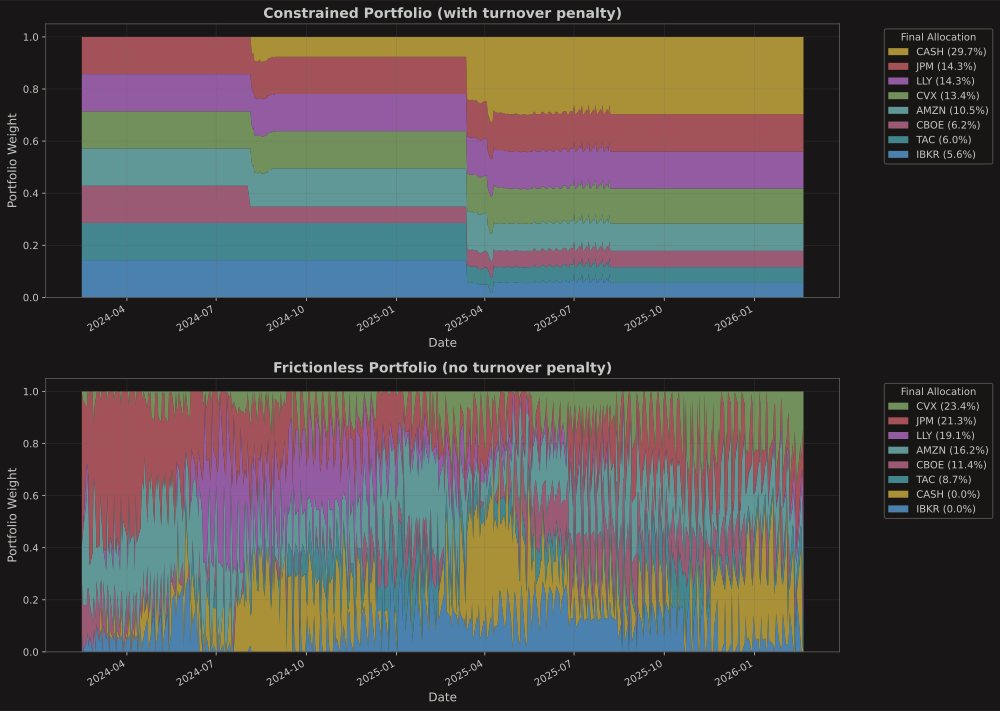

*Risk Metrics:*

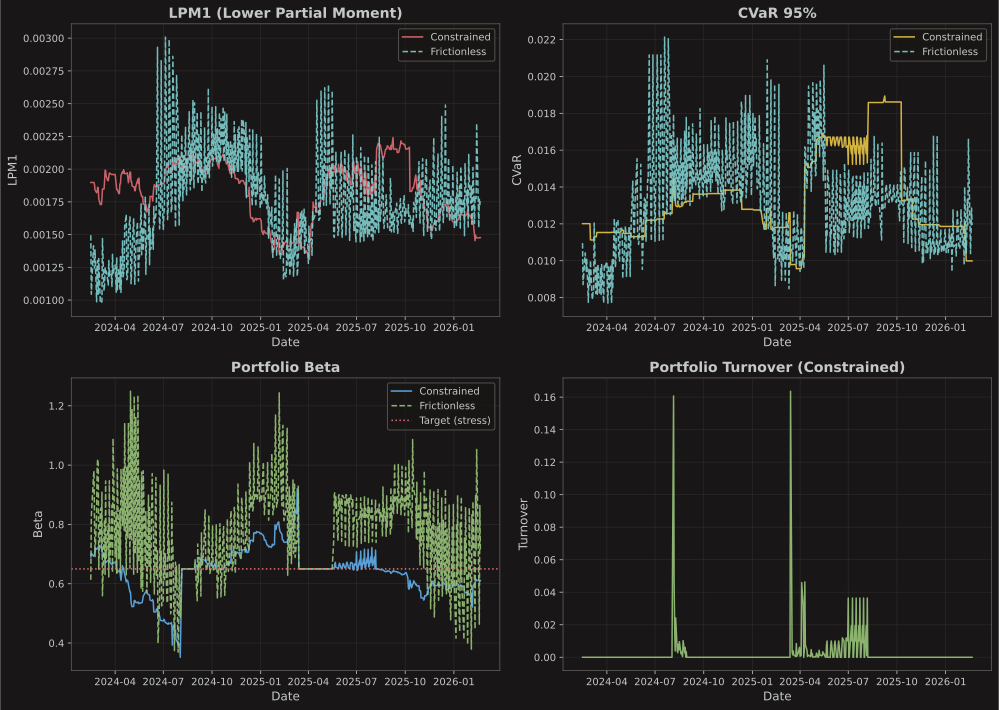

*Gap Analysis (Frictionless vs Constrained):*

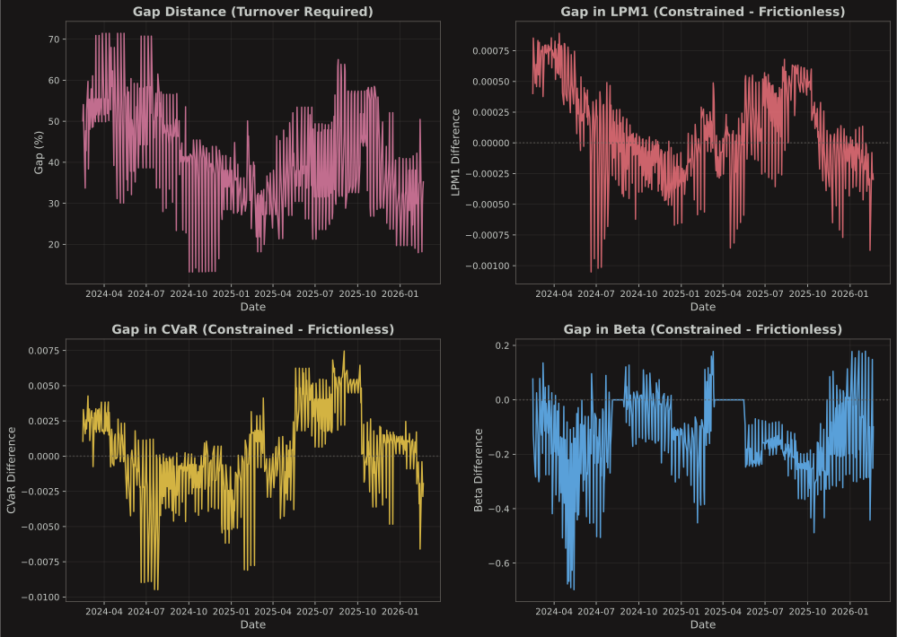

[↑ Back to top](#table-of-contents)

---

### Pairs Trading

**Statistical Arbitrage | Cointegration**

Market-neutral profits from mean reversion in cointegrated asset pairs.

**Key Features:**
- Engle-Granger cointegration testing
- Augmented Dickey-Fuller (ADF) test with optimal lag selection
- OLS hedge ratio estimation
- Mean reversion half-life calculation
- Spread z-score signals for entry/exit

**Interpreting Results:**
- **Cointegrated = YES**: Pair is tradeable; spread is mean-reverting
- **Cointegrated = NO**: Avoid this pair - no statistical edge
- **Z-Score > +2**: SHORT spread (sell Y, buy X) - spread is extended high
- **Z-Score < -2**: LONG spread (buy Y, sell X) - spread is extended low
- **|Z-Score| < 0.5**: EXIT position - spread has reverted to mean
- **Half-Life**: Expected holding period; shorter = faster mean reversion = better

**Example Output:**

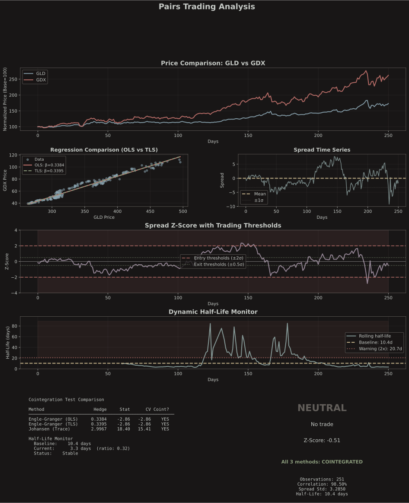

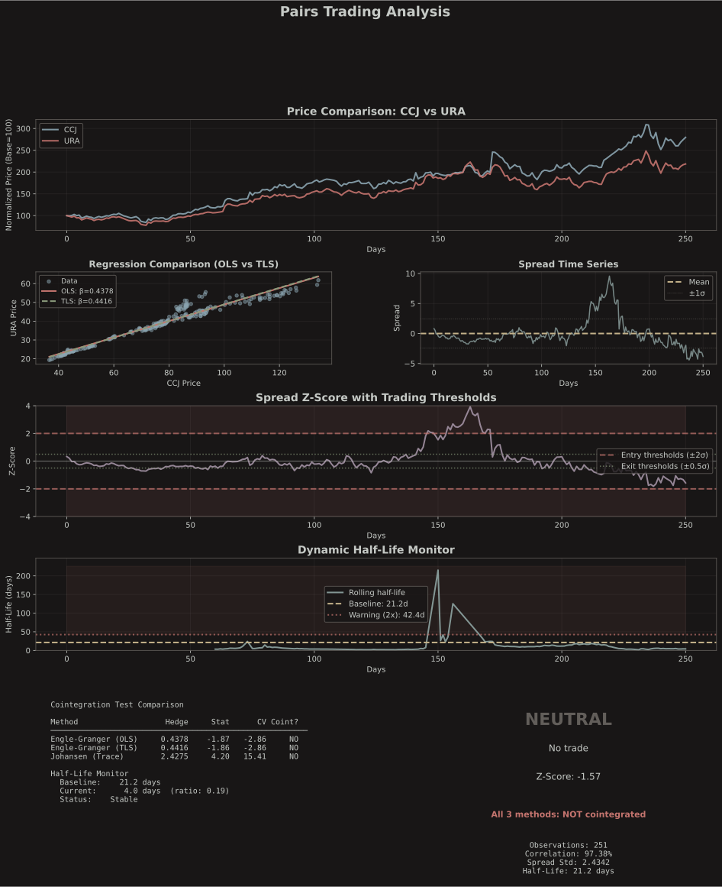

**Documentation:** [`pricing/pairs_trading/README.md`](pricing/pairs_trading/README.md)

[↑ Back to top](#table-of-contents)

---

### Liquidity Analysis

**Liquidity Scoring & Predictive Signals**

Score stocks by tradability and generate volume-based predictive signals.

**Key Features:**
- Liquidity scoring (0-100) with tier classification (Excellent/Good/Fair/Poor)
- Amihud illiquidity ratio, turnover ratio, relative volume
- On-Balance Volume (OBV) with divergence detection
- Volume surge detection and trend analysis
- Accumulation/Distribution signals
- Smart money flow estimation
- Volume-price confirmation analysis

**Interpreting Results:**
- **Liquidity Score > 70**: Excellent/Good - easy to trade, tight spreads
- **Liquidity Score < 50**: Poor - wider spreads, higher market impact
- **Relative Volume > 2x**: Volume surge - potential breakout/breakdown
- **OBV Divergence**: Price and volume moving opposite - potential reversal
- **Bullish Signal**: Volume confirms price move up
- **Bearish Signal**: Volume confirms price move down

**Example Output:**

*Liquidity Dashboard (Multi-Ticker):*

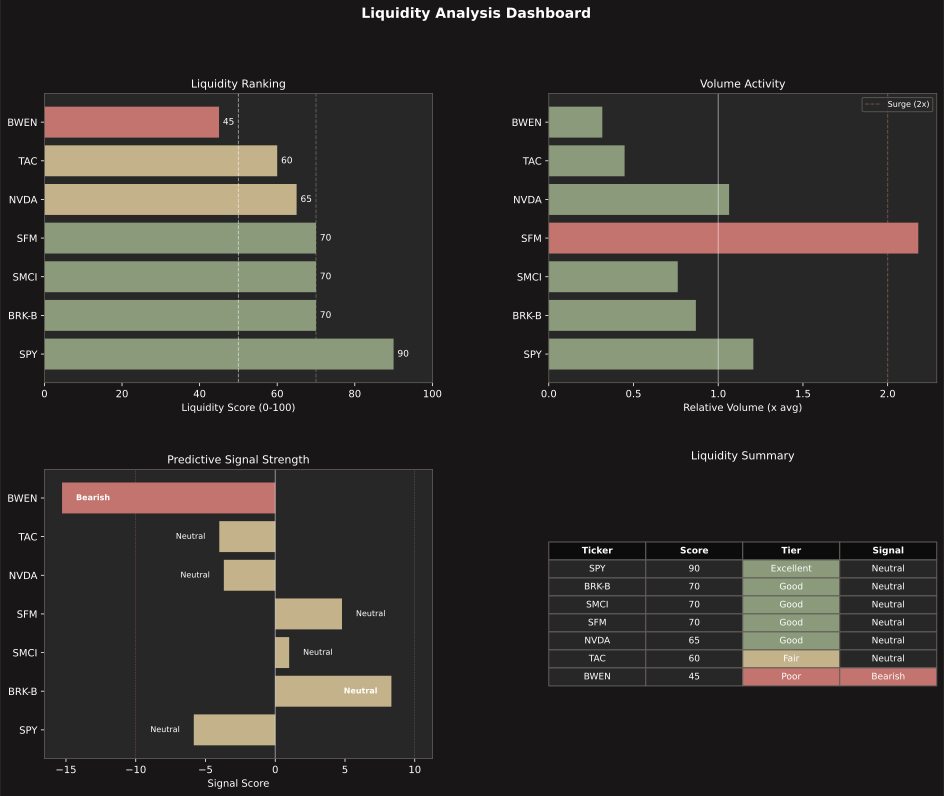

[↑ Back to top](#table-of-contents)

---

### Tail Risk Forecast

**VaR/ES Forecasting | HAR-RV Model**

Forecast next-day Value-at-Risk and Expected Shortfall using realized variance from intraday returns.

**Key Features:**
- **Realized Variance (RV):** Computed from 5-minute intraday returns (sum of squared returns)
- **HAR-RV Model:** Heterogeneous Autoregressive model with daily/weekly/monthly lookbacks
- **Jump Detection:** Threshold-based variance jumps (2.5 std devs above rolling mean)
- **Tail Risk:** VaR (95%/99%) and Expected Shortfall using t(6) distribution for fat tails

**Data Sources:**
- **IBKR (preferred):** Up to 1 year of 5-minute data with market data subscription
- **yfinance (fallback):** Limited to 60 days of 5-minute data

*SPY — Low Risk:*

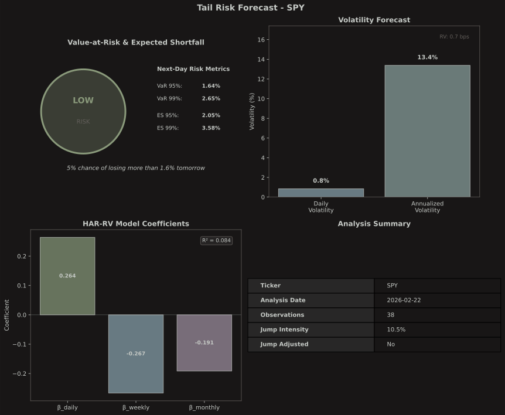

*SOXL (3x Semiconductors) — High Risk:*

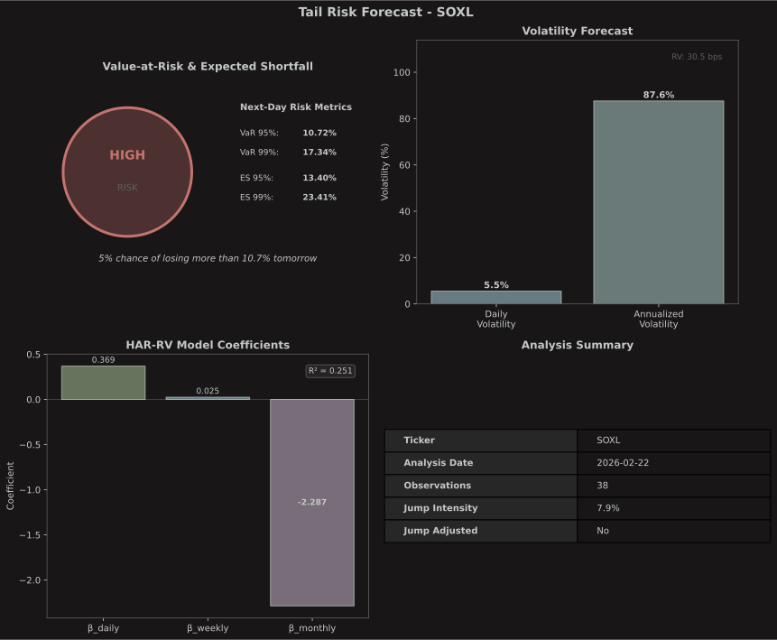

[↑ Back to top](#table-of-contents)

---

### Market Regime Forecast

**Regime Detection | Covered Call Timing**

Identify market regimes (trend + volatility state) and generate recommendations for income ETF strategies like covered calls.

**Key Features:**
- **Four modeling approaches:** Basic (GARCH+HMM), MS-GARCH, BOCPD (Bayesian changepoint), Gaussian Process
- **Trend detection:** Bull / Bear / Sideways classification via Hidden Markov Models
- **Volatility regime:** High / Normal / Low based on historical percentiles
- **Covered call suitability:** 1-5 star rating based on regime combination
- **Income ETF mapping:** SPY→JEPI/XYLD, QQQ→JEPQ/QYLD, single stocks→YieldMax ETFs
- **Earnings calendar:** Flags tickers within 7-14 days of earnings as elevated risk

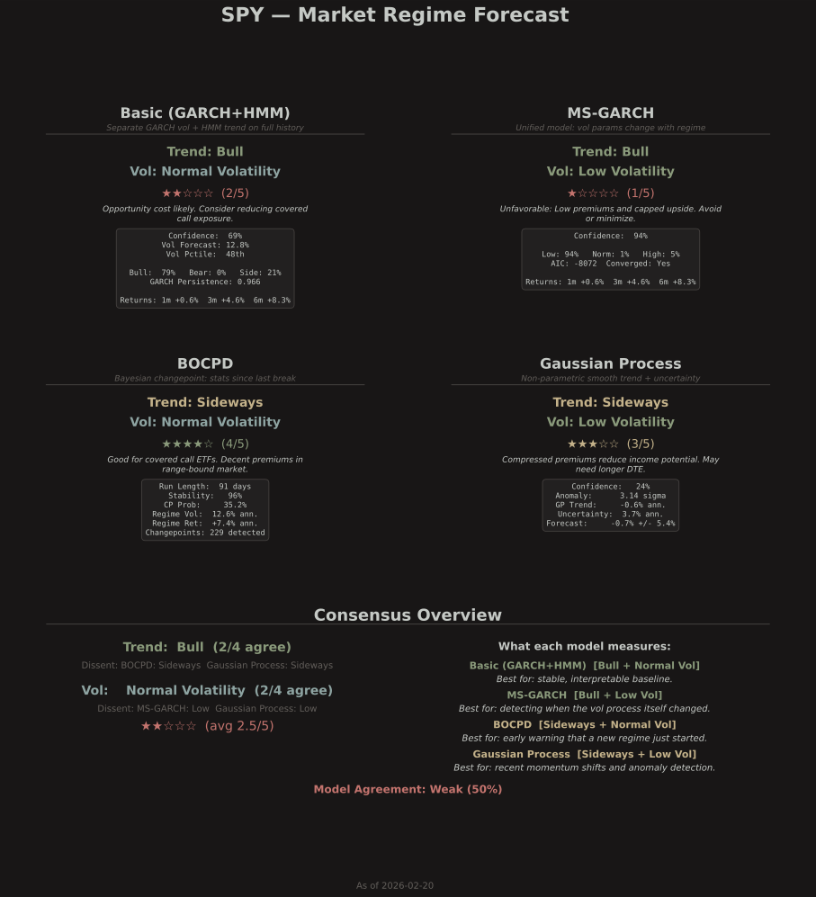

[↑ Back to top](#table-of-contents)

---

## Pricing Models - Volatility & Options

### Dispersion Trading

**Volatility Arbitrage | Correlation Trading**

Exploit differences between index implied volatility and constituent volatilities.

**Key Features:**
- Implied correlation extraction from volatility surfaces
- Dispersion level and z-score calculation
- Long/short dispersion trade construction
- Portfolio Greeks aggregation (delta, gamma, vega, theta)
- P&L attribution to correlation convergence

**Interpreting Results:**
- **Implied Correlation > 0.7**: Index vol is rich vs constituents - SELL index vol, BUY single-name vol
- **Implied Correlation < 0.5**: Index vol is cheap - BUY index vol, SELL single-name vol
- **Dispersion Z-Score > 2**: Strong signal to trade dispersion
- **Vega P&L**: Shows profit/loss from correlation convergence
- **Net Delta**: Should be near zero for market-neutral position

**Example Output:**

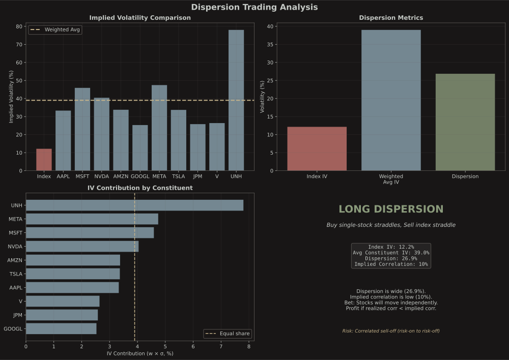

[↑ Back to top](#table-of-contents)

---

### Gamma Scalping

**Options Trading | Delta-Neutral Gamma**

Profit from realized volatility through delta-hedged option positions.

**Key Features:**
- Black-Scholes Greeks calculation
- Straddle/strangle position construction
- Delta-hedging simulation with rebalancing
- P&L decomposition (gamma, theta, vega)
- Hedging frequency optimization

**Interpreting Results:**
- **Gamma P&L > 0**: Realized vol exceeded implied - strategy profitable from hedging gains
- **Theta P&L**: Always negative - cost of holding options; must be offset by gamma gains
- **Net P&L**: Gamma P&L + Theta P&L; positive = RV > IV, negative = IV > RV
- **Rehedge Frequency**: More frequent = smoother P&L but higher transaction costs
- **Entry Signal**: Buy straddle when IV is low relative to expected RV

**Example Output:**

*P&L Attribution:*

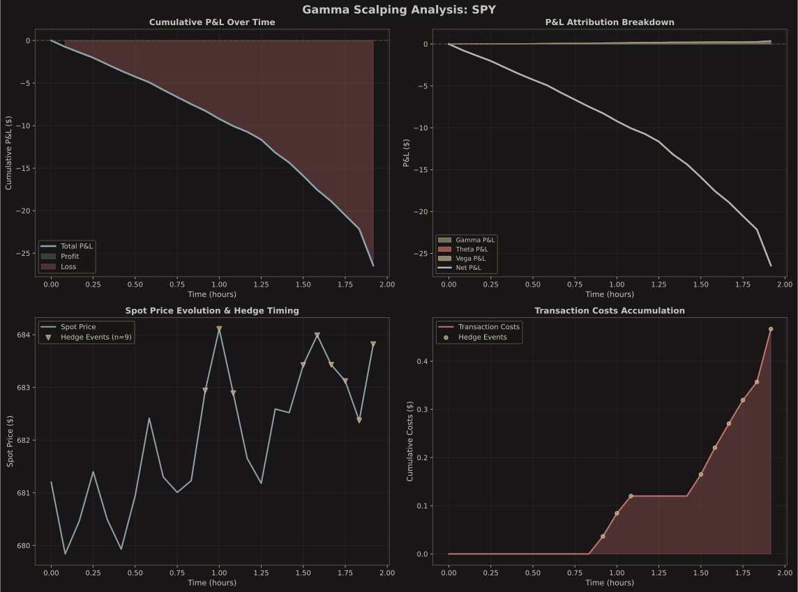

*Summary Metrics:*

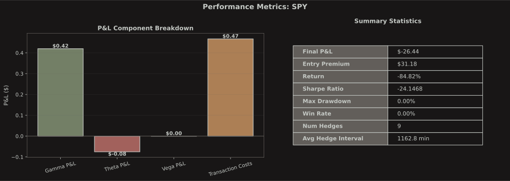

**Documentation:** [`pricing/gamma_scalping/README.md`](pricing/gamma_scalping/README.md)

[↑ Back to top](#table-of-contents)

---

### Volatility Arbitrage

**Volatility Trading | IV vs RV**

Identify and trade implied vs realized volatility divergences.

**Key Features:**
- Realized volatility estimation (close-to-close, Parkinson, etc.)
- IV/RV ratio analysis
- Volatility forecasting models
- Mean reversion signals
- Position recommendations

**Interpreting Results:**
- **IV/RV Ratio > 1.2**: IV is rich - SELL volatility (sell straddles, sell variance)
- **IV/RV Ratio < 0.8**: IV is cheap - BUY volatility (buy straddles, buy variance)
- **RV Forecast**: Expected future realized vol; compare to current IV for edge
- **Vol of Vol**: High vol-of-vol = uncertain forecast, reduce position size
- **Mean Reversion Signal**: IV tends to revert to RV over time

**Example Output:**

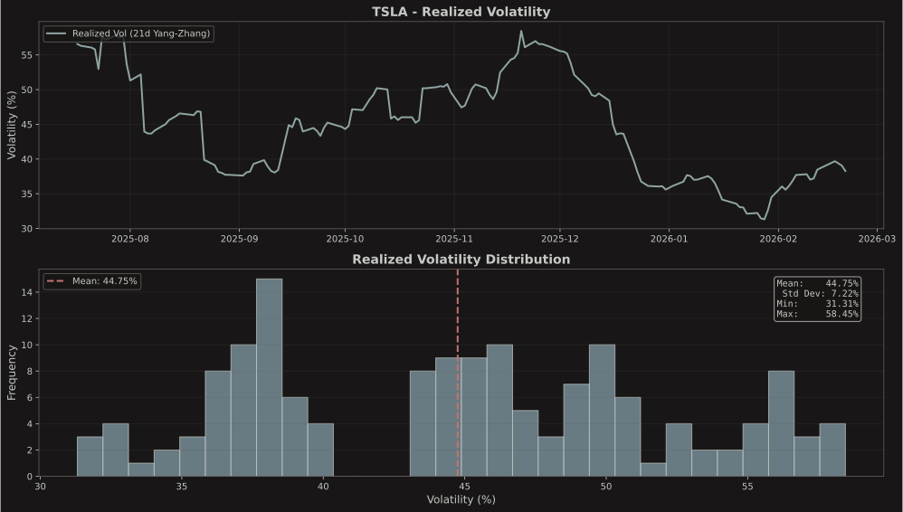

**Documentation:** [`pricing/volatility_arbitrage/README.md`](pricing/volatility_arbitrage/README.md)

[↑ Back to top](#table-of-contents)

---

### Variance Swaps

**Derivatives | VRP Harvesting**

Price variance swaps via Carr-Madan replication and harvest the variance risk premium — the persistent gap between implied and realized variance.

**Key Features:**
- Carr-Madan variance swap pricing (1/K² weighted OTM options)
- 5 realized variance estimators (Close-to-Close, Parkinson, Garman-Klass, Rogers-Satchell, Yang-Zhang)
- 3 forecast models (Historical RV, EWMA, GARCH(1,1))
- VRP signal generation with confidence scoring and Kelly sizing
- Options replication portfolio with delta/vega/gamma Greeks

**Documentation:** [`pricing/variance_swaps/README.md`](pricing/variance_swaps/README.md)

**Interpreting Results:**
- **VRP% > +2%**: Implied variance exceeds forecast — SHORT variance to harvest premium
- **VRP% < -1%**: Rare; realized exceeds implied — LONG variance for mean reversion
- **Confidence**: Scales linearly from threshold to cap; drives position sizing
- **Vega Notional**: P&L sensitivity per 1% vol move = Notional / (2·√K_var)

**Example Output (Close-to-Close + Historical — baseline):**

*Variance Risk Premium:*

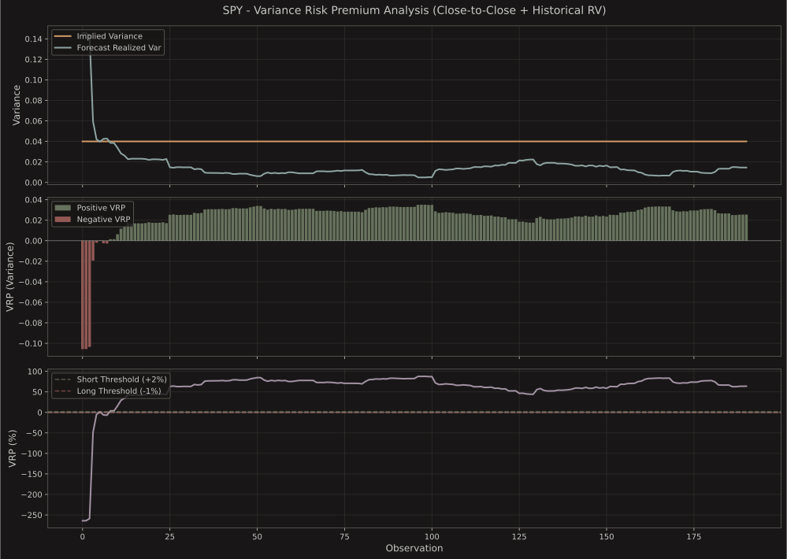

*Trading Signal:*

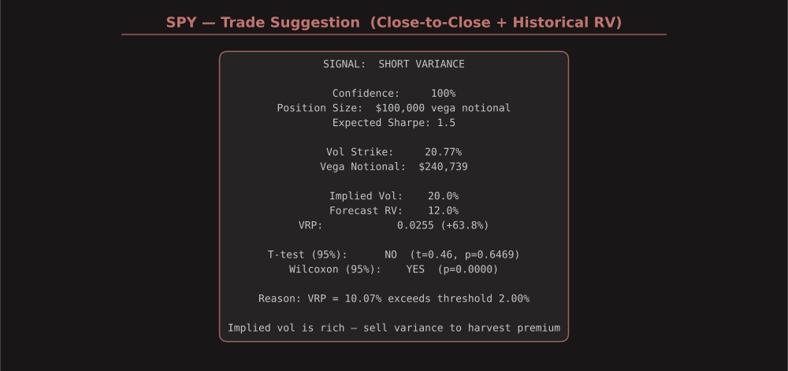

**With Yang-Zhang + GARCH(1,1) — recommended:**

*Variance Risk Premium:*

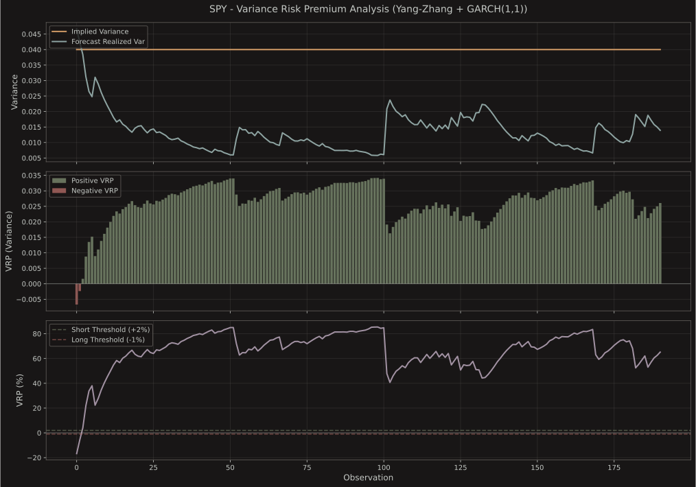

*Trading Signal:*

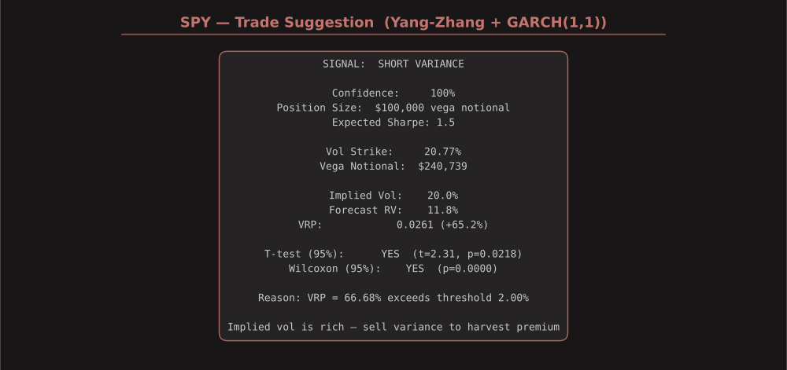

[↑ Back to top](#table-of-contents)

---

### Skew Trading

**Volatility Surface | Smile Arbitrage**

Trade the shape of the volatility smile/skew.

**Key Features:**
- Put/call skew measurement
- Skew z-score for mean reversion signals
- Risk reversal and butterfly construction
- Skew term structure analysis
- Historical skew percentiles

**Interpreting Results:**
- **Skew Z-Score > 2**: Put skew is steep (expensive) - SELL risk reversals (sell puts, buy calls)
- **Skew Z-Score < -2**: Put skew is flat (cheap) - BUY risk reversals (buy puts, sell calls)
- **Term Structure Slope**: Upward = contango (normal); Inverted = backwardation (fear)
- **Vol Smile Shape**: Steeper left side = crash protection is expensive
- **ATM Vol Level**: Context for skew trades; high ATM vol = elevated fear overall

**Example Output:**

*Volatility Smile:*

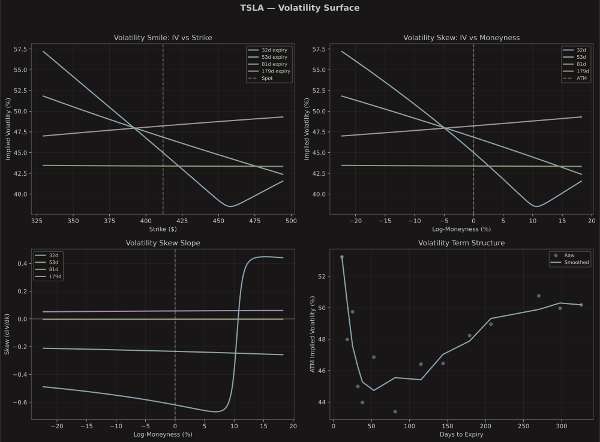

*Skew Time Series:*

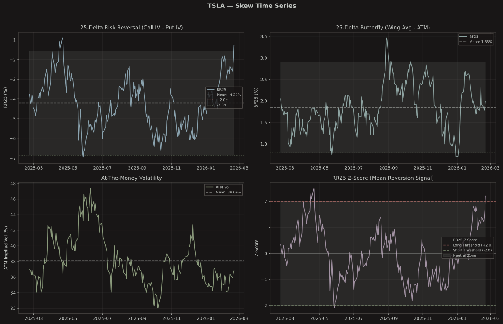

*Backtest P&L:*

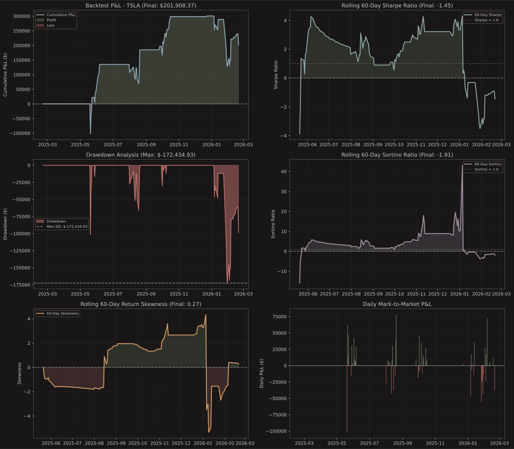

**Documentation:** [`pricing/skew_trading/README.md`](pricing/skew_trading/README.md)

[↑ Back to top](#table-of-contents)

---

### Skew Verticals

**Options Spreads | Skew Mean Reversion**

Vertical spreads that profit from volatility skew normalization.

**Key Features:**
- Normalized call/put skew metrics
- Skew z-score calculation
- Bull call and bear put spread construction
- Multi-factor edge scoring (0-100)
- Probability of profit estimation

**Interpreting Results:**
- **Edge Score > 70**: High conviction trade - skew is significantly mispriced
- **Edge Score 50-70**: Moderate conviction - consider smaller position
- **Edge Score < 50**: Low edge - pass or wait for better setup
- **Bull Call Spread**: Recommended when call skew is flat (OTM calls cheap)
- **Bear Put Spread**: Recommended when put skew is steep (OTM puts expensive)
- **Probability of Profit**: Higher = more likely to profit but lower max gain

**Dashboard:**

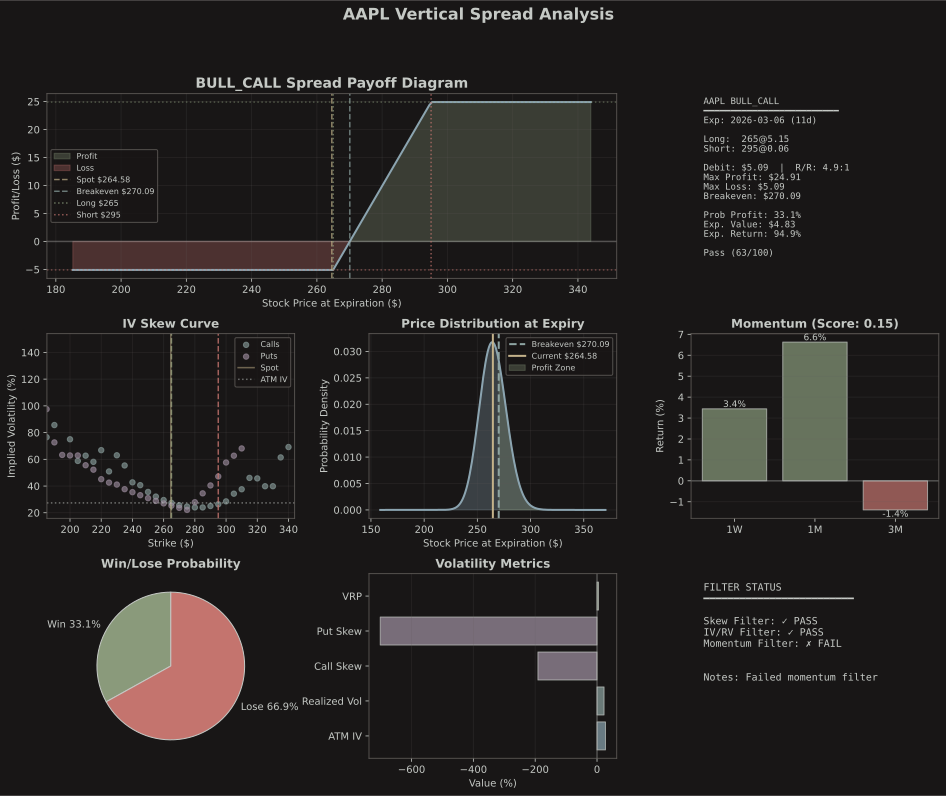

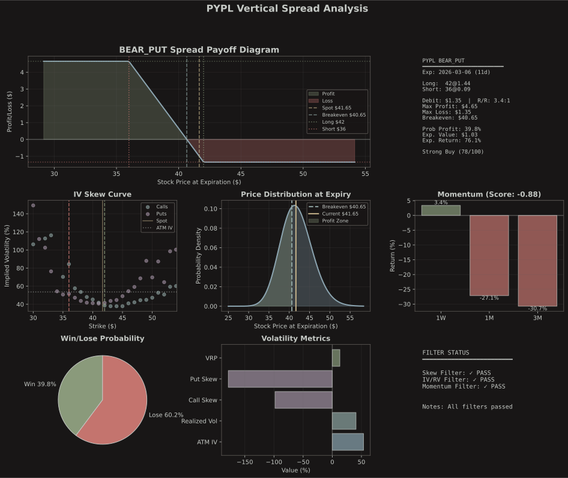

[↑ Back to top](#table-of-contents)

---

### Options Hedging

**Risk Management | Portfolio Protection**

Optimize equity portfolio hedges using options strategies with multi-objective optimization.

**Key Features:**
- Dual vol surface models (SVI + SABR) calibrated from market option chains
- Four strategies: protective put, collar, vertical spread, covered call
- Pareto frontier optimization (cost vs protection)
- Dual pricing: Black-Scholes (analytical) + Monte Carlo (Longstaff-Schwartz)
- Complete Greeks: Delta, Gamma, Vega, Theta, Rho

**Documentation:** [`pricing/options_hedging/README.md`](pricing/options_hedging/README.md)

**Interpreting Results:**
- **Pareto Frontier**: Points on the curve are optimal cost/protection tradeoffs; choose based on budget
- **Lower-Left**: Cheap but less protection (e.g., OTM puts)
- **Upper-Right**: Expensive but full protection (e.g., ATM puts)
- **Dominated Points**: Below the curve = inefficient; better alternatives exist
- **Strategy Selection**: Collars reduce cost but cap upside; put spreads limit max payout

**Example Output:**

*SVI Implied Volatility Surface (3D + Smile Overlay):*

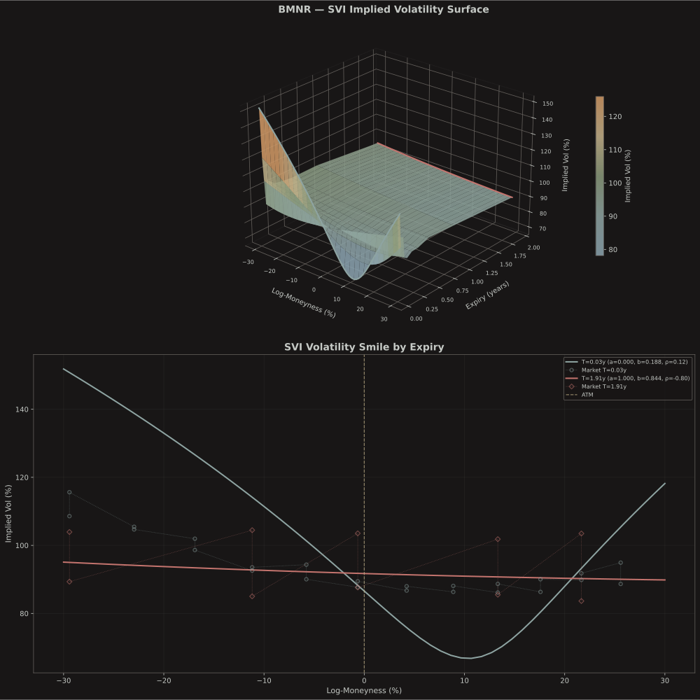

*SABR Implied Volatility Surface (3D + Smile Overlay):*

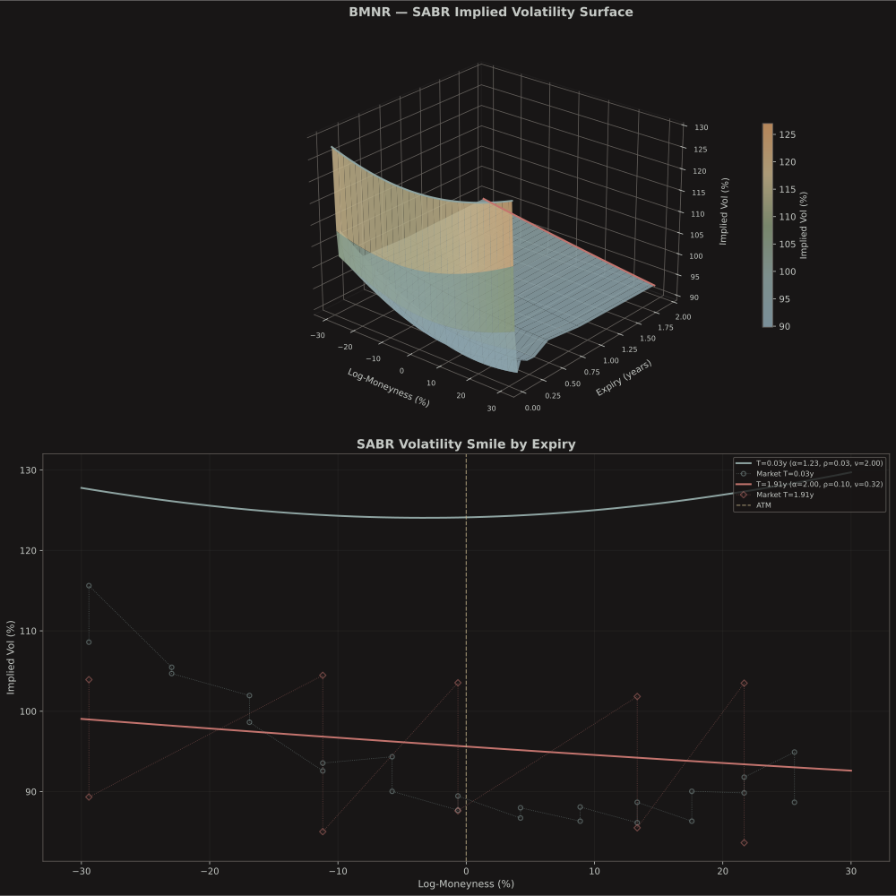

*Pareto Frontier (Cost vs Protection):*

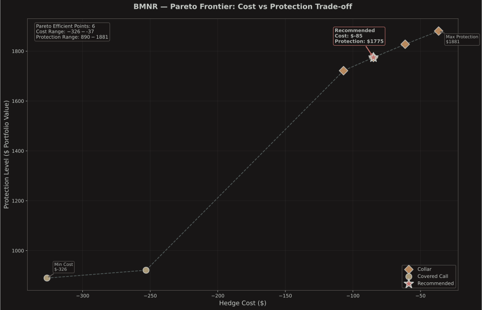

*Strategy Payoffs:*

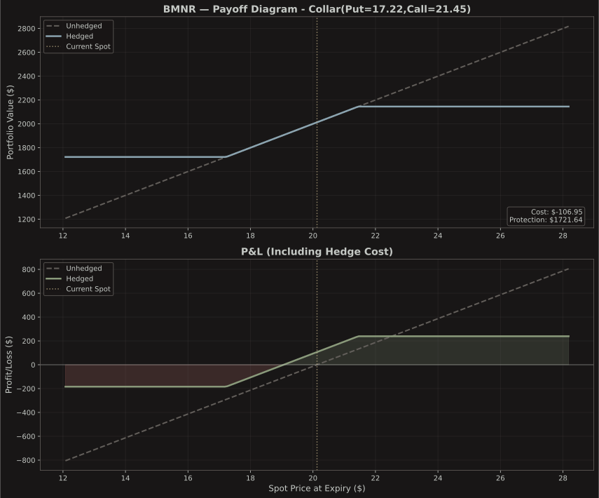

*Greeks Summary:*

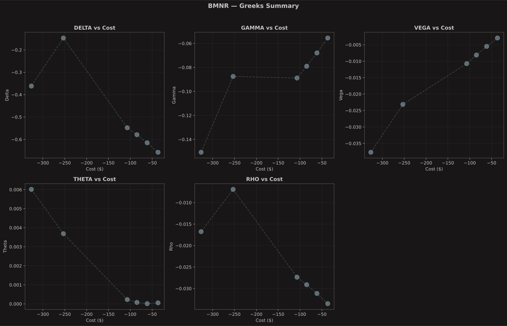

[↑ Back to top](#table-of-contents)

---

### FX Hedging

**Currency Risk | International Portfolios**

Manage foreign exchange exposure for international investments.

**Key Features:**
- Covered interest rate parity (forward pricing)
- Black-76 model for FX options
- Optimal hedge ratio calculation
- Cost-benefit analysis of hedging strategies
- Multi-currency portfolio support

**Documentation:** [`pricing/fx_hedging/README.md`](pricing/fx_hedging/README.md)

**Interpreting Results:**
- **Hedge Ratio**: Percentage of FX exposure to hedge (0-100%); 100% = fully hedged
- **Forward Points**: Cost/benefit of forward hedge vs spot; negative = hedging costs money
- **Optimal Hedge**: Balance between hedging cost and volatility reduction
- **Unhedged VaR**: Maximum expected loss from currency moves
- **Hedged VaR**: Reduced risk after implementing hedge

**Example Output:**

*Exposure Analysis (CHF investor, USD equities + crypto):*

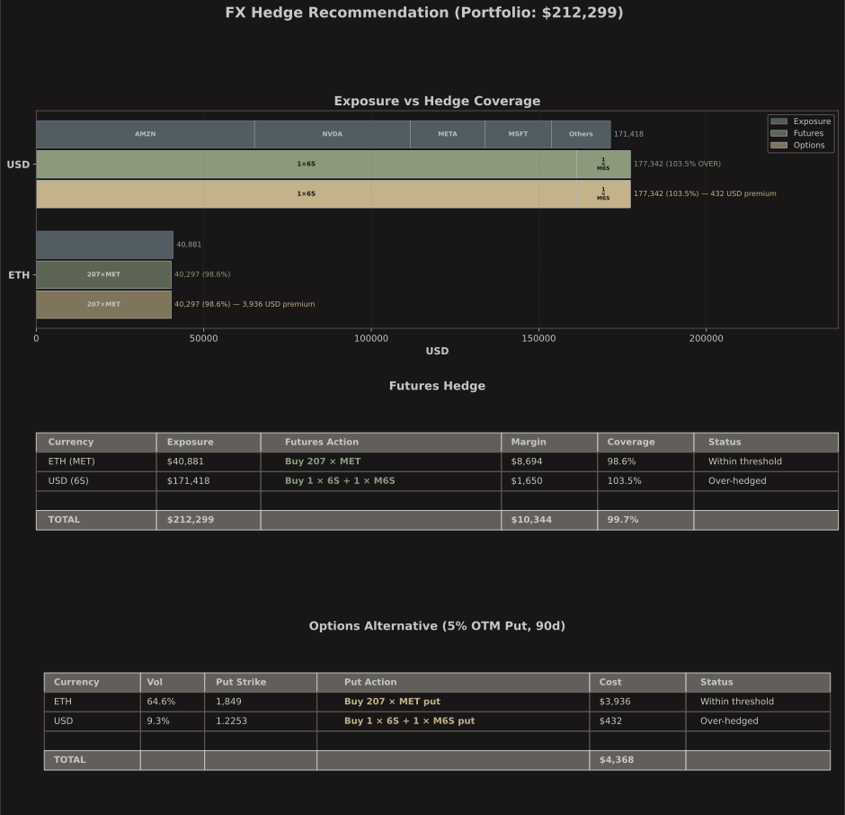

*Hedge Performance — CHF/USD (USD equity exposure):*

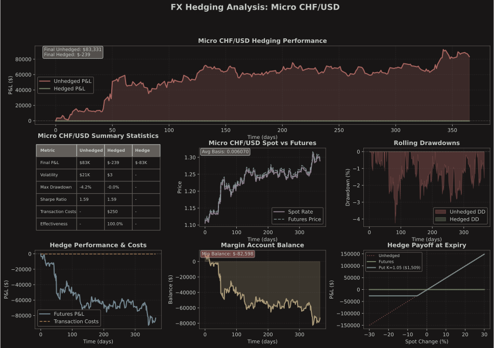

*Hedge Performance — Ether (crypto exposure):*

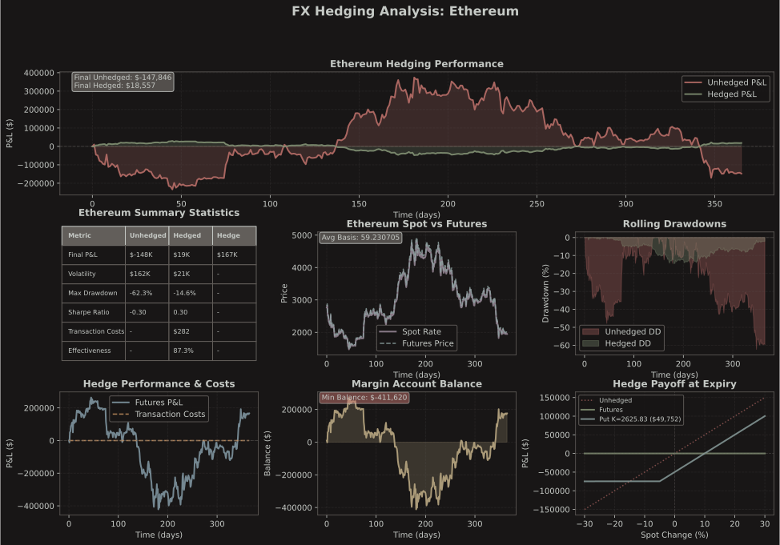

[↑ Back to top](#table-of-contents)

---

## Pricing Models - Earnings & Term Structure

### Earnings Vol Scanner

**Event Trading | IV Term Structure**

Identify profitable volatility trades around earnings announcements.

**Key Features:**
- IV term structure slope and ratio analysis
- IV/RV comparison for richness detection
- Expected move calculation
- Kelly criterion position sizing
- Calendar spread and straddle recommendations

**Interpreting Results:**
- **IV Ratio (Front/Back) > 1.5**: Front-month IV elevated for earnings - SELL calendar spreads
- **IV Ratio < 1.2**: Front-month IV cheap - BUY calendars or straddles
- **Expected Move**: Market-implied earnings move; compare to historical for edge
- **IV Crush Signal**: High pre-earnings IV will collapse post-announcement
- **Straddle Recommendation**: BUY if expected move > straddle cost; SELL if overpriced

**Sample Output:**


[↑ Back to top](#table-of-contents)

---

### Forward Factor Scanner

**Term Structure | Calendar Spreads**

Detect backwardation in volatility term structure for calendar spread opportunities.

**Key Features:**
- Forward volatility calculation from variance decomposition
- Forward factor (backwardation strength) measurement
- ATM and double calendar spread construction
- Position sizing scaled by forward factor magnitude
- Multi-ticker, multi-DTE scanning

**Interpreting Results:**
- **Forward Factor > 1**: Backwardation - near-term IV higher than forward IV; SELL calendars
- **Forward Factor < 1**: Contango (normal) - forward IV higher; BUY calendars
- **Forward Factor << 0.8**: Strong contango signal - high conviction calendar buy
- **Position Size**: Scale by forward factor magnitude; larger deviation = larger position
- **Double Calendar**: Use when both calls and puts show similar signal

**Sample Output:**

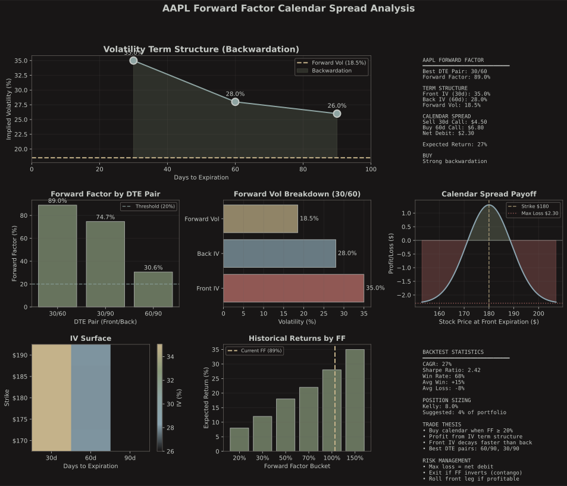

[↑ Back to top](#table-of-contents)

---

### Pre-Earnings Straddle

**ML-Based | Earnings Prediction**

Machine learning model to predict profitable pre-earnings straddle trades.

**Key Features:**
- 4-signal linear regression model
- IV ratio and IV-RV gap signals
- Predicted return and Kelly sizing
- Recommendation thresholds (Strong Buy, Buy, Pass)
- Historical backtest statistics

**Interpreting Results:**
- **Predicted Return > 10%**: Strong Buy - model expects profitable straddle
- **Predicted Return 5-10%**: Buy - moderate expected profit
- **Predicted Return < 5%**: Pass - insufficient edge after costs
- **Kelly Fraction**: Recommended position size as % of capital
- **Signal Breakdown**: Check which factors (IV ratio, IV-RV gap) are driving the signal

**Dashboard:**

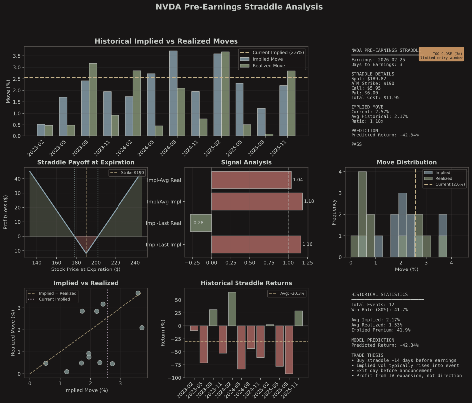

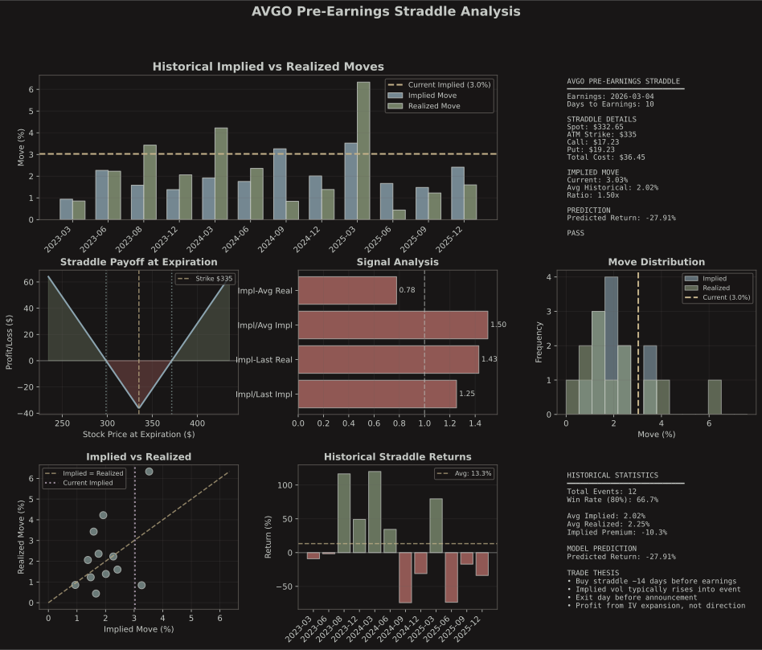

[↑ Back to top](#table-of-contents)

---

### Perpetual Futures

**Crypto Derivatives | No-Arbitrage Pricing**

Price perpetual futures contracts and everlasting options using closed-form solutions from Ackerer, Hugonnier & Jermann (2025).

**Key Features:**
- **Three contract types:** Linear (USD-margined), Inverse (BTC-margined), Quanto (cross-currency)
- **Everlasting options:** Perpetual calls/puts with closed-form pricing and Greeks
- **Real-time data:** Binance, Deribit, Bybit exchange integration
- **Arbitrage detection:** Compare theoretical vs market prices for trading signals
- **Funding rate analysis:** Fair funding rate calculation and basis tracking

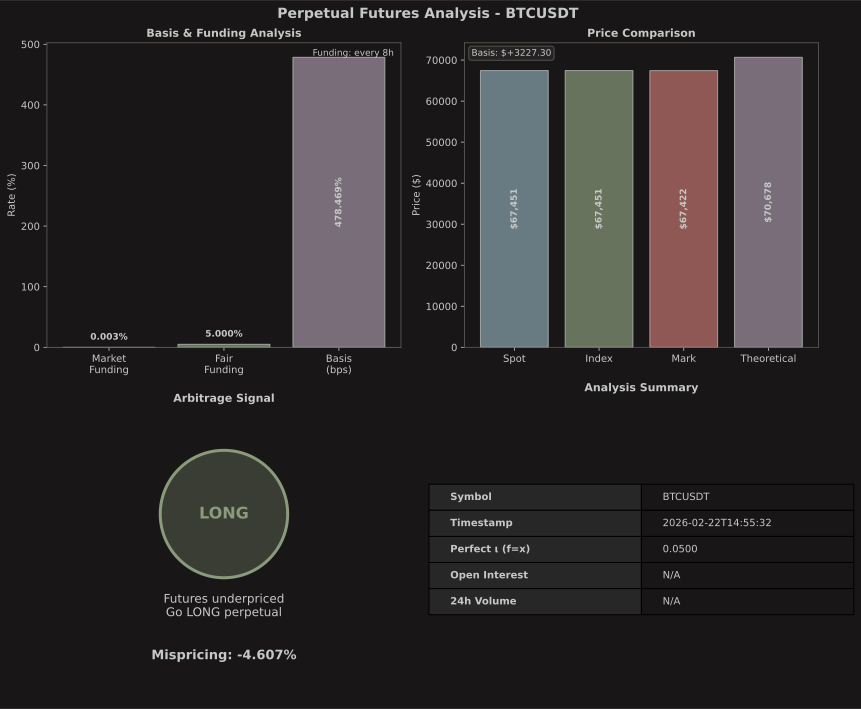

[↑ Back to top](#table-of-contents)

---

### Systematic Risk Signals

Early-warning framework for detecting systematic risk in financial markets, based on graph theory (minimum spanning tree) and covariance matrix eigenvalue analysis. See [full documentation](pricing/systematic_risk_signals/README.md).


[↑ Back to top](#table-of-contents)

---

## Valuation Models

### DCF Deterministic

**Equity Valuation | Traditional DCF**

Deterministic discounted cash flow valuation using FCFE and FCFF methods.

**Key Features:**
- Dual valuation: Free Cash Flow to Equity (FCFE) and Free Cash Flow to Firm (FCFF)
- 9-category investment signals (Strong Buy → Avoid/Sell)
- CAPM cost of equity, WACC with leveraged beta (Hamada formula)
- Implied growth solver (what growth is the market pricing in?)
- Sensitivity analysis (growth, discount rate, terminal growth)
- Multi-country support (20+ countries with RFR, ERP, tax rates)

**Documentation:** [`valuation/dcf_deterministic/README.md`](valuation/dcf_deterministic/README.md)

**Interpreting Results:**
- **Margin of Safety > 30%**: Strong buy candidate - intrinsic value significantly exceeds market price
- **Margin of Safety 10-30%**: Moderate buy - some upside but less conviction
- **Margin of Safety < 10%**: Fairly valued - no clear edge
- **Negative Margin**: Overvalued - avoid or consider shorting
- **Implied Growth**: If market-implied growth exceeds 15%, the stock may be priced for perfection
- **Sensitivity Heatmap**: Green regions show parameter combinations where stock remains undervalued

**Example Output:**

*Valuation Comparison (Standard Companies):*

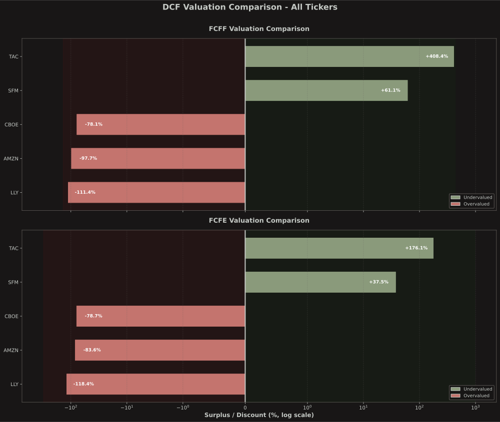

*Bank Valuation Comparison (Excess Returns Model):*

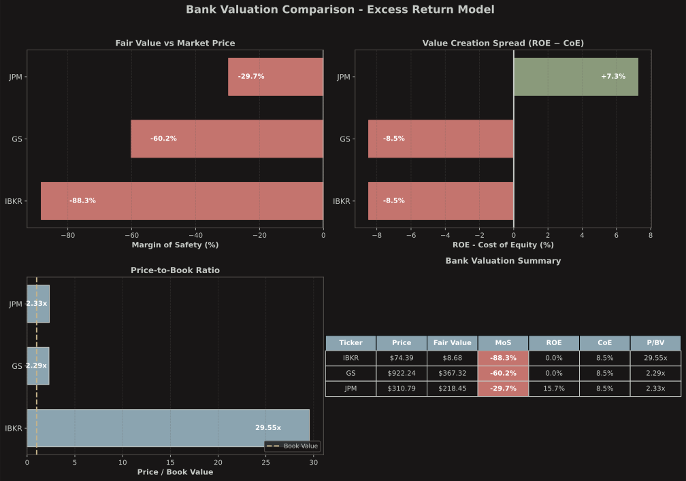

*Insurance Valuation Comparison (Embedded Value Model):*

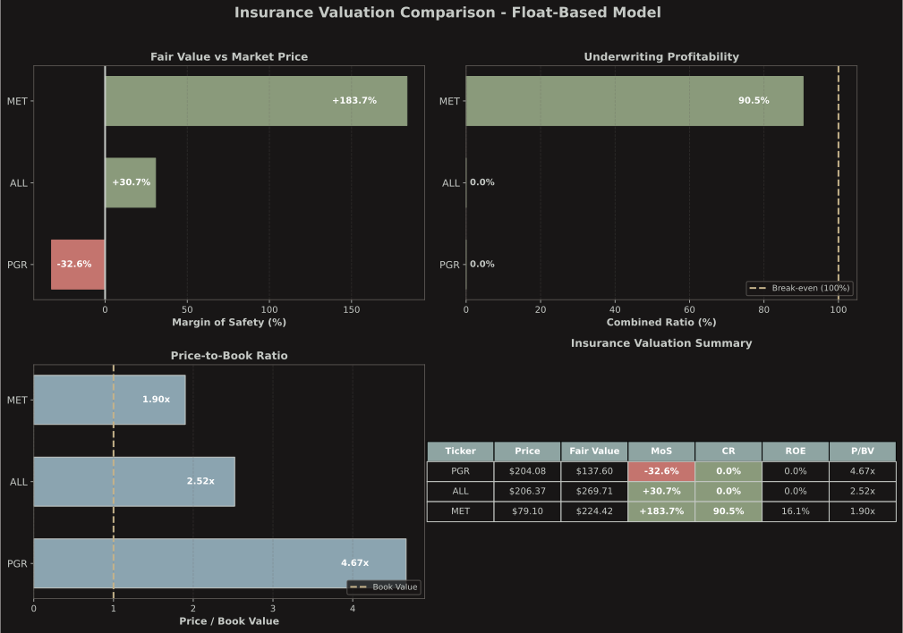

*Oil & Gas E&P Valuation Comparison (NAV Model):*

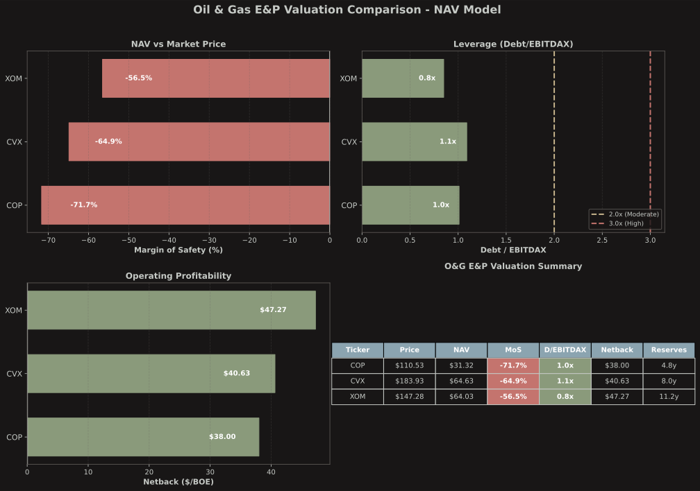

*Sensitivity Analysis — Standard DCF (Growth Rate, Discount Rate, Terminal Growth):*

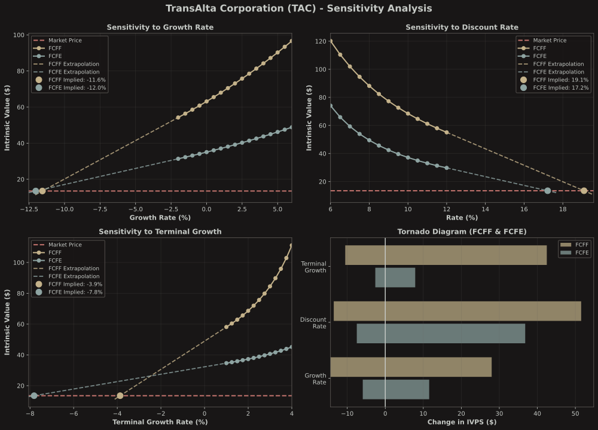

*Sensitivity Analysis — Bank (ROE, Cost of Equity, Sustainable Growth):*

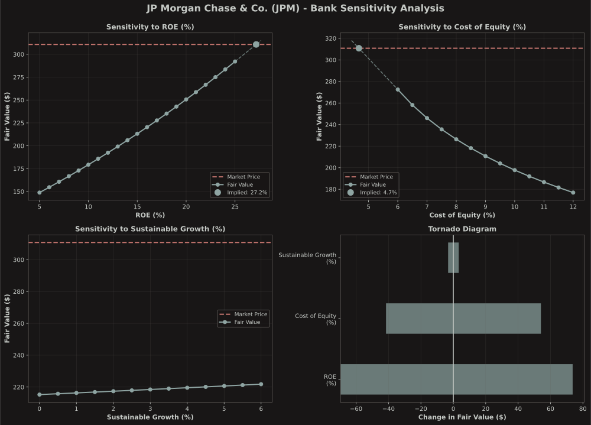

*Sensitivity Analysis — Insurance (Combined Ratio, Investment Yield, Cost of Equity):*

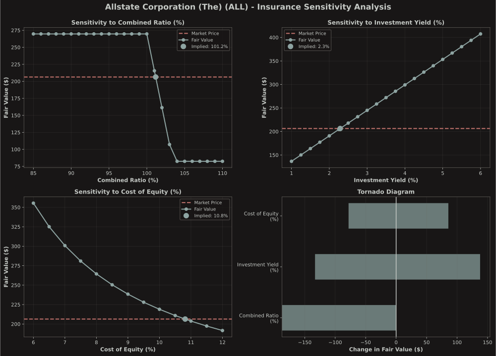

*Sensitivity Analysis — Oil & Gas (Oil Price, Lifting Cost, Discount Rate):*

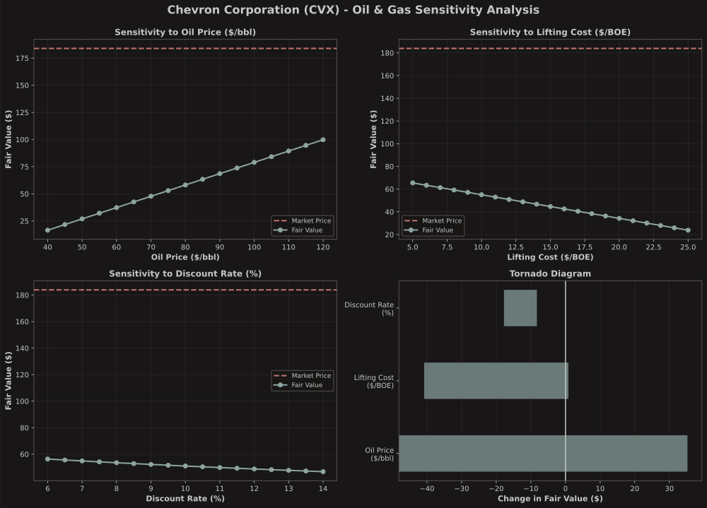

[↑ Back to top](#table-of-contents)

---

### DCF Probabilistic

**Equity Valuation | Monte Carlo Simulation**

Advanced DCF with Monte Carlo simulation for uncertainty quantification.

**Key Features:**
- Monte Carlo simulation (100-10,000 iterations)
- Stochastic discount rates (samples RFR, beta, ERP each iteration)
- Time-varying growth rates (exponential mean reversion)
- Bayesian priors for ROE/ROIC smoothing
- Portfolio efficient frontier (multi-asset optimization)
- Distribution statistics (mean, median, percentiles, probability of undervaluation)

**Documentation:** [`valuation/dcf_probabilistic/README.md`](valuation/dcf_probabilistic/README.md)

**Interpreting Results:**
- **P(Undervalued) > 70%**: High-conviction buy - most simulation paths show upside
- **P(Undervalued) 50-70%**: Moderate conviction - coin flip with slight edge
- **P(Undervalued) < 50%**: More likely overvalued - avoid or reduce position
- **KDE Plot**: Vertical line shows market price; area to the right = probability of undervaluation
- **Surplus Distribution**: Positive surplus = undervalued; check the median and 5th percentile for downside
- **Efficient Frontier**: Points on the curve are optimal; choose based on your risk tolerance (left = conservative, right = aggressive)

**Example Output:**

*Standard Model — Intrinsic Value Distribution (KDE):*

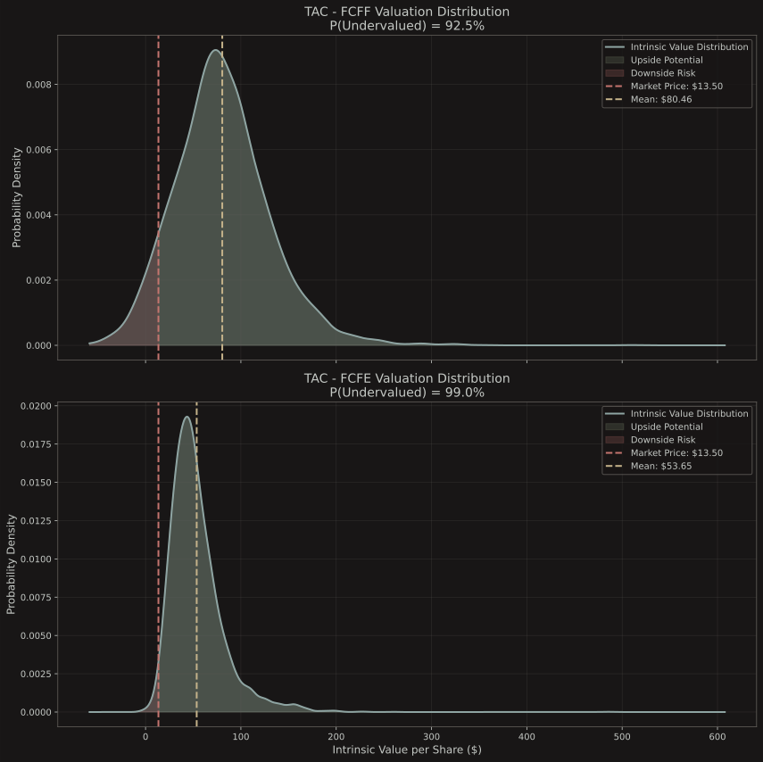

*Standard Model — Surplus Distribution:*

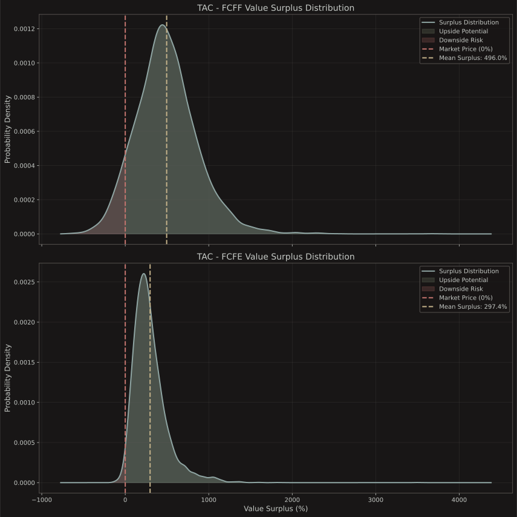

*Bank (Excess Return Model) — Fair Value Distribution:*

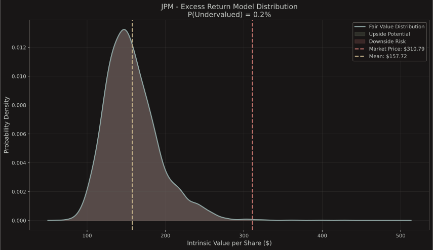

*Insurance (Float-Based Model) — Fair Value Distribution:*

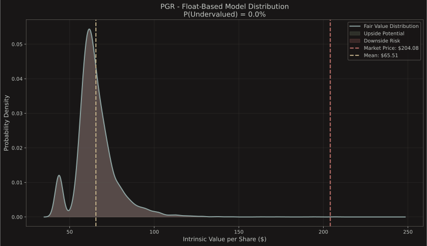

*Oil & Gas (NAV Model) — Fair Value Distribution:*

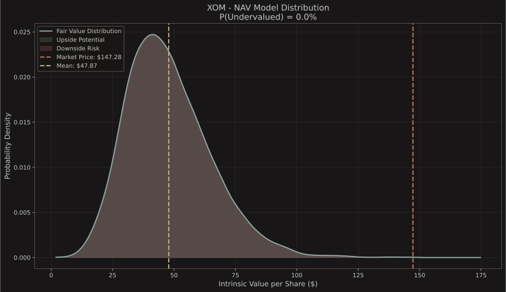

*Portfolio Efficient Frontiers (6 risk measures, FCFF top / FCFE bottom):*

μ–σ (Sharpe Ratio):

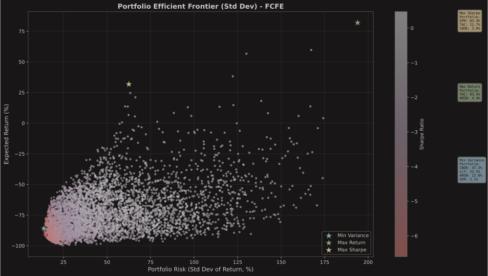

μ–P(Loss) (Tail Risk):

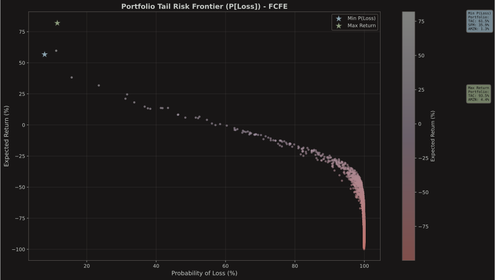

μ–σ↓ (Sortino / Downside Deviation):

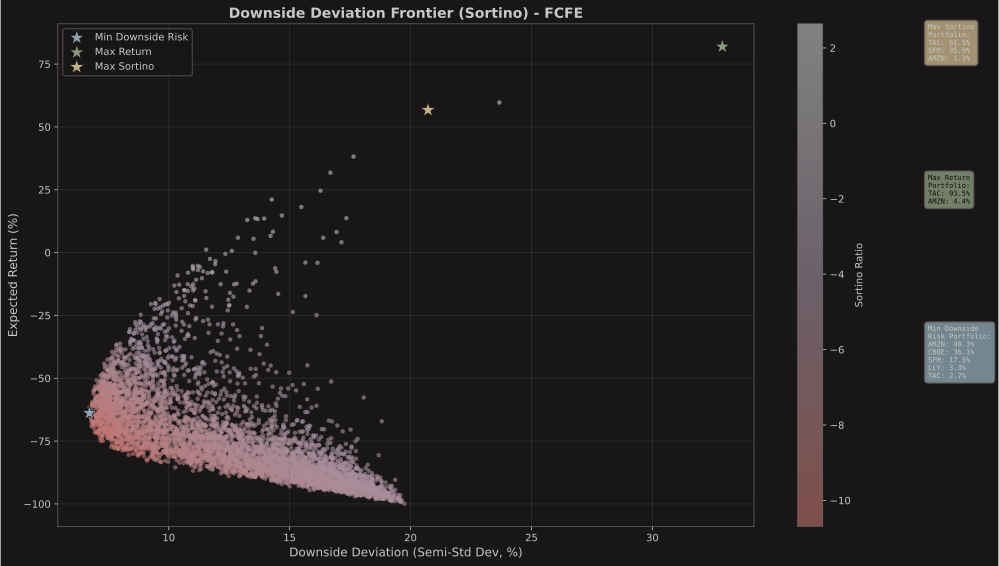

μ–CVaR (Conditional Value-at-Risk):


μ–VaR (Value-at-Risk):


μ–Max Drawdown (Calmar Ratio):


[↑ Back to top](#table-of-contents)

---

### DCF REIT

**REIT Valuation | FFO/AFFO, NAV, DDM**

Specialized valuation model for Real Estate Investment Trusts using industry-standard metrics.

**Key Features:**
- FFO/AFFO calculations (Funds From Operations adjusted for maintenance CapEx)
- NAV valuation (Net Asset Value from NOI/cap rate)
- Dividend Discount Model (Gordon Growth, two-stage DDM)
- P/FFO and P/AFFO relative valuation vs sector benchmarks
- Quality scoring (occupancy, lease quality, balance sheet, growth, dividend safety)
- 11 property sectors with sector-specific cap rates and multiples

**Documentation:** [`valuation/dcf_reit/README.md`](valuation/dcf_reit/README.md)

**Interpreting Results:**
- **Upside > 15%**: Undervalued REIT - consider buying
- **NAV Premium/Discount**: Trading above NAV = expensive; below NAV = potential value
- **AFFO Payout > 100%**: Dividend may be unsustainable - caution
- **Quality Score > 0.7**: High-quality REIT deserves premium valuation
- **Quality Score < 0.5**: Elevated risk - requires larger margin of safety
- **P/FFO vs Sector**: Below sector average with high quality = attractive entry

**Example Output:**

*Industrial REIT — PLD (Hold, Quality 0.86):*


*Net Lease REIT — O (Sell, Quality 0.72):*


*Data Center REIT — EQIX (Strong Sell, Quality 0.64):*


*Mortgage REIT — STWD (Caution, Quality 0.38):*


[↑ Back to top](#table-of-contents)

---

### Crypto Treasury

**Crypto Treasury Valuation | mNAV Model**

Valuates companies holding Bitcoin and/or Ethereum as treasury assets using the multiple of Net Asset Value (mNAV) methodology.

**Key Features:**
- Real-time BTC and ETH prices from yfinance (BTC-USD, ETH-USD)
- mNAV calculation (Market Cap / Crypto Holdings Value)
- Support for pure BTC, pure ETH, and mixed holdings
- Premium/discount analysis
- Implied crypto price (what market values BTC/ETH at via the stock)
- Cost basis tracking and unrealized gains
- Leverage analysis (Debt/NAV)

**Interpreting Results:**
- **mNAV < 0.8**: Deep discount - strong buy (getting BTC below spot)
- **mNAV 0.8-1.0**: Moderate discount - buy
- **mNAV 1.0-1.2**: Fair to slight premium - hold
- **mNAV > 1.5**: Significant premium - consider buying BTC directly
- **Implied BTC Price**: Compare to spot - lower = undervalued

**Example Output:**

*Crypto Treasury Comparison (BTC and ETH Plays):*


[↑ Back to top](#table-of-contents)

---

### GARP / PEG Analysis

**Growth At a Reasonable Price | PEG Ratio**

Combines value and growth investing—growth is worth paying for, but not at any price.

**Key Features:**
- PEG ratio calculation (Trailing, Forward, PEGY variants)
- GARP scoring system (0-100) with component breakdown
- Quality assessment (FCF conversion, D/E ratio, ROE)
- Investment signals (Strong Buy → Avoid)
- Multi-ticker comparison and ranking

**Interpretation:**
- PEG < 0.5: Very Undervalued
- PEG 0.5-1.0: Undervalued
- PEG 1.0-1.5: Fairly valued
- PEG > 2.0: Expensive for growth rate

**Example Output:**

*Strong Buy — META (85/A, PEG 0.44):*


*Buy — SFM (70/B, PEG 1.04):*


*Hold — AAPL (60/B, PEG 1.65):*


*Avoid — PLTR (67/B, PEG 2.87):*


*Avoid — COST (60/B, PEG 2.24):*


*Multi-Ticker Comparison:*


[↑ Back to top](#table-of-contents)

---

### Growth Analysis


**Pure Growth Investing | Growth Metrics**

Evaluate companies on growth potential, accepting higher valuations for exceptional growth.

**Key Metrics:**
- **Revenue CAGR:** Compound annual growth rate (Hypergrowth > 40%, High > 20%)
- **Rule of 40:** Revenue Growth % + FCF Margin % (> 40 = excellent)
- **Operating Leverage:** Earnings growth / Revenue growth
- **PEG Ratio:** P/E divided by earnings growth rate

**Growth Quality Assessment:**
- Margin trajectory (Expanding, Stable, Contracting)
- Operating leverage (earnings growing faster than revenue)
- EV/Revenue per point of growth

**Example Output:**

*Hypergrowth — PLTR (91/A, Growth Buy):*


*Hypergrowth — NVDA (89/A, Strong Growth):*


*High Growth — CRWD (43/C, Growth Hold):*


*Moderate Growth — SFM (50/C+, Growth Hold):*


*Slow Growth — JNJ (49/C+, Not a Growth Stock):*


*Multi-Ticker Comparison:*


[↑ Back to top](#table-of-contents)

---

### Dividend / Income Analysis


**Dividend Investing | Income Generation**

Evaluate stocks for dividend yield, safety, and growth—answers "How much income will it pay?"

**Key Metrics:**
- **Dividend Yield:** Annual dividend / Price (2-5% typical target)
- **Payout Ratio:** Dividends / Earnings or FCF (<70% = sustainable)
- **Dividend Growth Rate (DGR):** CAGR of dividend increases
- **Consecutive Increases:** Aristocrat (25+ years), King (50+ years)
- **Chowder Number:** Yield + 5-year DGR (>12 for high yield, >15 for low yield)

**Dividend Safety Scoring:**
- Payout ratio sustainability
- FCF coverage of dividends
- Balance sheet strength
- Earnings stability
- Track record of increases

**Valuation Methods:**
- Gordon Growth Model (DDM): D1 / (r - g)
- Two-Stage DDM for transitioning companies
- Yield-based valuation vs historical average

**Use Cases:**
- Build income-generating portfolios
- Screen for dividend safety before purchase
- Monitor existing holdings for cut risk
- Compare yield vs peers

**Default Comparison:** JNJ, KO, PEP, PG, VZ, MO — classic dividend aristocrats and kings.

**Note:** For REITs, use the `dcf_reit` model which handles FFO/AFFO metrics. Streak detection handles yfinance split-adjustment artifacts automatically.


[↑ Back to top](#table-of-contents)

---

### Relative Valuation


**Comparable Company Analysis | Peer Multiples**

Value stocks relative to peers using multiples—answers "Is it cheap vs similar companies?"

**Key Multiples:**
- **Equity:** P/E, P/B, P/S, P/FCF
- **Enterprise Value:** EV/EBITDA, EV/EBIT, EV/Revenue
- **Sector-Specific:** P/FFO (REITs), EV/ARR (SaaS), P/TBV (Banks)


[↑ Back to top](#table-of-contents)

---

### Normalized Multiples

**Sector-Benchmarked Valuation | Quality-Adjusted Percentiles**

Evaluate stocks by comparing their multiples (P/E, EV/EBITDA, P/S, etc.) against sector benchmarks with quality adjustments for growth, margins, and returns.

> **Note:** This module is designed for general sectors (technology, consumer, industrials, healthcare, etc.). It is not suitable for financials (banks, insurance) or resource sectors (oil & gas), which require specialized metrics — see [DCF Deterministic](#dcf-deterministic) for sector-specific models.

**Key Features:**
- **TTM + NTM multiples** — trailing and forward views
- **Percentile ranking** vs sector P25/median/P75
- **Quality adjustment** — superior fundamentals justify premium multiples
- **Implied prices** from each multiple method
- **Single and comparative** analysis modes

*CAT (Fair Value, 71% conf.):*


*DE (Fair Value, 69% conf.):*


*GE (Overvalued, 51% conf.):*


*HON (Fair Value, 77% conf.):*


*Comparative Analysis — CAT, DE, GE, HON:*


[↑ Back to top](#table-of-contents)

---

### Analyst Upside

**Analyst Price Target Scanner | Conviction Mapping**

Scan stocks for analyst price target upside, rank by opportunity size, and map conviction (high upside + low dispersion = strongest signal). Analyst consensus data is sourced from Yahoo Finance (via yfinance), which aggregates sell-side estimates from major brokerages through Refinitiv/LSEG.

**Key Features:**
- **15 predefined universes** — index (S&P 500, NASDAQ, Dow), sector (tech, healthcare, industrials, consumer, financials, energy), thematic (AI, clean energy, dividend aristocrats), market-cap (mid-cap, small-cap), or custom tickers
- **Parallel fetching** — concurrent data retrieval via yfinance
- **Dispersion analysis** — measures analyst disagreement (high-low range / mean)
- **52-week positioning** — where the stock sits relative to its range
- **Sector breakdown** — average upside by sector

**Metrics per stock:**
- Current price vs median/mean target
- Upside % and analyst count
- Dispersion (analyst disagreement)
- Recommendation consensus (strong buy → sell)


[↑ Back to top](#table-of-contents)

---

### ETF Analysis

**ETF Valuation & Quality Scoring**

Comprehensive ETF analysis covering premium/discount, tracking quality, costs, liquidity, and specialized derivatives-based ETF strategies.

**Standard ETF Metrics:**
- **Premium/Discount:** Price vs NAV gap (arbitrage opportunities)
- **Tracking Error:** How well ETF follows its benchmark
- **Total Cost of Ownership:** Expense ratio + trading costs + tax costs
- **Liquidity Score:** Spread, volume, implied liquidity from holdings
- **Size Tier:** AUM-based stability assessment

**Derivatives-Based ETF Analysis:**
| Type | Examples | Key Metrics |
|------|----------|-------------|
| Covered Call | JEPI, QYLD, XYLD | Upside capture, distribution yield, capture efficiency |
| Buffer/Outcome | BAPR, PJAN | Remaining buffer, remaining cap, days to outcome |
| Volatility | VXX, UVXY | Contango/backwardation, roll yield, decay rate |
| Put-Write | PUTW | Premium yield, assignment risk |

**Default Comparison:** SPY, QQQ, JEPI, SCHD — index trackers vs income ETFs.

*Covered Call ETF — JEPI (80/B+):*


*Standard Index ETF — SPY (75/B+):*


[↑ Back to top](#table-of-contents)

### Panel (Multi-Model View)

**Run all applicable valuation models per ticker, side by side.**

Triages each ticker (equity, ETF, REIT, crypto treasury), routes it to the right subset of models, runs them in parallel, and presents each model's verdict as-is. No composite score — a growth stock and a dividend aristocrat are judged by different lenses.

**Routing logic:**
- **ETFs** → ETF Analysis only
- **REITs** → DCF REIT only
- **Crypto treasury** (MSTR, MARA, etc.) → Crypto Treasury + general models
- **General stocks** → up to 7 models: Analyst Upside, DCF Deterministic, Normalized Multiples, GARP/PEG, Growth Analysis, Dividend Income, DCF Probabilistic (opt-in)

**Features:**
- Same-day data caching (skip re-fetch on reruns, `--fresh` to override)
- Pre-built OCaml binaries for parallel execution (no dune lock contention)
- Output: terminal dashboard, JSON, CSV, ntfy notification
- Supports universes: portfolio, watchlist, sp50, nasdaq30, sector baskets, liquid tickers

```bash
uv run valuation/panel/python/run.py --tickers AAPL,NVDA,JPM,O,SPY
uv run valuation/panel/python/run.py --universe portfolio
uv run valuation/panel/python/run.py --universe sp50 --format csv --output results.csv
```

[↑ Back to top](#table-of-contents)

---

## Monitoring

### Watchlist & Alerts

**Portfolio Tracking with Weighted Thesis Scoring**

Track positions (long, short, watching) with weighted bull/bear thesis arguments. OCaml analysis engine scores conviction, calculates P&L, and generates alerts for price targets, stop losses, and significant gains/losses. Push notifications via ntfy.sh.

**Features:**
- Weighted bull/bear thesis scoring with conviction levels (strong bull → strong bear)
- Position types: long, short, watching — with correct P&L and alert direction for each
- Price alerts: buy targets, sell targets, stop losses (direction-aware for shorts)
- P&L alerts: significant gains (>20%) and losses (>10%) from cost basis
- ntfy.sh integration for push notifications
- State tracking for change detection between runs


[↑ Back to top](#table-of-contents)

---

### Earnings Calendar

**Upcoming Earnings Tracking | Pre-Earnings Alerts | BMO/AMC Timing**

Track upcoming earnings dates for portfolio holdings and generate alerts before earnings. Fetches data from yfinance with parallel processing.

**Features:**
- Upcoming earnings dates with BMO/AMC pre-/post-market timing
- Configurable alert window (default 14 days) with priority levels
- Historical EPS surprise tracking (last 4 quarters)
- Read tickers from watchlist portfolio.json or CLI
- ntfy.sh notification integration


[↑ Back to top](#table-of-contents)

---

<!-- ## Alternative (WIP — code exists, not yet showcase-ready)

### Macro Dashboard

**Economic Regime Classification | Investment Positioning**

Classifies the macroeconomic environment from FRED data and generates investment positioning recommendations.

**Key Features:**
- **Cycle Phase:** Early Cycle (recovery), Mid Cycle (expansion), Late Cycle (peak), Recession
- **Yield Curve:** Normal, Flat, Inverted, Deeply Inverted (strongest recession predictor)
- **Inflation Regime:** Deflation through Very High, based on Core PCE/CPI
- **Labor State:** Very Tight through Weak, from unemployment rate
- **Risk Sentiment:** Risk-On to Risk-Off, based on VIX
- **Fed Stance:** Very Dovish to Very Hawkish, inferred from rates + inflation + labor
- **Recession Probability:** Composite estimate (yield curve, labor, GDP, VIX)

**Investment Implications:**
- Equity outlook (Overweight/Neutral/Underweight) by cycle and risk
- Bond duration guidance based on yield curve and fed stance
- Sector tilts per cycle phase (e.g., Financials in early cycle, Utilities in recession)
- Key risks dynamically built from current regime

**Example Output:**
```
═══════════════════════════════════════════════════════════════
                MACRO DASHBOARD
═══════════════════════════════════════════════════════════════
Economic Regime:
  Cycle Phase:         Mid Cycle (Expansion)
  Yield Curve:         Normal (Upward Sloping)
  Inflation:           At Target
  Labor Market:        Healthy
  Risk Sentiment:      Neutral
  Fed Stance:          Neutral
  Recession Prob:      10.0%
  Confidence:          100.0%

Investment Implications:
  Equity:              Neutral to Overweight
  Bonds:               Neutral duration
  Risk Level:          Moderate - Normal positioning
  Sector Tilts:        Technology, Communication Services, Industrials
```


> **FRED® API Notice:** This product uses the FRED® API but is not endorsed or certified by the Federal Reserve Bank of St. Louis. By using this module, you agree to the [FRED® API Terms of Use](https://fred.stlouisfed.org/docs/api/terms_of_use.html). Data sources: Federal Reserve Board, BLS, BEA, U.S. Census Bureau, via FRED. No FRED® data is stored, cached, or redistributed by this project — users fetch data directly with their own API key. This module uses a rule-based classifier; no machine learning or AI training is performed on FRED® data.

[↑ Back to top](#table-of-contents)

---

### Google Trends

**Retail Attention & Brand Interest Monitor**

Track Google search trends as a leading indicator of public interest. Rising search volume can precede stock moves.

**Signals Detected:**
- **Brand Surge:** >25% increase in brand searches (7-day)
- **Negative Spike:** Unusual spike in negative search terms (recalls, lawsuits)
- **Retail Attention:** Elevated stock-related search interest
- **Rising Queries:** Trending related searches

**Example Output:**
```
Google Trends Analysis Report
============================================================
Tickers analyzed: 7
Alerts generated: 2

Ticker       Attn   Brand 7d   Retail %         Signals
------------------------------------------------------------
AAPL           48      +3.2%         2%               -
NVDA           71     +12.5%         6%  retail_attention
TSLA           55      -8.1%         4%               -
MSFT           33      +1.4%         1%               -
META           42      +5.7%         3%  negative_spike
AMZN           39      -2.3%         2%               -
GOOGL          31      +0.8%         1%               -

ALERTS
------------------------------------------------------------
[HIGH] NVDA: Google Trends: Elevated retail search interest
[HIGH] META: Google Trends: Negative search spike 'meta layoffs'

RISING QUERIES
------------------------------------------------------------
NVDA: nvidia earnings, nvidia stock, jensen huang
TSLA: tesla news today, elon musk, tesla optimus
META: meta layoffs, instagram update, threads app
```

[↑ Back to top](#table-of-contents)

---

### Short Interest

**Squeeze Candidate Detection & Crowded Shorts**

Track short interest metrics to identify potential short squeezes. High short interest with positive catalysts can lead to explosive moves.

**Metrics Tracked:**
- **Short % of Float:** Percentage of float sold short
- **Days to Cover:** Shares short / average daily volume
- **SI Change:** Month-over-month change in short interest
- **Squeeze Score:** Composite 0-100 score based on SI, DTC, float, market cap

**Signals Generated:**
- **High Short Interest:** >15% of float shorted
- **High Days to Cover:** >5 days to cover all shorts
- **SI Increasing:** >10% month-over-month increase
- **Squeeze Candidate:** Score ≥50 (High potential at ≥70)

**Example Output:**
```
Short Interest Analysis Report
======================================================================
Tickers analyzed: 7
Alerts generated: 2

Ticker       SI %    DTC   Change    Squeeze  Score
----------------------------------------------------------------------
TSLA         3.2%    1.8    +5.2%        Low     28
NVDA         1.1%    0.4    -2.1%        Low     12
MSFT         0.6%    0.8    +0.3%        Low      8
META         1.4%    0.9    +1.8%        Low     14
AAPL         0.7%    0.6    -0.5%        Low      6
AMZN         0.9%    0.7    +0.9%        Low     10
GOOGL        0.8%    0.5    +0.2%        Low      7

ALERTS
----------------------------------------------------------------------
[INFO] TSLA: Short Interest: SI increasing +5.2% MoM
[INFO] META: Short Interest: SI increasing +1.8% MoM
```

[↑ Back to top](#table-of-contents)

---

### Insider Trading

**SEC Form 4 Monitoring & Signal Detection**

Track insider buying and selling from SEC Form 4 filings. Insider purchases are one of the most reliable bullish signals - insiders sell for many reasons but buy for only one.

**Signal Hierarchy:**
- **Cluster Buying:** Multiple insiders buying in short period (Very Strong)
- **CEO/CFO Buying:** Top executives have most visibility (Strong)
- **Large Purchases:** >$500K open market buys (Strong)
- **Director Buying:** Board members have strategic insight (Moderate)

**Metrics Tracked:**
- Open market purchases vs sales
- Buy/sell ratio and sentiment score
- Insider importance scoring (CEO > CFO > Director)
- Transaction value and timing

**Example Output:**
```
Insider Trading Analysis Report
===========================================================================
Tickers analyzed: 3
Alerts generated: 7

Ticker    Filings   Buys  Sells        Buy $       Sell $  Sentiment
---------------------------------------------------------------------------
AAPL            4      0      5           $0        $2.1M    Bearish
TSLA            6      0     24           $0       $53.5M    Bearish
META           47      0     41           $0       $26.3M    Bearish

ALERTS
---------------------------------------------------------------------------
[DEFAULT] TSLA: Insider Alert: Large sell by Musk Kimbal () - $25,606,501
[DEFAULT] META: Insider Alert: Large sell by Bosworth Andrew (CTO) - $3,085,696
```

[↑ Back to top](#table-of-contents)

---

### Options Flow

**Unusual Options Activity Detection**

Track options flow to detect potential informed trading. Large premium, high volume/OI ratios, and short-dated options can signal that someone knows something.

**Unusual Score Factors (0-100):**
- **Premium Size:** >$1M = 30pts, >$500K = 25pts, >$100K = 15pts
- **Volume/OI Ratio:** >10x = 25pts (new positions being opened)
- **DTE Urgency:** <7 days = 20pts (time pressure)
- **OTM Conviction:** Deep OTM = 15pts (betting on big move)
- **Raw Volume:** >10K contracts = 10pts

**Signals Detected:**
- **Bullish Flow:** Call premium >> Put premium (C/P ratio >2x)
- **Bearish Flow:** Put premium >> Call premium (P/C ratio >2x)
- **Large Premium:** Individual trades >$500K
- **High Vol/OI:** New positions opening (ratio >5x)

**Example Output:**
```
Options Flow Analysis Report
===========================================================================
Tickers analyzed: 2
Alerts generated: 11

Ticker       Call $      Put $      C/P  Unusual    Sentiment
---------------------------------------------------------------------------
NVDA        $373.6M    $129.3M     2.89       91      bullish
AAPL         $93.7M    $124.0M     0.76       38 slightly_bearish

ALERTS
---------------------------------------------------------------------------
[HIGH] AAPL: Options Flow: Large PUT $280.0 2026-01-16 - $23.3M (11,383 contracts)
[DEFAULT] NVDA: Options Flow: Bullish (moderate) - C/P ratio 2.9x, $373.6M calls
```

[↑ Back to top](#table-of-contents)

---

### SEC Filings

**Material Events & Activist Position Monitoring**

Monitor SEC EDGAR filings for material events that can move stock prices. All public company filings are available for free with no delay.

**Key Filing Types:**
| Form | Description | Importance |
|------|-------------|------------|
| 8-K | Material events | High - immediate catalysts |
| 13D | >5% activist position | Very High - activist involvement |
| 13G | >5% passive position | Moderate |
| 10-K/10-Q | Annual/Quarterly reports | Routine |

**8-K Item Categories (Most Actionable):**
- **Item 1.01/1.02:** Material agreements
- **Item 2.01:** Acquisitions/dispositions
- **Item 2.02:** Earnings results
- **Item 5.02:** Executive/director changes
- **Item 7.01:** Regulation FD disclosure

**Example Output:**
```
SEC Filings Analysis Report
===========================================================================
Tickers analyzed: 2
Alerts generated: 2

Ticker        Total      8-K   Material   Activist       Recent
---------------------------------------------------------------------------
AAPL              4        2          2         No   2026-01-08
NVDA             20        1          0         No   2026-01-09

ALERTS
---------------------------------------------------------------------------
[HIGH] AAPL: SEC Filing: 8-K Executive/Director change filed 2026-01-02
```

[↑ Back to top](#table-of-contents)

---

### NLP Sentiment

**Narrative Drift Detection via Embeddings**

Detect subtle changes in corporate language across SEC filings and earnings calls. Uses sentence-transformers embeddings to measure semantic drift between periods — when management shifts from "confident" to "cautiously optimistic," the numbers catch it before the headlines do.

**Pipeline Stages:**
1. **Fetch** — MD&A sections from 10-K/10-Q, earnings call transcripts, Discord channel exports
2. **Embed** — Sentence-level embeddings via MiniLM (all-MiniLM-L6-v2)
3. **Detect** — Delta detection (cosine distance from historical centroid), hedging language scoring, commitment strength tracking
4. **Surface** — Rank and export top-change snippets for human review

**Signal Ontology (16 categories):**
| Domain | Signals |
|--------|---------|
| Pricing & Margin | Pricing power, margin pressure, cost inflation |
| Demand & Visibility | Demand visibility, order book, backlog |
| Competition | Competitive threat, market share |
| Regulatory & Legal | Regulatory overhang, litigation risk |
| Guidance | Guidance confidence, management tone |
| Operations | Supply chain, execution risk |
| Capital | Capital allocation, liquidity concern |

**Detection Methods:**
- **Embedding Delta:** Cosine distance between current and historical centroid — large jumps surface narrative shifts
- **Hedging Language:** Scores density of uncertainty words (may, might, uncertain, volatile, headwind)
- **Commitment Tracking:** Ladder from "will" (1.0) → "expect" (0.8) → "hope" (0.3) → "monitoring" (0.2) — downgrades signal weakening conviction
- **Evasive Phrases:** Detects deflection patterns ("let me take a step back", "too early to say")

**Example Output:**
```
Narrative Drift Detection Pipeline
Tickers: AAPL, NVDA, TSLA, MSFT, META, AMZN, GOOGL
Quarters: 4

============================================================
Processing GOOGL
============================================================

[1/5] Fetching MD&A and Risk Factors...
  Fetched 8 MD&A documents
[4/5] Computing embeddings...
  Embedded 8 documents
[5/5] Detecting changes...
  mda: delta=0.371
  risk_factors: delta=0.434

============================================================
PIPELINE SUMMARY
============================================================
Documents: 41
Changes: 11
Snippets: 44
```

**Discord Community Sentiment:**


[↑ Back to top](#table-of-contents)

-->

---

<a id="disclaimer"></a>
<sub>**Disclaimer.** Nothing in this repository constitutes financial advice, investment advice, trading advice, or any recommendation to buy, sell, or hold any security. All model outputs are the product of simplified mathematical assumptions applied to noisy, incomplete data. Markets are non-ergodic systems: past distributions do not reliably describe future outcomes, ensemble averages do not converge to time averages for individual participants, and tail events reshape the landscape in ways no backtest captures. Every model here is wrong — some may occasionally be useful, but none should be mistaken for a forecast. Use at your own risk and consult a qualified financial professional before making any investment decision.</sub>
