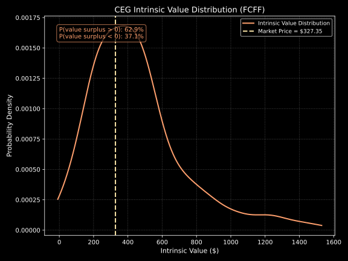

# atemoya

## theory

[typeset/atemoya.pdf](typeset/atemoya.pdf)

## implementation

```zsh
opam install . --deps-only
eval $(opam env)
```

```zsh
uv sync
```

```zsh
dune clean && dune build
```

define ticker selection here: [data/tickers.yml](data/tickers.yml)

### valuation

deterministic computation of selected stocks' intrinsic value per share through discounted free cash flow to equity and to firm - displaying margins of safety, projected and implied growth rates, and including interpretation of the result as can be seen [here](log/val/dcf_deterministic/IVPS_2025-07-26_17-02-52_GOOGL_SIE.DE_ROG.SW_ASML_TCS.NS_GRAB_CEG.log)
```zsh
uv run -m prep.val.dcf_deterministic
dune exec dcf_deterministic
```

probabilistic computation of selected stocks' intrinsic value per share ([here](log/val/dcf_probabilistic/IVPS_2025-07-26_17-03-38_GOOGL_SIE.DE_ROG.SW_ASML_TCS.NS_GRAB_CEG.log))

single-asset value-surplus distributions (FCFE)

<div>
  
  
</div>

single-asset value-surplus distributions (FCFF)

<div>
  
  
</div>

multi-asset value-surplus frontier (based on FCFE)

<div>
  
  
</div>

multi-asset value-surplus frontier (based on FCFF)

<div>
  
  
</div>

```zsh
uv run -m prep.val.dcf_probabilistic
dune exec dcf_probabilistic
uv run -m viz.val.dcf_probabilistic
```

### pricing

mpt: portfolio weights on efficient frontier in the mean-variance optimization framework
<div>
  
</div>

```zsh
uv run -m prep.pri.mpt
dune exec mpt
uv run -m viz.pri.mpt
```
