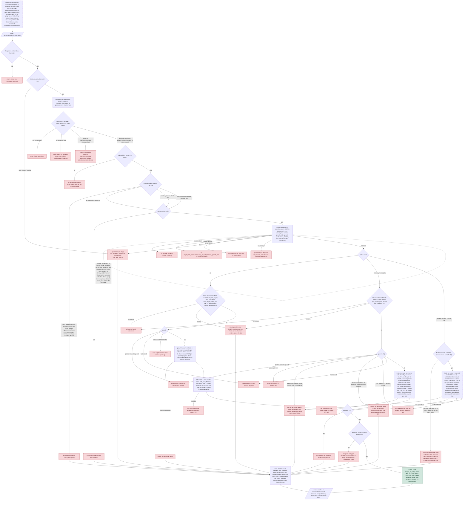

# Flow: ticker in, record out

Every branch that exists today, from a ticker in `reference/universe.json` (or an ad-hoc
file plus `--entity-class`) to one line in `output/valuations.jsonl`. Red terminal nodes
are the exact `failed_reason` strings, with variable parts in parentheses, so the chart is
checkable against `output/summary.txt`; a test asserts every reason string in the code
appears here. **Every change that adds a branch updates this file in the same commit.**

Nodes marked *(06)* were added by the bank model, *(07)* by the risk-free fetchers, *(08)* by the insurer model.

## Reading the chart against a run

`output/summary.txt` lists each ticker's `failed_reason`; find the same string here to see
which branch produced it. Reason text with numbers or names in it is shown with the
variable part in parentheses. Every `Failed` record still carries `floor`, `scope_limits`
and `lens_note`, so the floor node applies to all red terminals, not only the ones drawn
into it.

## Changelog

- entity class (05): declaration, class check, admissibility, floor.
- bank model (06): the residual-income model for `Bank`, its guards and its inputs; the
  admissibility branch now routes to the first admissible model in the row.
- risk-free fetchers (07): risk-free curves come from a source registry in three tiers; a tenor
  substitution is recorded on the parameter, never silent. No new `Failed` string.
- insurer model (08): a second statements provider (filed statements via SEC XBRL) for insurers,
  the insurer model on AOCI-adjusted book, and the `Failed` string for an insurer whose
  provider had no filed statements.
