# Flow: ticker in, record out

Every branch that exists today, from a ticker in `reference/universe.json` (or an ad-hoc
file plus `--entity-class`) to one line in `output/valuations.jsonl`. Red terminal nodes
are the exact `failed_reason` strings, with variable parts in parentheses, so the chart is
checkable against `output/summary.txt`; a test asserts every reason string in the code
appears here. **Every change that adds a branch updates this file in the same commit.**

Nodes marked *(06)* were added by the bank model, *(07)* by the risk-free fetchers, *(08)* by the insurer model, *(09)* by the cross-currency layer, *(10)* by filed statements as the primary source, *(11)* by one definition per field, *(12)* by the implied readouts and the bounded EBIT, *(13)* by the IFRS filers, *(14)* by the companyfacts-lag decision and the implied horizon, *(15)* by the residual-income model losing its terminal, *(16)* by the stability pass.

```mermaid
flowchart TD
    classDef failed fill:#f8d7da,stroke:#b02a37,color:#58151c
    classDef ok fill:#d1e7dd,stroke:#0f5132,color:#0a3622
    classDef new stroke-dasharray: 4 3

    IN[/"ticker: data/financials/(TICKER).json"/] --> FETCHED{"file parses as boundary financials?"}
    SNAP["snapshots (16): python/fetch_all.py writes every fetch to data/snapshots/(YYYY-MM-DD)/ (the fetch date, UTC; a second fetch on the same date gets a -2, -3 suffix, a snapshot is never overwritten), the shadow-yfinance records included, and data/financials is a relative symlink to the latest; the batch runs on any snapshot by path. With --baseline (a previous run) and --baseline-snapshot (the financials it was valued from) the batch writes output/stability_(old)_(new).txt: every moved input of every record classified as price (the market provider's price or cap; expected on a trading day, a finding on a non-trading day), new_filing (the accession changed), restated (same accession and period, the filed value changed; a finding), vendor_row (a vendor-path value moved with no filing behind it; a finding, old and new listed), rate_or_fx (a parameter or the fx rate; expected only when the refreshers ran, and the report says whether the risk-free as_of differs) or unexplained (anything else: zero is the acceptance); the summary carries the counts. A report, never a gate, never an adjustment. Snapshot three, after the next trading day's close: uv run python/fetch_all.py, then dune exec atemoya -- data/financials --out output --baseline output/run-2026-09-19/valuations.jsonl --baseline-snapshot data/snapshots/2026-09-19; expect price on every record and nothing else"]:::new -.-> IN
    PROVIDER["statements provider (10, 13): per ticker, decided by the filing and recorded on the record with the reason and the taxonomy. CIK resolves exactly in SEC's ticker map and the facts carry annual net income and equity on a 10-K or 20-F under us-gaap, else under ifrs-full (13): filed statements (SEC XBRL companyfacts) are primary, the tag per field per period from that taxonomy's section of reference/xbrl_tags.json, the statement currency taken from the facts' unit as financial_currency with the vendor's recorded beside it, SEC's submissions index read for every CIK-resolved name and its newest 10-K or 20-F recorded as submissions_latest_annual (14): when that filing is newer than the newest annual facts and those facts are past max_filing_age_days, and the vendor's newest annual ends no earlier than the filing's period less 45 days, the vendor's statements are used by a decision written into provider_reason (companyfacts lags submissions: (form) filed (date) (period (date)) not yet in facts; facts end (date)), the cross-check against the facts' newest period where one is common, else recorded as no common period; a lag with facts still within the gate keeps the filing and is noted; a lag with a stale vendor keeps the filing and the age gate fails it as before, the lag noted in provider_reason, filing date and accession on each period, the vendor's statements fetched as a cross-check (recorded per field, never a gate) and written beside as a shadow record. IFRS filer, facts on 20-F only, no annual anchors, no CIK, or companyfacts 404: the vendor feed (yfinance). Price, market cap and currencies always from yfinance. On either provider cash, total_debt, delta_nwc and ebit follow reference/field_definitions.json (11): cash and equivalents plus short-term investments less restricted cash; financial debt with operating leases excluded; the cash-flow statement's change in operating working capital (aggregate tag, else the classified components, null with a note when a tag is unclassified); operating income, else pretax plus interest expense as ebit_recipe = pretax_plus_interest; every period records the composition (definition and components summed)."]:::new -.-> IN
    FETCHED -- no --> UNREAD["stderr: cannot read financials; no record"]:::failed
    FETCHED -- yes --> THR{"bank_nii_ratio_threshold fresh?"}
    THR -- "stale / future / missing" --> PFAIL

    THR -- yes --> SIG["statement signature: Bank iff NII/revenue >= threshold, else Insurer iff premium row > 0, else none"]
    SIG --> DECL{"entity_class declared? (universe entry or --entity-class)"}
    DECL -- "no, no signature" --> F_UNDECL["entity_class not declared"]:::failed
    DECL -- "no, signature fired" --> F_UNDECL_HINT["entity_class not declared; statements indicate (Bank|Insurer) (evidence)"]:::failed
    DECL -- "declared OperatingCompany, signature fired" --> F_DISAGREE["class disagreement: declared OperatingCompany, statements indicate (Bank|Insurer) (evidence)"]:::failed
    DECL -- "declared, consistent / absent / differs (recorded in class_check)" --> ROW{"admissibility row for the class?"}

    ROW -- no --> F_NOROW["no admissibility row for entity class (class) in the reference table"]:::failed
    ROW -- yes --> ADM{"first admissible model in the row"}
    ADM -- "none (RegulatedUtility, MerchantPower, Reit, Miner, Royalty, HighGrowthSoftware, PreProfit, Wrapper, ConstructionStage, UnderBid, Ballast)" --> F_INADM["dcf not admissible for (class); lens: (lens)"]:::failed
    ADM -- "dcf (OperatingCompany)" --> COUNTRY
    ADM -- "residual_income (Bank) (06)" --> COUNTRY
    ADM -- "residual_income_insurer (Insurer) (08)" --> COUNTRY

    COUNTRY{"country in the fetch?"} -- no --> F_COUNTRY["country not determinable from the fetch"]:::failed
    COUNTRY -- yes --> CURAGREE{"filed statements: the filing's currency (the facts' unit) agrees with the vendor's statement currency? (13)"}:::new
    CURAGREE -- "differ" --> F_CURAGREE["financial currency disagreement: filing (X), vendor (Y) (13)"]:::failed
    CURAGREE -- "agree, or vendor statements" --> DEFS{"every period's compositions name the definitions in reference/field_definitions.json, and its ebit_recipe one the file lists? (11)"}:::new
    DEFS -- "another definition or recipe" --> F_DEFS["field definition mismatch: (field) follows (recorded), reference/field_definitions.json defines (name); refetch the statements (11)"]:::failed
    DEFS -- "yes, or none recorded" --> FILING{"filed statements: newest annual filing within max_filing_age_days 400? (10)"}:::new
    FILING -- "older" --> F_FILING["latest annual filing is N days old, older than its max_filing_age_days 400 (10)"]:::failed
    FILING -- "fresh, or vendor statements" --> CUR{"currency gate (09): financial_currency and trading_currency present? equal?"}:::new
    CUR -- "a field missing" --> F_CUR["missing market data: financial_currency, or missing market data: trading_currency (09)"]:::failed
    CUR -- "equal: the same-currency path, untouched" --> PARAMS
    CUR -- "differ: cross-currency (09)" --> FX{"FX both legs through USD from reference/fx_rates.json, fresh? (09)"}:::new
    FX -- "no series for a leg" --> F_FX["fx not available for (financial)/(trading) (09)"]:::failed
    FX -- "a leg stale or future" --> F_FXSTALE["fx for (code) (as_of date) is N days old, older than its max_age_days M (09)"]:::failed
    FX -- ok --> CONV["convert every statement total by fx_rate into the trading currency; price and market cap untouched (minor-unit prices were already divided at the fetch and the divisor recorded); parameters via resolve_cross: risk-free and terminal growth from the trading currency's country, tax from the domicile, cost of equity = rf + beta x mature ERP + country risk premium (domicile total ERP less the base); the same model runs on the converted record and the conversion rides on its inputs (09)"]:::new
    CONV --> PARAMS
    PARAMS["resolve parameters: projection_years, risk-free (country, 7y), ERP, statutory tax, terminal growth, debt spread, growth clamp, lambda, beta (industry table or default 1.0)"]
    PARAMS -. "risk-free curve tier (07): official (issuer or central bank) / fred_oecd_10y (the 7y taken from the OECD 10y, recorded as tenor_used) / manual (hand-copied, ages out under the 45-day gate); tier, tenor_requested and tenor_used ride on the parameter" .-> PARAMS
    PARAMS -- "country absent" --> F_NOCURVE["no risk-free curve for country (country)"]:::failed
    PARAMS -- "country absent" --> F_NOPARAM["no (equity_risk_premium|statutory_tax_rate|terminal_growth_rate) for country (country)"]:::failed
    PARAMS -- "tenor absent" --> F_NOTENOR["risk-free curve for (key) has no (tenor) tenor"]:::failed
    PARAMS -- "stale" --> PFAIL["(parameter) for (key) (as_of date) is N days old, older than its max_age_days M"]:::failed
    PARAMS -- "future as_of" --> F_FUTURE["(parameter) for (key) has as_of (date), later than the valuation date (today)"]:::failed
    PARAMS -- "resolved" --> WHICH{"routed model"}

    WHICH -- dcf --> EBIT{"ebit on the latest period derived (ebit_recipe other than operating_income)? then the record's cross-check must find it within threshold of the vendor's operating income (12)"}:::new
    EBIT -- "derived and the check misses, or no vendor figure to check against" --> F_EBIT["operating income not filed; derived EBIT misses the cross-check ((recipe): derived (x) against the vendor's (y), (d)% beyond the 2% threshold, or: no vendor operating income to check against) (12)"]:::failed
    EBIT -- "filed operating income, or derived and within threshold" --> DCF_PERIOD{"latest fiscal period, fields present? (ebit, d&a, capex, cash, total_debt, book_equity, delta_nwc over 2+ periods, price, market cap, currency)"}
    DCF_PERIOD -- "no periods" --> F_NOPERIOD["no fiscal periods in statements"]:::failed
    DCF_PERIOD -- "missing" --> F_MISSING["missing market data: (fields); missing statement fields for fiscal period ending (date): (fields)"]:::failed
    DCF_PERIOD -- ok --> DCF_GUARDS{"guards"}
    DCF_GUARDS -- "price or market cap <= 0" --> F_PRICE["price (p) and market cap (m) must be positive"]:::failed
    DCF_GUARDS -- "horizon < 0" --> F_HORIZON["projection horizon (N) years is negative"]:::failed
    DCF_GUARDS -- "wacc <= terminal growth" --> F_WACC["wacc (w) does not exceed terminal growth (g)"]:::failed
    DCF_GUARDS -- ok --> GROWTH["growth: fundamental (roic x reinvestment rate) if nopat > 0 and net reinvestment > 0, else revenue CAGR (3+ periods) capped at roic; clamp; mean-revert toward terminal at lambda"]
    GROWTH -- "neither computable" --> F_GROWTH["growth not derivable: (why)"]:::failed
    GROWTH --> DCF_EV["fcff = nopat + d&a - capex - mean delta_nwc; EV along the growth path + Gordon terminal; equity = EV - net debt; fair value = equity / (market cap / price)"]
    DCF_EV -- "not finite" --> F_NAN["fair value is not finite (enterprise value (ev), shares (n))"]:::failed
    DCF_EV --> CONCLUDE

    WHICH -- "residual_income (06)" --> RI_PERIOD{"latest fiscal period, fields present? (book_equity, net_income, price, market cap, currency) (06)"}:::new
    RI_PERIOD -- "no periods" --> F_NOPERIOD
    RI_PERIOD -- "missing" --> F_MISSING
    RI_PERIOD -- ok --> RI_GUARDS{"guards (06)"}:::new
    RI_GUARDS -- "price or market cap <= 0" --> F_PRICE
    RI_GUARDS -- "book equity <= 0" --> F_BOOK["book equity (b) is not positive (06)"]:::failed
    RI_GUARDS -- "fewer than 2 periods of net income over positive book" --> F_ROE["roe not derivable: need 2 fiscal periods with net income and positive book equity, have (n) (06)"]:::failed
    RI_GUARDS -- "fewer than 2 periods of dividends over positive net income" --> F_PAYOUT["payout not derivable: need 2 fiscal periods with positive net income and dividends paid, have (n) (06)"]:::failed
    RI_GUARDS -- "horizon < 0" --> F_HORIZON
    RI_GUARDS -- ok --> RI_EV["ROE_0 = mean net income / book; ROE_t reverts to CAPM cost of equity at lambda; book compounds by retained earnings (retention = 1 - mean payout); equity = book + PV of (ROE_t - ke) x start-of-year book over the explicit years, and nothing after them (15): ROE has reverted to the cost of equity by then and growth at the cost of equity is value neutral, so a bank earning its cost of equity is worth exactly book and franchise value is something the price must ask for through implied_roe0, not something the model grants; fair value = equity / shares; loan-loss ratios recorded, never a gate (06)"]:::new
    RI_EV -- "not finite" --> F_RINAN["fair value is not finite (equity value (e), shares (n)) (06)"]:::failed
    RI_EV --> CONCLUDE

    WHICH -- "residual_income_insurer (08)" --> INS_FILED{"filed statements with AOCI and premiums earned? (08)"}:::new
    INS_FILED -- "provider had none, or no AOCI / premiums on the latest period" --> F_FILED["insurer model requires filed-statement data; (why: no SEC filings for (ticker), or the period carries no AOCI or premiums earned) (08)"]:::failed
    INS_FILED -- yes --> INS_CORE["book per period = reported stockholders' equity - AOCI; then the residual-income core above (same guards: roe, payout), no terminal (15); underwriting checks recorded, never gates: combined-ratio proxy, reserves over premiums, AOCI over reported book; solvency null, basis stated (08)"]:::new
    INS_CORE -- "core guard fails" --> F_ROE
    INS_CORE -- "core guard fails" --> F_PAYOUT
    INS_CORE --> CONCLUDE

    CONCLUDE{"fair value > 0?"} -- no --> F_NONPOS["non-positive fair value (v): model not applicable"]:::failed
    CONCLUDE -- yes --> BOUND{"margin of safety <= sanity bound 5.0?"}
    BOUND -- no --> F_BOUND["margin of safety (m) exceeds sanity bound 5.00: likely structural break; check entity_class"]:::failed
    BOUND -- yes --> OK["Ok: fair_value, margin_of_safety, signal (Buy >= +25%, Sell <= -25%, else Hold), inputs tagged by model, floor present = true with the model's basis"]:::ok
    OK --> IMPLIED["implied readouts (12, 14), headline untouched: horizon_years (14) = the smallest whole number of explicit years, holding the observed start, at which fair value reaches the price, an integer scan over 1 to 40 with the bracket and fair_value_at_40, the risk-free rate held at the recorded 7y point, under the same guard; not reached at 40 means even indefinite persistence of the decaying path does not reach the price; meaningful_readout three-way: horizon when one solves, else level; level when the guard fails; level = the starting growth (dcf, domain -0.50 to 3.00) or starting ROE (residual income, -0.50 to 1.00) at which fair value equals price; half_life_years = the reversion half-life at which it does, holding the observed start, only when the start lies above its target (terminal growth / cost of equity), lambda domain 0.01 to 5.0; bisection; every null carries its reason; meaningful_readout by rule: half_life above the target, level otherwise"]:::new

    F_INADM --> FLOOR
    F_COUNTRY --> FLOOR
    PFAIL --> FLOOR
    F_MISSING --> FLOOR
    F_GROWTH --> FLOOR
    F_ROE --> FLOOR
    F_PAYOUT --> FLOOR
    F_FILED --> FLOOR
    F_FILING --> FLOOR
    F_DEFS --> FLOOR
    F_EBIT --> FLOOR
    F_CURAGREE --> FLOOR
    F_NONPOS --> FLOOR
    F_BOUND --> FLOOR
    IMPLIED --> RECORD
    FLOOR["floor: present = true (verified), false (PreProfit, Ballast by definition), null (not assessable here), with basis from the admissibility row; scope_limits and lens_note verbatim from the declaration"] --> RECORD[/"record: one line in output/valuations.jsonl; summary groups Failed by reason and inadmissible by class"/]
```

## Reading the chart against a run

`output/summary.txt` lists each ticker's `failed_reason`; find the same string here to see
which branch produced it. Reason text with numbers or names in it is shown with the
variable part in parentheses. Every `Failed` record still carries `floor`, `scope_limits`
and `lens_note`, so the floor node applies to all red terminals, not only the ones drawn
into it.

## Changelog

- entity class (05): declaration, class check, admissibility, floor.
- bank model (06): the residual-income model for `Bank`, its guards and its inputs; the
  admissibility branch now routes to the first admissible model in the row.
- risk-free fetchers (07): risk-free curves come from a source registry in three tiers; a tenor
  substitution is recorded on the parameter, never silent. No new `Failed` string.
- insurer model (08): a second statements provider (filed statements via SEC XBRL) for insurers,
  the insurer model on AOCI-adjusted book, and the `Failed` string for an insurer whose
  provider had no filed statements.
- cross-currency (09): the currency gate, the cross-currency conversion and international CAPM, the
  minor-unit price guard at the fetch, and the `Failed` strings for a missing currency
  field, a missing FX pair and a stale FX leg.
- filed statements (10): filed statements as the primary provider for us-gaap annual filers, the
  provider decision on every record, the vendor cross-check, and the filing-age `Failed`.
- field definitions (11): one definition per field on both providers (`reference/field_definitions.json`),
  the composition on every period and in the DCF inputs, the ebit recipe, and the
  field-definitions gate with its `Failed` string.
- implied readouts and bounded EBIT (12): the implied readouts on every `Ok` record (headline untouched), the one EBIT
  refinement with its refinement policy as data, and the policy's `Failed` string.
- IFRS filers (13): the ifrs-full taxonomy and the 20-F as an annual form, the statement currency
  from the facts' unit, and the currency-agreement `Failed` string.
- companyfacts lag and implied horizon (14): the companyfacts-lag routing decision from SEC's submissions index (a new
  `provider_reason`, no new `Failed` string) and the implied horizon. 
- residual income without a terminal (15): the residual-income model loses its terminal spread; the cost-of-equity-versus-
  terminal-growth `Failed` string leaves with it.
- stability pass (16): dated snapshots, the stability classification of every moved input between two
  snapshots, and the two commands for snapshot three. No new `Failed` string.
