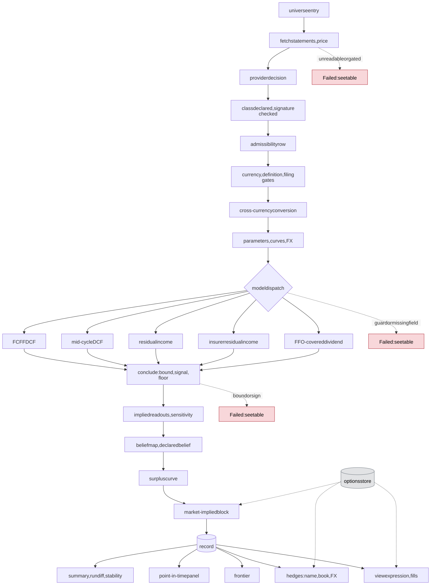

# Flow: ticker in, record out

The chart shows stages only; `docs/flow.mmd` is its source and the two change together.
Every `failed_reason` a record can carry is in the table below against the stage that
emits it, with variable parts in parentheses, so a line of `output/summary.txt` can be
traced to a stage. A test asserts that every reason string in the code appears in this
file.

## Every Failed reason, by stage

| stage | reason as the record carries it |
|---|---|
| read | stderr: cannot read financials; no record |
| declaration | ticker identity: SEC's ticker map gives CIK (now) ((title)) for (ticker), the universe entry declared CIK (map_cik); or: no longer lists (ticker); refused before anything else |
| declaration | entity_class not declared |
| declaration | entity_class not declared; statements indicate (Bank or Insurer) (evidence) |
| declaration | class disagreement: declared OperatingCompany, statements indicate (Bank or Insurer) (evidence) |
| admissibility | no admissibility row for entity class (class) in the reference table |
| admissibility | dcf not admissible for (class); lens: (lens) |
| country | country not determinable from the fetch |
| point-in-time gates | no point-in-time statements: (vendor provider carries no filing dates, or filed statements lag on the date: ...) |
| point-in-time gates | no point-in-time shares: no cover page or balance-sheet count filed by the date, or no share count within 400 days of the period |
| point-in-time gates | rate source has no history for (currency) |
| currency gate | financial currency disagreement: filing (X), vendor (Y) |
| definitions gate | field definition mismatch: (field) follows (recorded), reference/field_definitions.json defines (name); refetch the statements |
| filing age | latest annual filing is N days old, older than its max_filing_age_days 400 |
| currency gate | missing market data: financial_currency, or missing market data: trading_currency |
| FX | fx not fetched for (financial)/(trading): run python/refresh_fx.py with your FRED key |
| FX | fx not available for (financial)/(trading) |
| FX | fx for (code) (as_of date) is N days old, older than its max_age_days M |
| parameters | risk-free curve not fetched for (country): run python/refresh_rates.py with your FRED key |
| parameters | no risk-free curve for country (country) |
| parameters | *(no reason: a domicile declared in `rate_sources.json`'s `no_curve_fallback`, whose statements and price are in one currency, takes that currency's curve and keeps its own country risk premium; the risk-free parameter's source says "trading currency; domicile curve unavailable")* |
| parameters | no currency declared for domicile (country) in fx_sources |
| parameters | *(no reason: a domicile whose own currency, declared in `fx_sources.json`'s `country_currencies`, is not the one its statements and price are both in takes that currency's curve and terminal growth and keeps its own country risk premium and tax rate; the risk-free parameter's source says "reporting currency; the domicile's own currency is (code)")* |
| parameters | no (equity_risk_premium, statutory_tax_rate or terminal_growth_rate) for country (country) |
| parameters | risk-free curve for (key) has no (tenor) tenor |
| parameters | (parameter) for (key) (as_of date) is N days old, older than its max_age_days M |
| parameters | (parameter) for (key) has as_of (date), later than the valuation date (today) |
| EBIT policy | operating income not filed; derived EBIT misses the cross-check ((recipe): derived (x) against the vendor's (y), (d)% beyond the 2% threshold, or: no vendor operating income to check against) |
| mid-cycle window | mid-cycle normalisation needs at least 8 annual return observations, have (k); the provider carries (n) periods |
| mid-cycle window | mid-cycle reinvestment needs at least 8 periods with capex, d&a, delta_nwc and nopat, have (k) |
| mid-cycle guards | through the cycle the business did not earn a positive return on its capital ((mean roic r over k observations) or (the sum of nopat over n periods, s, is not positive)) |
| mid-cycle guards | through the cycle the business reinvested more than it earned (reinvestment rate r) |
| DCF period | no fiscal periods in statements |
| DCF period | missing market data: (fields); missing statement fields for fiscal period ending (date): (fields) |
| DCF guards | price (p) and market cap (m) must be positive |
| DCF guards | projection horizon (N) years is negative |
| DCF guards | wacc (w) does not exceed terminal growth (g) |
| DCF guards | non-positive free cash flow (v): the DCF is not applicable; declared (class) |
| DCF growth | growth not derivable: (why) |
| DCF value | fair value is not finite (enterprise value (ev), shares (n)) |
| residual income guards | book equity (b) is not positive |
| residual income guards | roe not derivable: need 2 fiscal periods with net income and positive book equity, have (n) |
| residual income guards | payout not derivable: need 2 fiscal periods with positive net income and dividends paid, have (n) |
| residual income value | fair value is not finite (equity value (e), shares (n)) |
| insurer | insurer model requires filed-statement data; (why: no SEC filings for (ticker), or the period carries no AOCI or premiums earned) |
| BDC guards | missing statement fields for fiscal period ending (end): net_asset_value_per_share, net_investment_income, distributions_per_share, weighted_shares |
| BDC guards | net asset value per share (v) is not positive |
| BDC guards | distributions per share (d) is not positive; there is no coverage to read, and the distribution is the point of the lens |
| BDC guards | net asset value growth needs two periods carrying a filed net asset value per share, have (n) |
| REIT guards | the filer's leases are financing receivables; NAREIT FFO does not apply |
| REIT guards | ffo (f) is not positive |
| REIT guards | ffo growth needs two periods with ffo and weighted-average shares, have (n) |
| REIT guards | cost of equity (ke) does not exceed terminal growth (g) |
| conclude | non-positive fair value (v): model not applicable |
| conclude | margin of safety (m) exceeds sanity bound 5.00: likely structural break; check entity_class |

The stretch block is never a `Failed` either: on every record whose price history holds
250 closes on or before the date it carries the six measures with their own-history
percentiles and the two counts (`stretch_low`, `stretch_high`) against
`reference/stretch.json`; a shorter history carries `stretch_reason` instead. The summary
counts the names at or above 3 on each side and prints a line for each with its measures
and the anchor beside it; whose thesis it corroborates is the reader's, the tool holds
none.

The market-implied block is never a `Failed`: on an `Ok` record run with `--options` it is
either present or null with one of `no options data`, `no options snapshot within (N)
days before (D)`, `no expiry >= 365 days with >= 8 quoted strikes on each side`, or
`smile fit failed: (why)`.

## Reading the chart against a run

`output/summary.txt` lists each ticker's `failed_reason`; find the same string in the
table to see which stage produced it. Every `Failed` record still carries `floor` and
`scope_limits`, so the floor applies to every terminal, not only the drawn one.

The universe file declares and does not remember: a run's outcomes live in its records,
and the acceptance of any change is the run diff against the previous run
(`--baseline`), with every moved input classified against the previous snapshot
(`--baseline-snapshot`).

## The build-out readout

A record that refused because it is investing more than it earns says nothing else today.
The build-out readout (60) says the one thing that can be said, and **it is not a model**:
the record stays `Failed` with its own reason, gains no fair value, no margin of safety and
no signal, and nothing downstream — frontier, hedges, panel — reads it. **It adds no
`Failed` string and can never fail a record.**

It appears on a record declared `Cyclical` or `OperatingCompany` that failed the mid-cycle
observation guard or the non-positive-free-cash-flow guard, whose latest capex exceeds its
depreciation and whose latest operating income is positive; any other record carries neither
`build_out` nor `build_out_reason`. A record the readout is about but cannot draw carries
`build_out_reason` instead: the latest capex does not exceed depreciation, the latest
operating income is not positive, a field is missing, or the two declarations are absent.

**Two declarations per name, in the universe entry**, each a value, the evidence for it and
a date, both or neither: `build_out_return`, the after-tax return the new capital earns once
earning, and `build_out_lag_years`, whole years from spend to first earning. The name's own
recent return on capital is the natural citation in the `why` and is **never** the input.
**A declaration is in the units its holder reasons in** (63): the return is declared *after*
depreciation, as every filing states one, and the readout converts it to the cash yield it
needs by adding the same depreciation-to-capital ratio it then charges as maintenance. Both
figures and the ratio go on the record, the return axis and the contour are in accounting
terms, and a tranche's free cash flow is exactly the declared return on its cost.

**The split is the depreciation rule, stated.** Growth capex in a year is capex less
depreciation where positive; maintenance is depreciation, because no filer discloses the
split. The surface runs the return from fifteen points under the declaration to fifteen over
in one-point steps, and the lag from zero to six years. At each point the value is the
standing business — the latest free cash flow with maintenance capex in place of the capex
actually spent, held flat, as a perpetuity at the settled terminal growth — plus the last
three years' growth capex as tranches, each earning the converted cash return on its cost
from the lag after its spend, less its own maintenance at the company's
depreciation-to-capital ratio, as a flat perpetuity; less net debt, per effective share. The WACC, the tax rate and the
terminal growth are the ones the DCF resolves for the name, from the same functions.

The readout is the **price contour**: per lag, the return at which the value equals the
price. Where no return in the declared range reaches the price, or the price is below the
whole range, the contour is null and says which, with the figure at that end — and that is
itself the readout, not a gap.

Its scope limits go on every block: the maintenance split is a proxy; the standing business
is held flat, which understates a growing name and overstates a fading one; every dollar of
growth capex is valued as if it becomes earning capital, which no build-out achieves. It is
a map of what the price requires, not a value.

## The runway readout

The Unprofitable class is refused by design, its lens being cash runway against the
catalyst calendar, and until brief 76 the record carried the lens's name and nothing of
the lens. Every Unprofitable record now carries `runway`, or `runway_reason` saying why
not, beside its own refusal. No other class carries either field: the question is not
theirs.

The reading is the latest period's cash and short-term investments as the cash definition
reads them, the period's free cash flow from the cash-flow statement's own lines, net cash
from operating activities less capital spending, both as filed or as the vendor reports
them, the burn where that is negative, the years of runway as cash over burn, and the
release dates the earnings calendar puts inside those years, counting the next when it has
not passed and stepping at the calendar's median cadence. A period that funded itself
carries the block with `self_funding` true and no years. The history lists every filed
period's free cash flow so the reader sees whether the burn is narrowing.

Two things it is not. It is not free cash flow as the DCF reads it: that engine derives it
from EBIT, and this reads the filer's own operating subtotal, because a loss-maker's
GAAP loss is full of charges that never left the bank, stock compensation and fair-value
marks among them, and the first draft of this readout, built on net income, read BBB
Foods as burning five times what its cash-flow statement shows. And it is not a forecast:
the burn is one filed year's, not a run-rate, and a name whose burn is halving each year
reads the same as one whose burn is doubling, which is what the history beside it is for.
Nothing here is a fair value, a floor or a signal, and nothing downstream reads it.

## Fetched data

Nothing obtained from a data provider is tracked. `reference/` holds declarations and
attributed vintage tables; the risk-free curves and FX rates are written by the refreshers
to `data/reference/`, gitignored at that path and at their old paths under `reference/`,
and read by the batch from `--fetched DIR` (default `data/reference`).

Point-in-time writes its own per-date copies under `data/pit/(D)/reference/` and the panel
passes that directory as both `--reference` and `--fetched`. A record that needs a curve
or a rate the user has not fetched fails naming the refresher to run.

## Market-implied

The options store and the readout beside the declared belief. The terminal is
self-contained: `tools/thetaterminal/` (gitignored entirely) holds the jar the user
downloads, its config and logs; `python/theta_terminal.py start|stop|status` reads
`THETADATA_EMAIL` and `THETADATA_PASSWORD` from the environment (direnv loads `.env`),
writes a creds file there with mode 600, launches the jar with `--creds-file`, and removes
the file once the port answers; it never prints a credential.

`python/fetch_options.py <ticker>... [--as-of D]` writes the full end-of-day chain for the
date, every expiry and strike unfiltered, with the underlying's close from the stock
endpoint, to `data/options/<date>/<TICKER>.json`. The batch reads the store only under
`--options DIR` and never requires it: without the flag a record carries neither
`market_implied` nor `market_implied_reason`.

Every number in the block is risk-neutral: it embeds the market's risk pricing and is not
a forecast, and the spot it is read from is the snapshot date's close, which may differ
from the record's price. The growth axis is approximate: a horizon of one to two years
stands in for the long run. The detail is in `docs/market-implied.md`.

## Hedging

Single-name hedging runs beside the batch and touches no record: `python/hedge.py` takes
an untracked holdings file (ticker, shares, horizon, exactly one constraint), reads the
name's chain from the store (the latest snapshot at or before `as_of`, the same rule as
everywhere), the per-expiry smiles from `atemoya-smile` (the constrained fit, expiry by
expiry) and the name's fair value and risk-free rate from the latest run.

Four structures are priced from quotes, ask for what is bought and bid for what is sold; a
missing leg or a leg more than five vol points off the smile excludes the candidate;
cost, floor and cap per candidate, distribution-free; the exact Pareto set; the declared
constraint selects and nothing is recommended without one. Capping the upside is a
declaration: a collar or covered call is selectable only when the entry declares
`min_cap_pct` and the cap is at or above it, else only puts and put spreads, the output
saying which. One risk-neutral floor probability comes from the smile's density; the
scope limits sit on every output. No model price, no sampling.

A book: `python/hedge_book.py` reuses all of it on one index's chain, each holding
declaring its beta with a why and a date (`python/beta.py` reports a regression beside it
that the hedge never reads), exposure = shares x spot x beta summed, whole contracts with
the residual reported, the book's floor and cap from the index payoff on the declared
betas, the book floored at zero; an index absent from the store is refused with the fetch
command named.

Currency exposure: `python/hedge_fx.py` sells the declared exposure forward with CME FX
futures from the dated table `reference/fx_futures.json` (strict loader), the forward by
covered interest parity on the fetched curves, the spot the ECB's daily reference rate as a
dollar cross of two ECB rates from `data/reference/fx_spot_daily.json`
(`refresh_fx.py --daily`, the valuation path never reading it; a missing file names the
refresher), the vendor's front quote as a flag, whole standard and micro contracts with
the residual, the margin, and a deterministic payoff grid; a currency not in the table is
refused by name and a missing curve names the refresher.

A declared view: `python/express.py` prices every vertical on the view's side from
quotes, applies the holder's probability only where the max-profit region is exactly the
declared one, the short strike at the quoted strike nearest the level (every other
candidate null with the reason and listed, not ranked; the ranking answers only how wide
and debit or credit), puts the risk-neutral probability of the payoff regions beside it,
ranks by expected value per dollar at risk with the disagreement shown, and states the
implied-against-realised volatility diagnostic; a view without a probability or a why, or
a name without a chain, is refused.

The fill model: `python/fetch_tape.py` stores the trade tape with the quote at each print
(a subscription-tier refusal reported as the vendor words it), `python/fill_model.py`
builds empirical quantiles of the fill position per name, moneyness third, spread width
and half-hour, nothing fitted and symmetric by construction, `--fill-model` prices each
leg of a vertical at its cell's median fill instead of the flat slippage, never both, and
`python/fills_vs_model.py` reads a holder's own fills against the table. The detail is in
`docs/hedging.md`.

## Frontier

`python/frontier.py <candidates.json>` is Smith and Smith's endgame: for an untracked
candidate set, the distribution of the portfolio's value surplus (the margin of safety)
under the declared beliefs, and the long-only weightings that minimise downside risk at
each level of expected surplus. It needs a batch run whose records carry a belief and its
41-point surplus curve, the correlation section of `reference/beliefs.json` (one declared
common-factor number, per-pair overrides optional, never estimated), and the draws and
seed in `reference/params.json`.

Each name's marginal is its truncated normal; the joint is a Gaussian copula. Risk is
downside-only: the probability of a negative surplus, LPM1 at zero and CVaR at 95%; the
standard deviation is reported beside them and never optimised. The frontier minimises
CVaR95 at each target mean by the Rockafellar and Uryasev linear programme; the
minimum-p_negative, minimum-CVaR and minimum-std portfolios are reported side by side,
with the current weights when given.

Names that are Failed, absent or without a belief are listed with the reason and
excluded; the universe is never the candidate set. Output goes to
`output/frontier/<candidates-file-name>/` as a JSON, a text summary and a two-panel
plot, expected surplus against p_negative and against CVaR95. When every candidate's
p_negative is one, the summary says the frontier is not informative at these prices and
the output is still written.

## Required return

CAPM is the default cost of equity and is never silently replaced. A declared required
return is a premium in percentage points over the country's risk-free rate, resolved per
name (a `names` entry, else the class default, else CAPM) from
`reference/required_returns.json`, both sections empty until the user declares one, or a
further `--required-returns` file. The rules of use:

1. **A required return is yours.** It is declared, dated, and carries a why: a premium in
   percentage points over the country's risk-free rate at the model's tenor. The tool
   never derives it from a beta, a prior or history. The loader accepts exactly three
   fields (`premium_over_rf`, `why`, `as_of`) and refuses anything else.
2. **Revise it by a dated declaration when evidence warrants**, never because of what a
   number looks like.
3. **The parameter is the premium over the risk-free rate**, so a declaration serves every
   currency: on the cross-currency path it replaces beta times ERP and the country
   premium, and the risk-free rate stays the trading currency's.
4. **A declaration moves the anchor**, not the signal thresholds; the readouts, the
   sensitivity step, the belief map and the probability all run on the rate used.
5. **Every record stamps `required_return_version`** when a declaration applies, and the
   run diff names every record whose version changed.
6. **Class defaults and per-name entries are tracked** in `reference/required_returns.json`;
   both sections ship empty. A further file given as `--required-returns` overrides the
   tracked entries.
7. **CAPM is the default and is never silently replaced.** Every Ok record carries
   `cost_of_equity_capm`, `cost_of_equity_used` and `required_return_source`, so the gap
   between the two rates is visible on every record a declaration touches.

## Definition rules

**(69) The residual-income path reads the common side of the filing.** Residual income values
common equity, and preferred stock is a claim senior to it: its dividends are not the common
holder's income and its carrying value is not the common holder's book. So on that path —
and on no other — income is `NetIncomeLossAvailableToCommonStockholdersBasic` where filed,
else net income less the filed preferred dividends; book is stockholders' equity less the
filed preferred carrying value; and the payout numerator is the filed common-dividend element,
else dividends paid less the preferred dividends. `net_income`, `book_equity` and
`dividends_paid` themselves are untouched, so no DCF-shaped, REIT or BDC record moves.

**Both or neither.** The filing does not always support all three. A filer that pays preferred
dividends but files no carrying value for it — Morgan Stanley files none at all, and PNC,
MetLife and UnitedHealth file a par line of exactly zero beside real preferred — can give a
common income but not a common book, and common income over total book is neither reading: it
divides a return that belongs to one claim by a book that belongs to two. Where the filing
cannot support both, every figure stays on the total-equity basis and `common_basis_why` says
so. A par-value line of zero does not resolve the carrying value, because presence of the tag
is not evidence of preferred stock.

The one exception is **redeemable preferred**, which is mezzanine equity and never sat inside
stockholders' equity at all: there the income is the common holder's after the preferred
dividend and the book already is, so the income moves and the book does not. Deducting it
would take out something that was never in.

`PreferredStockLiquidationPreferenceValue` is deliberately not a fallback: on filers that file
both it equals the carrying value for some and differs every year for others, and one field
cannot mean two things.

**Preferred dividends are not common distributions (69).** Brief 65's rule reads a filing with
its financing section filed and no dividend element as saying it distributed nothing. The
preferred elements now sit in `preferred_dividend_evidence` rather than `dividend_evidence`,
so a preferred dividend no longer blocks it; a combined common-and-preferred element, and
minority and affiliate distributions, still do. They are moved within the same file rather
than deleted, because the restatement scan harvests every element name the tracked reference
files carry and dropping one would rewrite restatement rows on records that never read it.

The rules of `reference/field_definitions.json` that decide whether a filed field exists
at all:

1. **Working capital has three kinds and a refusal.** A cash-flow `IncreaseDecreaseIn*`
   component is an asset (positive when the balance grew, an outflow, added), a liability
   (positive when the balance grew, an inflow, subtracted), or a net balance of assets
   less liabilities (added like an asset); an excluded tag sits in the operating section
   but is not working capital and is never summed. A tag in none of the four leaves the
   field null with a note naming it, never a partial number. Every tag was checked
   against its us-gaap definition and the vendor's working-capital line on a real year
   before it entered the table.
2. **Debt is zero only when the filing says so twice.** No debt tag for the period and no
   interest expense or interest paid for the period gives total debt 0, recorded as "no
   debt line filed and no interest expense filed; taken as 0". Either present without the
   other leaves the field null: a filer paying interest owes something.
3. **The mid-cycle model's NOPAT has two recipes, one per name.** Where every year in the
   window carries an operating-income line the filer itself reported, NOPAT is that line
   after tax, at the year's effective rate where the DCF's rule derives one and the
   statutory rate otherwise, so a non-operating one-off never enters the window. Where a
   filer reports none, it is bottom-up: net income plus interest expense times one minus
   the statutory rate, per period from filed lines, and the through-cycle mean is what
   dampens one-offs. A window never mixes the two; `nopat_recipe` names the one used, and
   the EBIT policy does not apply on that path under either.
4. **The latest-period gate is the model's.** `required_on_latest_period` in the
   definitions names, per model, what the latest fiscal period must carry: everything the
   DCF reads (FCFF is that year), the balance sheet only for the mid-cycle model (its
   reinvestment rate is a ratio of sums and its NOPAT applies a through-cycle return to
   today's capital). Inside the mid-cycle window a period lacking a flow is excluded from
   the sum it cannot serve, named on the record, and the guards count what remains: at
   least 8 return observations and at least 8 periods in the reinvestment sums.
   **A year the company was too small to compare leaves the return average too.** The
   through-cycle return is `NOPAT_t / IC_{t-1}`; when the business was a fraction of its
   present size that ratio describes a different firm, and the window is there to hold two
   commodity cycles, not two corporate lifetimes. A period whose opening invested capital
   is below `midcycle_scale_floor` (declared and dated in `params.json`, a tenth of the
   latest period's capital) is dropped from the average and listed on the record as
   `{period_end, sum: "roic", missing: "opening capital below the scale floor"}`, exactly
   as any other exclusion; the eight-observation guard then counts what remains, so a name
   with too little comparable history fails with the count instead of valuing on the wrong
   ratio. The reinvestment sums are untouched, because a ratio of sums over the window is
   not distorted the way a mean of ratios is: those years' flows barely enter either sum.
   Changing the floor is a dated declaration, never a tuning.
5. **D&A is the largest filed total**, inside the FFO recipe too. **Under IFRS it
   excludes impairment**: the pure tag first; where absent, the inclusive tag less the
   impairment filed (the total, else its components) plus the reversal filed, recorded as
   `inclusive_less_impairment` with every tag; an impairment the filing does not tag is
   never subtracted; the plain adjustment tag as a total when neither is filed; and when
   no total of any kind is filed, `DepreciationExpense` plus `AmortisationExpense`, both
   required, as `sum_of_components_ifrs`, the right-of-use depreciation not added because
   on TSMC the two-tag sum matched the vendor's row within the threshold. When several
   D&A total tags are filed in one period the field is the largest, since a total is
   never smaller than any of its components; every candidate is recorded with the tag
   taken. The components fallback applies only when no total is filed.

   **Below the totals the chain reads the filer's own cash-flow reconciliation, not its
   notes** (62). Brief 61's own-year rule made the difference visible: where a filer files
   no total, `Depreciation` and `AmortizationOfIntangibleAssets` are often the property and
   intangible note figures, while the reconciliation's own lines are `OtherDepreciation-
   AndAmortization` and `AdjustmentForAmortization`. So the combined line is read first,
   with the amortisation line added when it is filed separately, as `cash_flow_lines`;
   the note pair is below it, and the amortisation line is preferred inside the pair too.
   **The note pair needs both parts.** Depreciation alone is a filer's whole D&A only when
   it has no intangibles to amortise, so the pair stands when both are filed and otherwise
   only when the filing carries no finite-lived intangibles balance at all; a filer with
   intangibles that tags no amortisation anywhere has a line it did not tag, and the period
   carries no D&A rather than a depreciation figure standing in for a total.
6. **Debt components are summed when no aggregate or complete pair is filed.** A filer
   with fewer instruments is not missing data: one component per kind, recorded;
   absent-is-zero applies only when no component and no interest tag is present.
   **Interest evidence has a sign and a size** (65). A trace of interest is not the filing
   saying a second time that the filer owes something. Interest counts as evidence only
   when it is an expense — a figure that is income never does, whatever its size — and when
   it exceeds `interest_evidence_floor` of operating income, a declared parameter at half a
   per cent. The floor needs a scale, so it is applied only where operating income is filed
   and positive; with no operating income line, or a loss, the evidence stands and the
   field stays null. Both conditions are written into the debt source on the record when
   the rule fires. Only a filer that tags no debt line at all ever reaches this test.
   **The evidence includes the accrual** (72). `InterestExpenseOther` is an interest line
   and joins the list; and where a filing tags no interest expense at all, a positive
   `InterestPayableCurrent` (or its current-and-noncurrent form) is read after it under the
   same sign and size test, because a filer that owes interest at the year end owes
   something. Ford's own FY2024 filing tags the first and its own FY2018 filing only the
   second, its debt instants being dimensioned by segment and never reaching companyfacts,
   and the rule had written total debt 0 on both years; both now stay null with the tag
   named. **A fallback period's balance sheet** (72). A period no filing reports as its own
   year is read from the latest filing that carries it at all, which for the third-oldest
   year of a three-year filer presents that year's income statement and not its balance
   sheet. On such a period, and only such a period, cash and debt the chosen filing does
   not resolve are read from the latest annual filing that carries the line, the source
   saying so; a period read from its own year keeps its own presentation, so a line its
   own filing did not tag stays untagged.
7. **AOCI by components.** When the aggregate is absent the filed components are summed,
   recorded as `sum_of_components` with each component.

   **A filer that has never distributed anything retains everything** (65). An absent
   dividend tag cannot tell "none" from "not filed", so it alone still refuses. The
   cash-flow statement's financing subtotal settles it: a period whose filing carries that
   subtotal and no dividend or distribution element of any kind — the wider
   `dividend_evidence` list, preferred and minority included, not the common-stock payments
   the models read — has said it paid none, and the period carries `no_distributions_filed`.
   On the residual-income path, two such periods with positive net income give retention 1
   with the source on the record; either condition missing leaves the existing refusal.
8. **FFO does not apply to a financing lease.** A triple-net REIT may account for its
   properties as sales-type or direct-financing leases: they are then net investments in
   leases, they earn interest rather than rent, and there is no real-estate depreciation
   to add back, so NAREIT FFO is not the measure and net income under its name would be a
   receivable dressed as property. When the period files no depreciation total and the
   filer carries both the net-investment-in-lease balance and the interest earned on it,
   `ffo` is null with the reason "the filer's leases are financing receivables; NAREIT FFO
   does not apply", and the REIT model fails with that string instead of naming a tag it
   could not find. The balance alone is not evidence: an insurer may hold direct-financing
   leases inside an investment portfolio and never ask for FFO.
9. **A sub-line stands as a total only where nothing else is filed.** `OtherDepreciation-
   AndAmortization` is defined as D&A classified as other, so it is never a candidate
   under the largest-total rule and cannot displace a filed total; below the totals it is
   the filer's own combined line and is read there (62, rule 5 above). Capitalised
   internal-use software is read as capex on the same footing, last in the tag order, so a
   filer tagging purchases of property, plant and equipment is untouched. **An aggregate
   that already carries what a component would add is read whole**: a filer presenting one
   balance-sheet line for cash, equivalents and short-term investments tags
   `CashCashEquivalentsAndShortTermInvestments`, which is searched after the two
   cash-equivalents elements so no period that resolves moves, and the short-term
   investments component is not added again.
10. **Interest stand-ins on the mid-cycle path only.** When no interest-expense line is
   filed, a net non-operating interest figure negated, else cash interest paid, stands
   in, recorded as `net_nonoperating_interest` or `interest_paid_stands_in` on the period
   and on every observation; the DCF path's EBIT policy never reads a stand-in.

### A period's statement comes from one filing

A filer's companyfacts carry every filing that ever reported a fiscal year, and the same
period appears in the year's own 10-K and again as a comparative column in the next two or
three. Those columns are **regrouped to the later year's presentation**: a line the filer
once tagged on its own may be folded into another. Taking the newest fact per tag, tag by
tag, therefore mixes two presentations inside one period and counts a folded line twice —
Apple's FY2021 other-liabilities line reads 5,799m in its own 10-K and 7,475m in the FY2023
one, the difference being exactly the contract-liability line the FY2023 filing absorbed and
the FY2022 filing still tagged separately.

So **a period's values all come from one accession**: the filing whose own fiscal year the
period is, identified as the filing whose newest annual duration fact ends at that period.
A period no filing reports as its own year falls back to the latest filing that carries it.

A later filing that disagrees about a tag the record reads is recorded on the period as
`restated_from` — the tag, the value taken, the value not taken, and which filing it came
from — and **never used**. A restatement is a finding; which of two numbers to believe is a
judgement this tool leaves to its reader.

Where a filer tags both its own working-capital aggregate and the components that make it
up, the two must agree, and the period carries `working_capital_reconciled` with the gap.
Both numbers are the filer's own, out of the same filing, so the check needs nothing about
the statement's structure — and it is exactly the identity a period assembled from two
filings breaks. The fetch run tallies how many of those periods reconcile and names the
filers that do not. It gates nothing.

### Statements from ESEF

A name with no SEC filer whose universe entry declares an `lei` (73) reads its ESEF
annual reports from filings.xbrl.org, the keyless aggregator of the Inline XBRL every
issuer on an EU, EEA or UK regulated market must file. The identifier is declared, never
resolved: the vendor's ISIN lookup returned nothing for three of the four names and a
wrong code for one, and an LEI is a fact about the filer a human reads once from the
report's own cover.

**The facts arrive in the companyfacts shape and nothing downstream knows the
difference.** Each report's xBRL-JSON becomes entries with the period end, the value, the
report's id as the accession, the date it was added as the filing date and `ESEF` as the
form, and the same period reader reads them under the ifrs-full definitions: one period
per report (the rule above), the tag behind every number, the restatement scan, the
vendor cross-check beside. A fact with a dimension beyond the core five is a breakdown
and is skipped; a fact in a unit that is not a currency is skipped. A report is annual
when a duration of about a year ends at its period end, so Novo Nordisk's quarterlies in
the same format are skipped and named; two reports for one period end (a dual listing
files twice) resolve to the earlier-added one, the other named.

**An anchored extension stands in only where the standard line is absent.** ESEF filers
extend the taxonomy freely and must anchor each extension to the closest wider standard
concept in the report's definition linkbase, which is read from the package. Where a
report tags no standard fact for a concept the definitions read and does tag an extension
anchored to that one concept as narrower, the extension's value is read under the
standard concept and the note names both, because a narrower line is at most the wider
one and the reader is told which line stood in. An extension anchored to several wider
concepts, or to none, or to a concept nothing reads, is left alone; a standard fact in the
same report always wins. Sanofi's profit before tax reads this way; its depreciation does
not, its only depreciation line being an extension wider than two standard adjustments,
so the record carries none and says so.

### Statements from DART

A Korea Exchange line reads its annual reports from OpenDART (74) when the operator holds
a key, free on registration, read from the environment first and the env file second like
every other key and never printed. Nothing is declared: the regulator's own corporation
register maps the six-digit stock code to the eight-digit filer, cached for a day. Each
business year's annual report is one call, the consolidated statements line by line with
the account id, the current-year amount, the period the line covers and the receipt
number of the report, whose first eight digits are the day it was filed; a line whose
account id is a standard ifrs-full concept becomes a fact in the companyfacts shape and
the same period reader reads the year from its own report. A line under DART's own
account id, or under no standard code at all, is counted on the record and left unread
unless a declared reading, measured on the filers before it was written, says what it is:
DART's operating income, the line K-IFRS requires every filer to present, is the
operating income the ebit recipe reads; DART's one-line change in operating assets and
liabilities is the working-capital aggregate, negated into the boundary's sign (Samsung's
three filed years against the vendor's, to the won); and short-term borrowings filed under
no code at all are read by the regulator's own label for them, because a debt recipe
summing the tagged components would otherwise read Samsung as owing a fifteenth of what it
owes. Each reading is named on the record. What the face of the statements does not carry
stays absent: neither Samsung nor SK hynix presents depreciation on its cash-flow
statement, the reconciliation being in the notes the endpoint does not serve, so both
refuse the DCF for want of it, as Sanofi does, and the vendor's figure from the notes is
not taken in its place. The walk runs from this year back and stops after two empty years
in a row; the lag decision and the cross-check are the ESEF path's. Without the key the
name stays on the vendor and the reason says which key is missing.

### A lens that discounts nothing

Most classes here end in a model that projects something and discounts it. The BDC lens
does not. A business development company marks a portfolio of private loans and equity
stakes to fair value every quarter and states a net asset value per share; **that mark is
the fair value**, because the alternative is for the tool to re-underwrite loans it cannot
see. So there is no discount rate, no growth rate and no country parameter on that record
at all — the parameters gate the pipeline, they are not inputs to the lens.

What the record carries instead are four ratios of filed lines, which is what makes the
mark useful: the premium or discount the market puts on it (`price_to_nav`, and the signal
follows the margin of safety as everywhere, so a premium reads Sell and a discount Buy),
what the portfolio earns against it (`nii_yield_on_nav`), what the holder is paid
(`distribution_yield`), and whether the payment is covered (`nii_coverage`, net investment
income per share over distributions per share; below one the distribution comes out of
capital and erodes the mark, which `coverage_note` says and `nav_cagr` shows over the filed
periods).

Because there is no parameter, there is nothing to invert and nothing to step: the implied
readouts, the sensitivity block, the belief and the surplus curve are all absent with the
same reason, and the name never enters the frontier.

### The belief's parameter, per path

Every belief is a declaration about the one thing the long run turns on, and which thing
that is depends on the model. On the DCF, mid-cycle and REIT paths it is long-run growth,
offset around the country's terminal growth. On the residual-income path there is no
terminal growth — by design, since a bank whose return on equity equals its cost of equity
is worth exactly book — so the belief sits on **the long-run return on equity the ROE path
reverts to**, offset around the name's cost of equity.

That reversion target is a parameter of the model, defaulting to the cost of equity, which
is why every bank and insurer number is unchanged by its arrival. The fourth readout is
`implied_roe_target`: the long-run return on equity at which fair value equals price,
everything else held, bisected over ten points under the cost of equity to thirty over it.
Fair value rises with it, because the excess return the path settles at is the target less
the cost of equity and the explicit sum carries it with nothing after. `probability_overpaid`
is the belief's CDF there, and the surplus curve sweeps the same parameter, so those names
enter the frontier like any other.

### Where terminal growth comes from

The anchor every growth path reverts to is the country's long-run nominal growth in its
own currency, because that is the currency the terminal cash flow is in. The table is
`params.json`'s `terminal_growth_rate`, transcribed from the IMF World Economic Outlook —
the nominal GDP series in national currency, percent change at the last year of the
projection horizon, deliberately not the current year, which carries the cycle. The
vintage and its release date are on the table, `max_age_days` fails it when no newer
vintage is transcribed, and **there is no default row**: a country the table does not
carry fails the record naming the field. A cross-currency name takes the row of the
trading currency's country, not its domicile's, and so does a name whose statements and
price are both in a currency that is not its domicile's own.

## Beliefs

The belief parameter is terminal growth, fixed on the merits. This choice may be revisited
only on an argument about the model, never on what it does to a number. The rules of use,
in this order:

1. **A belief is yours.** It is declared, dated, and carries a why. The tool never
   estimates it from history; history, GDP and base rates are evidence you cite in the
   why. The loader accepts exactly six fields (`mean`, `sd`, `floor`, `ceiling`, `why`,
   `as_of`) and refuses anything else.
2. **Revise it by a dated declaration when evidence warrants.** A structural event, such
   as a supply shock that changes a company's long-run demand, a lost moat, or a
   regulatory change, is exactly the moment. Never revise it because of what a number
   looks like.
3. **The belief parameter is terminal growth, fixed on the merits.** Starting growth is
   observed from filings; the reversion speed is a structural assumption with its
   sensitivity shown; long-run growth is the question every investor can answer. This
   choice may be revisited only on an argument about the model, never on what it does to
   a number.
4. **`probability_overpaid` is a statement of your belief, not a frequency.** It is the
   probability, under your truncated normal on long-run growth, that the value surplus
   (the margin of safety) is negative: that long-run growth falls short of what the price
   needs. Its calibration can only be checked years later; its revision can happen today.
5. **Every record stamps `belief_version`.** Two runs with different beliefs are
   different runs, and the run diff says so on every record whose version changed. A run
   without a belief for a name records no version and no probability, with the reason.
6. **Every belief is tracked.** `reference/beliefs.json` holds one default per entity
   class as offsets around the country's settled terminal growth and, beside them under
   `names`, per-name absolute beliefs that override the default. A further file of
   per-name beliefs may be given as `--beliefs`; it overrides the tracked ones. Banks and
   insurers carry no belief: their model has no terminal growth.

## Insiders

Form 4, on every CIK-resolved record (66). **It never fails a record and adds no `Failed`
string**: a name without a CIK, or with no Form 4 in the year, carries `insiders_reason`
instead of a block, and nothing downstream reads either.

Open-market purchases (`P`) and sales (`S`) from the non-derivative table only; awards,
exercises, withholdings and gifts are counted by their code and never summed. Over ninety and
three hundred and sixty-five days: distinct buyers and sellers, dollars each way, the net, the
largest purchase with its owner and relationship as filed, and whether a chief executive or
financial officer bought. `cluster_buy` is two **distinct** insiders buying inside a fourteen-day
window in the trailing ninety days.

Everything is cut on the **filing** date, which the index carries and the document does not, so
the point-in-time panel reads only what was public on its date. The summary prints the ninety-day
counts beside every stretched name and then lists those **stretched with insiders on the other
side**. No score, no weight and no signal: the block counts and lists, and the reader decides.

## Consensus and surprise

A side output off the universe (82), drawn on the chart as a dotted edge that never reaches
the record. `python/consensus.py` takes the Street's bar for every name each day, keeps the
vendor's release history beside the filed quarters, and summarises each name's surprise
pattern and the pooled rate. **It adds no `Failed` string and fails no record.** Its own
states are written into its files, not into a record:

| file | state | as the file carries it |
|---|---|---|
| a day's name | failed | vendor failed: (exception) |
| a day's name | none: no consensus, not retried that day | the vendor carries no consensus for this name |
| a day's name | none: no consensus, not retried that day | the vendor lists the periods but no EPS or revenue estimate in any |
| a day's manifest | partial | (n) name(s) failed; rerun today to retry them |
| a day's manifest | gap | no run on this day; a consensus bar cannot be taken after the fact |
| a release | no period | no filed fiscal period ends 1 to 120 days before the release |
| a release, filed quarters | no filer | no SEC filer for this name: no filed period ends or quarterly revenue |
| a name's history | failed | vendor failed: (exception) |
| a name's history | none: the vendor answered and has no past release | the vendor's dated earnings table carries no past release with a reported figure |
| a window | zero estimate | estimate is zero: no surprise in percent |
| a summary | no pairs | no revenue bar was snapshotted before a release whose filed quarter is on disk |

## Changelog

- entity class (05): declaration, class check, admissibility, floor.
- bank model (06): the residual-income model for `Bank`, its guards and its inputs; the
  admissibility branch now routes to the first admissible model in the row.
- risk-free fetchers (07): risk-free curves come from a source registry in three tiers; a tenor
  substitution is recorded on the parameter, never silent. No new `Failed` string.
- insurer model (08): a second statements provider (filed statements via SEC XBRL) for insurers,
  the insurer model on AOCI-adjusted book, and the `Failed` string for an insurer whose
  provider had no filed statements.
- cross-currency (09): the currency gate, the cross-currency conversion and international CAPM, the
  minor-unit price guard at the fetch, and the `Failed` strings for a missing currency
  field, a missing FX pair and a stale FX leg.
- filed statements (10): filed statements as the primary provider for us-gaap annual filers, the
  provider decision on every record, the vendor cross-check, and the filing-age `Failed`.
- field definitions (11): one definition per field on both providers (`reference/field_definitions.json`),
  the composition on every period and in the DCF inputs, the ebit recipe, and the
  field-definitions gate with its `Failed` string.
- implied readouts and bounded EBIT (12): the implied readouts on every `Ok` record (headline untouched), the one EBIT
  refinement with its refinement policy as data, and the policy's `Failed` string.
- IFRS filers (13): the ifrs-full taxonomy and the 20-F as an annual form, the statement currency
  from the facts' unit, and the currency-agreement `Failed` string.
- companyfacts lag and implied horizon (14): the companyfacts-lag routing decision from SEC's submissions index (a new
  `provider_reason`, no new `Failed` string) and the implied horizon. 
- residual income without a terminal (15): the residual-income model loses its terminal spread; the cost-of-equity-versus-
  terminal-growth `Failed` string leaves with it.
- stability pass (16): dated snapshots, the stability classification of every moved input between two
  snapshots, and the two commands for snapshot three. No new `Failed` string.
- point-in-time (17): point-in-time records and the panel; three `Failed` strings for a date without
  filed statements, cover-page shares or rate history; held vintages declared on the record.
- REIT lens (18): the REIT model on the FFO-covered dividend, FFO per NAREIT from filed tags; the
  `Failed` strings for a non-positive FFO, too few periods for FFO growth, and the cost of
  equity against terminal growth on this path.
- share counts and point-in-time recoveries (19): two share definitions (a period's weighted-average diluted count for any flow
  per share, a point count for market cap), the point-in-time balance-sheet fallback and
  the same-period vendor check. No new `Failed` string; two reworded.
- universe declares only (20): the universe entry is exactly ticker, entity_class, why and
  scope_limits, loaded strictly; the expectation check and the note echo leave the batch;
  the record loses its per-name lens text. No new `Failed` string.
- model version, dated runs, the software class, a private universe (21): `model_version`
  on every record, summary and run diff; every `--out` run also under `output/runs/`;
  `HighGrowthSoftware` admits the DCF; `--universe` and `--snapshots` for a second,
  untracked universe file. No new `Failed` string.
- the cyclical class and the mid-cycle DCF (22): `Cyclical` and `dcf_midcycle` on
  through-cycle return on invested capital; period depth per model (the mid-cycle window
  parameter for the class, five otherwise); a declared `cik` on a universe entry;
  `PreProfit` renamed `Unprofitable`; the class's default scope limits on every record.
  Three new `Failed` strings (observations, return, reinvestment); the refusal string for
  the renamed class changes its class name.
- sensitivity and the belief map (23): the deterministic sensitivity block with declared
  readability steps on every Ok record; the belief map's price contour on the
  growth-then-terminal paths, its grid to `output/maps/`, and `plot_map.py` on
  matplotlib. No new `Failed` string; no headline moves.
- declared belief and probability_overpaid (24): a six-field truncated normal on long-run
  growth per class (tracked, offsets) or per name (`--beliefs`), loaded strictly;
  `implied_terminal_growth`, `probability_overpaid` in closed form and `belief_version` on
  every Ok growth-then-terminal record; the six rules of use above. No new `Failed`
  string; no headline moves.
- definitions coverage (25): the three-kind working-capital table with a net kind, the
  debt absent-is-zero rule and the aggregate-plus-convertible recipe, capex tags widened,
  bottom-up NOPAT on the mid-cycle path (no EBIT policy there), the declared CIK honoured
  point-in-time. No new `Failed` string; the mid-cycle missing-fields list names
  net_income and interest_expense instead of ebit.
- one universe (26): the seven names that lived only in a second, untracked list join
  `reference/universe.json`; that list, its snapshot root and its output root are gone;
  per-name beliefs live under `names` in `reference/beliefs.json`; `--universe` and
  `--beliefs` stay as generic options. No new `Failed` string; no number moves.
- mid-cycle window and D&A total (27): the latest-period gate per model in the
  definitions, exclusions named inside the mid-cycle window with a guard on the
  reinvestment sums, spot fcff a nullable readout; D&A the largest filed total with
  candidates recorded. One new `Failed` string (the reinvestment guard).
- no fetched data in the repo (29): the risk-free curves and FX rates move from
  `reference/` to gitignored `data/reference/`, written by the refreshers and read with
  `--fetched`; the registry seeds the curve file; two new `Failed` strings name the
  refresher to run when a file was never fetched.
- gaps from the first growth batch (31): thirteen working-capital tags verified into the
  three kinds and the excluded list, the component-sum debt recipe, AOCI by components,
  the FFO depreciation list with the largest-total rule, interest stand-ins for the
  mid-cycle NOPAT, Shell's IFRS capex line; one new `Failed` string, the non-positive
  free-cash-flow guard on the dcf path.
- IFRS depreciation, disinvestment, captive finance, ORCL (32): the IFRS D&A recipe
  excludes impairment by filed totals or components; a negative through-cycle reinvestment
  rate fails the mid-cycle model (one new `Failed` string); Caterpillar and Ford declare
  the captive-finance scope limit and the Cyclical class text names it; Oracle is declared
  Cyclical.
- the reinvestment floor (33): the mid-cycle reinvestment rate is floored at zero with the
  measured rate recorded beside it and a flag; the disinvestment guard and its `Failed`
  string are gone.
- declared required return (34): `reference/required_returns.json` with empty class and
  name sections and strict loaders; a declaration replaces CAPM above the risk-free rate on
  every model; both rates and the source on every Ok record; readouts, sensitivity, map
  and probability on the rate used. No new `Failed` string; no number moves.
- the value-surplus frontier (35): the surplus curve on every record with a belief, the
  declared correlation section (a draft at 0.20), the frontier parameters, and
  `python/frontier.py` with its measures and plot. No new `Failed` string; no number moves.
- terminal growth gets a source (57): `params.json`'s `terminal_growth_rate` stops being
  a set of undocumented judgements and becomes a transcription of the IMF World Economic
  Outlook's nominal GDP growth in national currency at the last projected year, with the
  vintage and release date on the table; the `default` row goes, because a table with a
  source has no default, and British Virgin Islands goes with it, having no series in a
  database it is not a member of. Every row rises, because the old values sat at roughly
  half of nominal growth, so **every DCF, mid-cycle and REIT record moves and the belief
  distributions shift up with their anchor** — by design, and no belief was adjusted to
  offset it. Residual-income records are untouched: that path has carried no terminal
  growth since the terminal spread was removed. No new `Failed` string.
- declarations in the holder's units, and the bank and insurer ceilings (63): the build-out
  return is declared as an after-tax accounting return on new capital, after depreciation,
  the units a filing states and a reader compares against, and the readout converts it to the
  cash yield it charges maintenance against, both figures and the ratio on the record; the
  two drafts are confirmed at 0.22 with a two-year lag and 0.14 with four. The `Bank` belief's
  ceiling goes to eight points over the cost of equity and the `Insurer`'s to five, the centre,
  the width and the floor unchanged, on the argument that franchise banks have held five to
  eight points over for decades — not on the readout it produces. No headline moves.
- the build-out readout (60): a record that refuses because it is investing more than it
  earns gains `build_out`, the surface of value across what the new capital earns and how
  long it takes to earn it, with the price as a contour per lag. A readout, not a model: no
  fair value, no signal, no new `Failed` string, and the record stays `Failed` with its own
  reason. Two declarations per name in the universe entry, drafted for AMZN and VG and
  marked for the user to confirm; `python/plot_build_out.py` draws it. Every other record
  carries neither field and is byte-identical.
- the rule panel sorted on beta: `python/rule_beta.py` gives every name in the rule panel a
  beta from the year's daily returns each June and reads the fifths' returns, alphas and
  the return earned per unit of beta, after Frazzini and Pedersen, "Betting Against Beta",
  NBER Working Paper 16601, December 2010, doi:10.3386/w16601, Novy-Marx and Velikov,
  "Betting Against Betting Against Beta", working paper, November 2018,
  doi:10.2139/ssrn.3300965, and Levi and Welch, "Best Practice for Cost-of-Capital
  Estimates", Journal of Financial and Quantitative Analysis 52(2), 2017,
  doi:10.1017/S0022109017000114. A side tool: no record on the valuation path moves and
  there is no new `Failed` string.
- the rule study on market-adjusted returns: `python/rule_alpha.py` scores the rule panel's
  sorts as the intercept of each fifth's monthly return on the market's, beside the rule
  study's raw tables and never in place of them, after Jensen, Kelly and Pedersen, "Is
  There a Replication Crisis in Finance?", NBER Working Paper 28432, February 2021,
  doi:10.3386/w28432, and Gormsen and Lazarus, "Duration-Driven Returns", working paper,
  April 2019, doi:10.2139/ssrn.3359027. A side tool: no record on
  the valuation path moves and there is no new `Failed` string.
- Lindt by its participation certificate: `LISP.SW` joins the universe, an operating
  company on the vendor's statements; the vendor counts that line correctly and the
  registered share wrongly, so the certificate is the line valued and the registered share
  stays out. No new `Failed` string; no existing record moves.
- eleven Swiss names: Zurich Insurance, Swiss Life, Julius Baer, Lonza, Straumann, Geberit,
  SGS, Kuehne+Nagel, Sonova, Partners Group and Swatch join the universe at a downstream
  reader's request, classes drafted and confirmed by the user the same day; six are valued,
  two insurers are refused for want of filed statements and three cyclicals for a short
  vendor history. Lindt & Sprüngli, also asked for, is left out: the vendor counts both of
  its share lines at one line's price, and the tool has no ratio between share lines. No
  new `Failed` string; no existing record moves.
- six Swiss franc reporters: Holcim, Sika, Schindler, VAT Group, Givaudan and Swisscom join
  the universe at a downstream reader's request, classes drafted and confirmed by the user
  the same day; three are valued, two cyclicals are refused for a short vendor history and
  one for a debt figure the vendor does not carry. No new `Failed` string; no existing
  record moves.
- vendor debt from the combined rows: where the vendor shows no Long Term Debt row, debt is
  read from its combined debt-and-lease rows, less the lease rows where it shows them and
  whole, with the source saying so, where it shows none; a nil from the subtraction is taken
  only when the period's cash flows show no borrowing or repayment and no more interest
  than the leases explain, otherwise the figure stays missing. Two records are valued where
  they were refused for the missing figure; no other value moves. No new `Failed` string.
- nine Swiss lines: Novartis, UBS, ABB, Sandoz, Alcon, Swiss Re, Logitech, Galderma and
  Richemont join the universe at a downstream reader's request, all trading in francs while
  reporting in dollars or euros, classes drafted and confirmed by the user the same day;
  six are valued and three refused, two for an amortisation figure the filer does not tag
  and one for the insurer model's need of filed statements. No new `Failed` string; no
  existing record moves.
- ten names: Wipro, Accenture, EPAM, Datadog, Global-e, Amgen, Krystal Biotech, Evolution,
  the Hong Kong line of China Merchants Bank and Recruit join the universe at a downstream
  reader's request, classes drafted and confirmed by the user the same day; six are valued,
  two are `Unprofitable` by the class text and two are refused on the vendor's statements.
  No new `Failed` string; no existing record moves.
- a consensus period the vendor misdates: a period dated more than 120 days before the
  snapshot day cannot be one still being forecast, so its `end_date` is null and
  `end_date_reason` says what the vendor sent, the figures kept. A side output; no record
  moves and no `Failed` string.
- the curve follows the currency: a record whose statements and price are both in a
  currency that is not its domicile's own (a dollar reporter domiciled in Israel, Singapore
  or the United Kingdom) discounted on the domicile's curve, a rate in another currency
  than its cash flows; it now takes the reporting currency's curve and terminal growth and
  keeps the domicile's country risk premium and tax rate, as a name that reports at home
  and trades abroad already did. `reference/fx_sources.json` gains `country_currencies`,
  each domicile's own currency, declared by hand. New `Failed` string: no currency declared
  for domicile (country) in fx_sources. Five records move, those of the five valued names
  the rule reaches, and no other.
- classes confirmed: the user confirmed the classes drafted for the fifty-seven names of
  briefs 71 and 81; Celestica and Dutch Bros move from `OperatingCompany` to `Cyclical` and
  are refused for too few through-cycle observations, and Kaspi gains its reason in full and
  a scope limit. No new `Failed` string; no other record moves.
- the tenge: `KZT` joins `reference/fx_sources.json` with the National Bank of Kazakhstan's
  official daily rate as its source (provider `nbk`, keyless, any calendar day, so the
  point-in-time path reads it too); the one tenge filer is valued where it was refused for
  no rate. No new `Failed` string; no other record moves.
- loose ends: the smile fit is computed once per chain and expiry in a run, which takes a run
  with the options store from about two and a half minutes to under one with the same
  bytes out; the peer-implied gap gains a wider item set in the broad study and
  `docs/tried.md` the result; IBM's operating-profit gap is explained on its entry; Taiwan's
  and Kazakhstan's curves stay manual with the probe recorded. No record moves; no new
  `Failed` string.
- three side tools on the run's outputs: `python/implied_cost.py` (the consensus-implied cost
  of capital, Easton's PEG, beside CAPM and the options-implied return),
  `python/earnings_reactions.py` (the move across each release against its consensus
  surprise) and `python/watch.py` (what changed between two runs). They read files and
  fetch nothing; no record moves and there is no new `Failed` string.
- terminal growth held to the risk-free rate, and three quality lines in the summary: where
  a country's terminal growth is above the risk-free rate the valuation discounts at, the
  model uses the rate and the parameter says so; five records move, none in dollars. The
  run summary lists the names not profitable, not generating cash, and issuing shares. No
  new `Failed` string.
- rate variants and the score in detail: `python/rule_variants.py` reruns the rule panel's
  records under a terminal growth held to the risk-free rate and under the equity risk
  premium of the date's vintage (`reference/erp_history.json`), and `broad_study.py` takes
  the quality score apart by value, signal and size. Studies: no record on the valuation
  path moves and there is no new `Failed` string.
- the rule panel and its study: `python/rule_panel.py` runs the point-in-time fetch and the
  binary on the five hundred largest filers each June since 2013, admitted by an
  industry-code rule checked against the declared classes, and `python/rule_study.py` reads
  the margin of safety beside the earnings yield on it. Side tools: no record on the
  valuation path moves and there is no new `Failed` string.
- the broad panel and its study: `python/broad_panel.py` forms a row each June since 2010 for
  every SEC filer with a ticker today, from SEC's frames and bulk monthly bars, and
  `python/broad_study.py` reads cheapness, quality and a peer-implied gap on it before 2022
  and since. Side tools: no record, no `Failed` string, nothing on the valuation path.
- quality: `quality` on every record whose statements are filed, Piotroski's nine signals
  with the accruals ratio and gross profitability, from two fiscal years and no model, or
  `quality_reason`; the fetch adds `quality_lines`. A readout; no new `Failed` string; every
  record is byte-identical with the two fields stripped.
- the growth shadow: `growth_shadow` on every record whose generic DCF completed, the value
  on the higher of the two growth estimates instead of the switch at zero net reinvestment,
  beside the headline and never replacing it. A readout; no new `Failed` string; every
  record is byte-identical with the field stripped.
- the R&D shadow is removed: measured on the panel it ranked names as the headline did, and
  the reason is structural, so the block, its fetch field, its parameter and its study
  section are gone; `docs/tried.md` records what was learned. Every record is byte-identical
  with the two fields it carried stripped; no new `Failed` string.
- the third EBIT recipe: revenues less the filer's total costs and expenses, plus interest
  where it sits inside those costs, a fallback the policy reads only where the derived
  figure misses the vendor cross-check and this one passes the same threshold; the user's
  decision, reversing "there is no third recipe". With `IncreaseDecreaseInDueToAffiliates`
  classified as a working-capital liability line, one record changes status. No new
  `Failed` string.
- India's curve: from the manual tier to the OECD ten-year through FRED, which answers the
  refresher but lags about two months, so a rupee record is still refused on the 45-day gate
  on most days. No new `Failed` string; no record's status moves.
- three statement rules: `IncreaseDecreaseInDueFromRelatedParties` is a working-capital asset
  line (Sea), the IFRS deferred-income-with-contract-liabilities adjustment a working-capital
  line (Spotify), and the IFRS depreciation chain ends on the cash-flow reconciliation's own
  pair where nothing earlier is filed (Spotify). Measured on every cached filer: only null
  fields gain a value. Two records change status; no new `Failed` string.
- two revenue elements: `RevenuesNetOfInterestExpense` and
  `RevenueFromContractWithCustomerIncludingAssessedTax` join the us-gaap revenue list, which
  left fifteen filers with no revenue or a part of it on some year. Measured on every cached
  filer: only the revenue field and the restated-tag list move. One record changes status;
  no new `Failed` string.
- the base rate: `base_rate` on a dollar record valued by a DCF-shaped model, how often
  companies of the same starting size grew as fast over five years as the record's path and
  as the path the price needs, from the table `python/base_rates.py` builds out of SEC's
  frames; or `base_rate_reason`. A readout; no new `Failed` string; every record is
  byte-identical with the two fields stripped.
- the mid-cycle recipe: where every year in the window carries a filed operating-income line
  the model's NOPAT is that line after tax, at the year's effective rate where derivable,
  so a non-operating one-off no longer enters the window as an operating year; where a filer
  reports none it stays bottom-up from net income and interest. `nopat_recipe` names which,
  `roic_mid_bottom_up` records the other mean beside it. Nine `Cyclical` records move; no new
  `Failed` string; every record outside the class is byte-identical.
- the expected-return lens on the point-in-time path: the risk-free rate it reads keeps its
  vintage there, as the valuation's own parameters do, where it had refused every record with
  a parameter dated after the date; and `baseline_study.py` gains its section. No new
  `Failed` string; no record moves outside `--options` on a point-in-time date.
- the options-implied expected return: under `--options`, `options_expected_return` on every
  record of a name that is not a fund, Martin and Wagner's expected return from three
  risk-neutral variances, beside CAPM and the declared required return, or its reason. A
  lens read after the batch; no new `Failed` string; no other field of any record moves.
- planned sales and the share of holdings sold: each insider window gains `plan_sales`,
  `plan_sellers`, `plan_dollars_sold` and `sellers_detail`, which the downstream project asked
  for to tell stock-pay selling from unusual selling. Counts and lists only; no new `Failed`
  string; a record on a snapshot fetched before them is byte-identical.
- the R&D shadow: `rd_shadow` on every record routed to the generic DCF, the value with
  research and development capitalised straight-line over the declared
  `rd_amortization_years`, beside the headline and never replacing it, or `rd_shadow_reason`;
  the fetch adds `rd_history`. A readout, not a branch: no new `Failed` string; every record
  is byte-identical with the two new fields stripped.
- the ticker-identity guard: `map_cik` on the universe entry, the CIK the SEC's ticker map
  gave when the entry was last confirmed; the fetch compares it on every run, live and
  point-in-time, and a difference refuses the record first, ahead of the class. One new
  `Failed` string, in the declaration stage; no record moves.
- SPCX: the ticker passed from a SPAC-strategy fund to Space Exploration Technologies on its
  listing, and the entry still described the fund; it is rewritten and the class is
  `Unprofitable`. No new `Failed` string; no other record moves.
- scope limit codes, Enbridge and Okta: every scope limit carries a stable code beside its
  text, declared in `reference/universe.json` under `scope_codes` and emitted on the record
  as `scope_limit_codes`, which the downstream project asked for so a reader can filter by
  rule; Enbridge moves from `OperatingCompany` to `RegulatedUtility` and is refused by class,
  and Okta gains the `goodwill_heavy` limit. No new `Failed` string; every other record is
  byte-identical with the new field stripped.
- the naive baseline and the holdout: `python/baseline_study.py` sorts the anchor study's
  rows by earnings yield, book-to-price and EBIT over enterprise value beside the margin of
  safety, and `reference/holdout.json` puts thirty-two names and every date after 2026-06-30
  aside from both studies before any model changes. A study, not a branch: no new `Failed`
  string; no record moves.
- two fixes the downstream project asked for: `fetch_all.py` refuses to start, exit 2, when
  `data/financials` is a real directory, since the batch would go on valuing it instead of
  the new snapshot; and a release history the vendor answers with no past release is `none`,
  not `failed`, as the daily snapshot already told the two apart. No new `Failed` string; no
  record moves.
- consensus and surprise (82): a side output the downstream project asked for, drawn off
  the universe and never reaching the record. `python/consensus.py` takes each name's
  Street bar every day it runs, this and next quarter and both fiscal years with mean, low,
  high, analyst count and the EPS trend at 7 to 90 days, idempotent per day, with a gap
  manifest for every day without a run and a fund's missing consensus kept apart from a
  failed fetch. Beside it, each name's release history on the vendor's Street-adjusted
  basis matched to its filed fiscal period, and quarterly revenue as first filed. The
  summary gives each name's beat rate and surprise over its last 8 and 12 releases, revenue
  pairs as snapshots come to precede releases, and the pooled rate; shrinkage is the
  reader's. Lumentum files revenue under an element the shared tag list lacks, so the
  module reads it beside the list, and widening the list is left to a measured change. No
  valuation record moves and no `Failed` string is added.
- thirty-two names and a holding-company class (81): the downstream project running a clone
  asked for thirty-two names over two days, the class judgments delegated to the tool as in
  brief 71 and every why saying what was read. Howard Hughes fits no class since it bought a
  specialty insurer: one set of consolidated statements now holds a land developer and an
  insurer, so the admissibility rule adds `HoldingCompany`, refused with the sum of the parts
  named, rather than giving it a place in `OperatingCompany`. Strategy is a `Wrapper`, the
  premium or discount to the bitcoin it holds being that lens exactly. Thales reads its ESEF
  reports by the LEI its own facts carry; Saab declares its LEI and stays on the vendor by the
  aggregator-lag decision. Twelve of the thirty-two value and twenty refuse with the reason on
  the record. Lumentum's refusal is a finding about the mid-cycle model rather than the name:
  its after-tax operating profit is built from net income, so a one-time loss on extinguishing
  convertible notes enters the window as an operating year and alone turns the mean return
  negative; the scope limit says so. Every one of the hundred and seventy-eight existing
  records is byte-identical between the previous tip and this tree on the same snapshot. The
  class refusal is the existing templated string, so no new `Failed` string.
- the anchor study (80): the first look at the outputs. Every panel row, valued on its
  quarter-end from what was known then, set beside the excess over SPY at a quarter, a
  half year and a year, grouped by what the record said: over the eighteen quarter-ends
  from 2022 to mid-2026 the anchors did not precede the price on their own side. Buys
  ran below the market at a year and sells about level with it; the cheapest quintile
  by margin of safety ran below the dearest; a belief that the price was almost surely
  overpaid preceded a year level with the market; and the sign of the margin matched the
  sign of the year's excess on 418 rows of 889. One regime, eighteen dates, no statistic
  claimed, and no model, belief or signal touched: a finding for the reader, recorded in
  full in `output/anchor_study/`. The panel builder gains a per-name daily cache and a
  switch to skip the Form 4 read, without which the rebuild spent an hour fetching
  documents the study does not read. No new `Failed` string.
- the home lines of 20-F filers read their own filings (79): Toyota's Tokyo line and
  AstraZeneca's London line declare the SEC filer by CIK, the ticker map knowing only the
  depositary receipts, and read the same IFRS statements their home lines trade on;
  AstraZeneca moves from the vendor's four columns to five filed years and Toyota stays
  on the vendor by the lag decision until companyfacts carries its June 20-F. MUFG is
  deliberately not declared: its 20-F is US GAAP against the J-GAAP its Tokyo line trades
  on, a third apart on net income, and the entry says so. A Japanese filed source is
  therefore not needed for any name held. No new `Failed` string.
- Hong Kong's curve from the Government Bond Programme's workbook (78): the HKMA open API
  stops at three-year Exchange Fund Notes, but hkgb.gov.hk publishes the institutional
  bonds' closing reference pricings daily as a workbook with the three, five, seven and
  ten-year benchmarks, keyless, read with xlrd, the newest dated row the observation and
  nothing substituted because the seven-year is a benchmark of its own; the one-year is a
  floating note with no yield and is not listed. The Government asks to be quoted as the
  owner of the pricings, which the source string does. Tencent's Hong Kong line values.
  Taiwan stays manual, every route probed and recorded. No new `Failed` string.
- Singapore's curve from MAS's own page (77): the API gateway needs a registered corporate
  account a foreign individual cannot open, but MAS's Daily SGS Prices statistics page
  renders the benchmark closing yields server-side and keyless, so the hand-copied entry,
  a hundred and seventeen days stale, gives way to it: the newest dated row, the tenors
  read at their own columns, the seven-year substituted from the ten-year and recorded.
  Sea and Grab clear the curve gate and stop at the working-capital field their filings
  lack. No new `Failed` string.
- the runway readout (76): every Unprofitable record carries cash against the burn, the burn
  being the cash-flow statement's own net cash from operating activities less capital
  spending, the years of runway, the filed history of free cash flow, and the releases the
  earnings calendar puts inside the runway; or the reason there is none. A new field on
  every period, `operating_cash_flow`, read as filed on both taxonomies and from the vendor's
  row, additive on the wire. No fair value, no floor, no signal; no other class carries the
  fields. No new `Failed` string.
- China's curve from ChinaBond (75): the hand-copied Chinese entry, a hundred and seventeen days
  stale, gives way to the China Government Bond yield curve China Central Depository &
  Clearing publishes, read keyless from the chart's own endpoint by a form POST and picked by
  the curve's id, every whole-year tenor on the grid and no interpolation. The other four
  manual entries were probed and stay, the registry saying why for each: Hong Kong's open API
  serves Exchange Fund Notes to three years and no bond yields, Taiwan's exchanges serve
  issuance and no curve, Singapore's gateway needs a registered credential, Kazakhstan's
  bank serves exchange rates only. No record moves: the one name priced in yuan is refused
  by class. No new `Failed` string.
- statements from DART (74): a Korea Exchange line reads its annual reports from OpenDART
  when the operator holds a key, the regulator's own register mapping the stock code to the
  filer and each business year's consolidated lines arriving with their ifrs-full account
  ids, the receipt day as the filing date, through the same period reader. Three declared
  readings, measured on Samsung and SK hynix: DART's operating income, its one-line
  working-capital change negated into the boundary's sign, and short-term borrowings filed
  under no code read by their label. One recipe rule: term deposits held outside cash
  equivalents join cash on top of the investment alternative, which no 20-F filer tags and
  which brings ASML's and Samsung's cash to the vendor's row exactly. On the run both Korean
  names move from the vendor to the filing and refuse the DCF for want of a depreciation
  line neither presents on the face of its statements. Taiwan stays on the vendor: MOPS
  refuses scripted requests and the exchange's open API carries no history. EDINET waits on
  a key. The pre-commit hook refuses the two new key names with any value. No new `Failed`
  string.
- statements from ESEF (73): a name with no SEC filer whose universe entry declares an
  `lei` reads its ESEF annual reports from filings.xbrl.org, keyless, in the companyfacts
  shape and through the same period reader under the ifrs-full definitions, with the
  anchoring read from each report's package so an extension anchored to one standard
  concept the definitions read stands in where the standard line is absent, the note
  naming both. Declared on Sanofi, Air Liquide, ASML and Novo Nordisk; Allianz is not on
  the aggregator. Two recipe rules came with it, measured on every ifrs-full filer:
  `RevenueFromContractsWithCustomers` after `Revenue`, the working-capital aggregate
  where no component is tagged, in the sign the filers that tag both were measured at,
  and the cash-flow reconciliation's combined depreciation adjustment only beside an
  impairment figure, because read without one it put Novo's impairment into free cash
  flow and lifted its value by half. On the run: ASML moves from the vendor's four
  columns to five filed years; Sanofi and Novo Nordisk, valued on the vendor before, now
  refuse for want of a depreciation line their reports do not tag, which is the honest
  reading; Air Liquide stays on the vendor by a recorded decision, the aggregator's newest
  report being past the gate while the vendor carries the newer year; HSBC's periods gain
  a depreciation figure its model does not read. No other record's periods move. No new
  `Failed` string.
- the debt a filing cannot show (72): the mid-cycle audit found the absent-is-zero rule
  writing total debt 0 on Ford for FY2018 and FY2024, a filer whose debt lines are
  dimensioned and never reach companyfacts and whose own filings tag interest as
  `InterestExpenseOther` or only as the accrual `InterestPayableCurrent`; both join the
  evidence, under the existing sign and size test, so both years stay null with the tag
  named. Measured on all 33 periods the rule fires on, Ford's two are the only ones that
  move. And a period no filing reports as its own year, read from a filing that presents
  its income statement and not its balance sheet, now takes cash and debt from the latest
  filing that carries the line, saying so: six periods on six names, three of them
  business development companies whose FY2021 debt had read zero. The three new element
  names add restatement rows on ten records that read none of them, recorded and never
  taken. The window floor of eight and the scale floor stay as declared, the audit having
  found every other lost observation working as written. No new `Failed` string.
- twenty-five names, Mexico, the terminal's jar and a Bundesbank placeholder (71): a
  downstream project running a clone asked for twenty-six names and four repairs. Twenty-five
  join `reference/universe.json` with the class judgments delegated to the tool and every
  why saying what was read; SK hynix was already here and Bending Spoons, which the project
  had no symbol for, is listed on Nasdaq as BSP. Two of the names report in pesos, so Mexico
  joins the four country tables from their own sources, the risk premium and tax rows from
  the vintages the files already carry, the terminal-growth row from the IMF's own SDMX
  service on the same April 2026 vintage (Denmark's two figures came back from the same call
  exactly as recorded), and a curve on the OECD monthly tier through FRED, probed before it
  was written; the peso now names Mexico as its curve's country. `theta_terminal.py start`
  fetches the terminal's jar from ThetaData's open download when it is missing, before the
  credentials step, streamed to a temporary file, checked by the zip magic and a minimum size,
  renamed into place atomically with its size and sha256 printed, never replacing a jar that
  is there unless `--update-jar` says so; and the login falls back from the environment to
  the env file at the repo root for whichever variable the environment lacks, as the FRED
  key and the SEC identity already did. The Bundesbank parser skips the `.` a holiday
  leaves in the series and takes the newest numeric observation, the ninety-day age check
  unchanged. No new `Failed` string.
- preferred dividends are not common distributions (69): the residual-income path reads the
  common side of the filing -- income available to common, book less the filed preferred
  carrying value, and a payout numerator of common dividends -- where the filing supports all
  three, and stays wholly on the total-equity basis where it does not, because common income
  over total book is neither reading. Redeemable preferred moves the income and not the book,
  since it never sat inside stockholders' equity. The preferred elements move out of brief
  65's dividend evidence, so a filer that pays preferred dividends and no common one reads as
  distributing nothing to common holders and SoFi values. `net_income`, `book_equity` and
  `dividends_paid` are untouched, so no DCF-shaped, REIT or BDC record moves; twenty-one
  bank and insurer records do, on purpose. No new `Failed` string.
- the earnings gate for the options tools (68): every record gains an `earnings` block, Ok or
  Failed -- the next results release, where the date came from, what the last eight releases
  did, and what the option market charges for the next one. The calendar is filed and keyless,
  every 8-K carrying item 2.02 over five years from SEC's own index, with the vendor's dates
  where a filer files none; the next date is the vendor's where it carries one and a
  projection from the filed cadence otherwise, and the record always says which. The implied
  event move is the later of the two bracketing expiries' total variance less the earlier's,
  at the forward on the fitted smile, `null` with the reason where no expiry precedes the date
  or the subtraction is negative. `hedge.py`, `express.py` and the `market_implied` expiry
  carry `spans_earnings` with the implied move beside it; **no candidate is excluded and
  nothing is re-ranked** -- the flag is added where a candidate is serialised, so the Pareto
  set, the constraint and both ranking keys cannot see it. It never fails a record, adds no
  `Failed` string, and nothing in the valuation reads it.
- stretch and insiders through time (67): a study beside the batch, not in it. Every trading
  day of every name's vendor history from the third year onward is walked with the stretch
  block's own `measures_at` and `counts`; an episode starts the first day a side reaches three
  after twenty trading days below it. What followed is measured at +20, +60 and +120 trading
  days against SPY over the same dates, and what the insiders had done is brief 66's own
  window and cluster functions over the ninety days ending the day *before* the episode.
  Descriptive only: counts, medians and quartiles, a cell under ten printing its count alone,
  and no statistic the sample cannot carry. It changed the batch by nothing, adds no `Failed`
  string, and nothing downstream reads it. Two findings from building it: `filings.recent` is
  a year or a thousand filings, whichever is more, so anything that walks further must read
  the older pages `filings.files` names, and a CIK is resolved by the fetch's own resolver
  rather than read out of a record's prose.
- insiders: Form 4 as the other half of stretch (66): every CIK-resolved record gains an
  `insiders` block read from SEC's own index and archive, keyless and timestamped — open-market
  purchases and sales only, with awards, exercises, withholdings and gifts counted by code and
  never summed. Distinct buyers and sellers, dollars each way, the largest purchase, a
  chief-executive-or-financial-officer flag and a two-insider fourteen-day cluster rule, over
  ninety and three hundred and sixty-five days. Cut on the filing date, so the point-in-time
  panel carries it. The summary prints the counts beside every stretched name and lists those
  stretched with insiders on the other side; `plot_insiders.py` draws the transactions on the
  stretch chart. No score, no weight, no signal, and no new `Failed` string.
- batch three's findings as rules, and Denmark (65): four rules from the twenty names
  brief 64 added. Interest counts as evidence of debt only when it is an expense and above
  a declared floor of half a per cent of operating income, so two lease-only retailers that
  file no borrowing at all stop being refused over an undrawn facility's fees.
  `IncreaseDecreaseInLeasingReceivables` joins the working-capital exclusions, the vendor's
  line agreeing to the dollar on four years without it and missing by four fifths with it.
  A residual-income filer whose filing carries the financing subtotal and no dividend
  element of any kind retains everything, with the source on the record. And Denmark joins
  the three country tables from their own sources, with a curve probed live at Statistics
  Denmark's keyless StatBank, where Danmarks Nationalbank publishes: ten-year only, the
  seven-year substituted and recorded, no rate hand-copied. No new `Failed` string.
- the tags an own-year filing uses (62): brief 61's rule reads each period from the filer's
  own-year filing, which is internally consistent but sometimes tags less than the filings
  after it, and 136 value cells went null. Three elements answer for almost all of what
  mattered. `CashCashEquivalentsAndShortTermInvestments` is a balance-sheet line that
  already carries the investments, searched after the two cash-equivalents elements so no
  period that resolves moves; Caterpillar regains cash on seven periods and its mid-cycle
  window goes from seven observations to fourteen. Below the D&A totals the chain now reads
  the filer's own cash-flow reconciliation — `OtherDepreciationAndAmortization` with
  `AdjustmentForAmortization` beside it — before the note pair, which itself needs both
  parts or a filing with no finite-lived intangibles at all; the note figures were standing
  in for a total on filers that never tagged one. Seven records move and 126 are
  byte-identical. No new `Failed` string.
- a period's statement comes from one filing (61): the fetcher chose the newest fact per
  tag independently, so a period assembled its components from several filings whose
  presentations differ and double counted a line a later filing had folded into another;
  confirmed on Apple FY2021 and FY2022 and on Oracle. Now every tag for a period comes from
  the filing whose own fiscal year it is, a later filing's different value is recorded as
  `restated_from` and never taken, and point-in-time inherits the rule from the filings on
  or before the date, which also fixes the share count a filer's own column swap corrupted.
  Where a filer tags both the working-capital aggregate and its components the two are
  checked against each other and the gap recorded, gating nothing. No new `Failed` string.
- a BDC lens, and Valero's old years refused (59): a `Bdc` class and a `bdc_nav` model
  whose fair value is the net asset value per share the filing states, with the premium to
  it, the yield on it, the distribution yield and the coverage of the distribution beside
  it; no rate, no growth and no parameter appear on that path, so the implied readouts, the
  sensitivity block, the belief and the curve are all refused with one reason and the name
  does not enter the frontier. Four new `Failed` strings, all guards on filed lines. The
  period selection gains the net asset value per share as a second anchor beside net
  income, because two of the three filers stop tagging net income and one tags its
  realised-gain line under that element; no other filer carries the tag, so no other
  filer's period set moves. Separately, the filing's own reconciliation of net income to
  operating cash flow is admitted as a second verification for a working-capital tag on
  years the vendor does not cover — and applied to Valero it **refuses** the one tag its
  2011-2019 years leave over, because on that filer the tag is the face-line subtotal of
  the components beside it and no kind reconciles, while another filer uses the same tag as
  a real component. Valero keeps seven reinvestment periods and stays `Failed`.
- a belief for banks and insurers (58): the residual-income model's ROE reversion target
  becomes a parameter defaulting to the cost of equity, which leaves every number where it
  was and gives the path something a belief can be about; `reference/beliefs.json` gains
  Bank and Insurer as offsets over the cost of equity with a zero centre, so the long run
  grants no franchise value unless the width and the ceiling say so; `implied_roe_target`
  is the fourth readout there, `probability_overpaid` follows from the belief's CDF at it,
  and the surplus curve sweeps the same parameter so those names enter the frontier. The
  belief block names its parameter and carries the implied readout under the matching name.
  No new `Failed` string; no headline moves.
- Uruguay's rows and the mid-cycle scale rule (55): Uruguay joins the equity-risk-premium
  and statutory-tax tables from the vintages those files already cite, so MercadoLibre
  resolves its country risk premium and its tax rate and values on the dollar curve the
  no-curve declaration routes it to; the terminal-growth table gets no Uruguay row and says
  why, because it names no external source to transcribe from and MercadoLibre does not
  need one. `params.json` gains `midcycle_scale_floor`, a declared tenth: a year whose
  opening invested capital is below that fraction of the latest period's leaves the
  mid-cycle return average with an exclusion reading "opening capital below the scale
  floor", the observation guard counting what remains and the reinvestment sums untouched.
  No new `Failed` string.
- batch 2's gaps and reclassifications (54): nine working-capital component tags, the
  convertible-debt balances, interest on borrowings as debt evidence, capitalised software
  as capex and a last-resort D&A sub-line join the definitions, each classified by its
  us-gaap definition and checked against the vendor's grouping of the same tags on two
  fiscal years; a REIT whose properties are net investments in leases earning interest is
  refused with one new `Failed` string, "the filer's leases are financing receivables;
  NAREIT FFO does not apply", carried on the period by the definition and read only by the
  REIT model; `reference/rate_sources.json` gains `no_curve_fallback`, a declaration that
  a named domicile with no reachable official curve discounts at the currency its
  statements and price are both in while keeping its own country risk premium, which
  removes a `Failed` path rather than adding one; Amazon and Venture Global are
  reclassified `Cyclical` and Robinhood keeps the software lens with its interest-revenue
  scope limit declared. `InterestExpenseBorrowings` enters the debt definition's
  interest evidence only: it is a component on a deposit-taking filer, never the
  interest-expense line, so it derives no EBIT and a filer that tags nothing else
  fails on `ebit` as a filer limitation. No currently-Ok record moves.
- stretch (52): six measures from closes and volume with own-history percentiles, two
  counts against declared thresholds and the summary's lines for every name at or above
  three on either side; computed at fetch time and point-in-time, copied through by the batch. No
  `Failed` string; no pre-existing field moves.
- a fill model from the trade tape (50): the tape fetcher, the empirical quantile table,
  `--fill-model` in the expression tool and the holder's fills against it. No number moves.
- margins, the exchange minimum and the broker's override (49): a holding may declare its
  broker's initial margin, used when present with the exchange minimum reported beside it.
  No number moves.
- a daily FX spot for the FX hedge (48): the ECB's daily reference rates as the hedge's
  spot, the weekly H.10 file untouched for valuation. No number moves.
- the view applies at the level only (47): `p_view` on the spreads short at the strike
  nearest the level, debit or credit, any width; nothing else ranked. No number moves.
- expressing a view with verticals (46): `python/express.py`, the declared view, the
  quote-priced verticals, `p_view` against `p_market`, EV per dollar at risk, the vol
  diagnostic. No new `Failed` string; no number moves.
- share counts through corporate actions (44): the point-in-time count nearest the filed
  period, the cover page within 400 days, the vendor's split record applied to the count
  and to the live check's cover page. One new `Failed` string; no live number moves.
- FX hedging with futures (43): `python/hedge_fx.py`, `reference/fx_futures.json`, parity
  carry from the fetched curves, whole and micro contracts, the payoff grid. No new
  `Failed` string; no number moves.
- a book hedged with index options (41): `python/hedge_book.py` and `python/beta.py`,
  declared betas, whole contracts, the book's floor and cap on the index payoff. No new
  `Failed` string; no number moves.
- the depositary-receipt ratio (42): `adr_ratio` on the universe entry, point-in-time
  shares divided by it, and the live check flagged in the summary. No new `Failed` string;
  no live number moves.
- the IFRS component sum (40): `DepreciationExpense` plus `AmortisationExpense` when no
  total is filed, verified on TSMC against the vendor's row; TSMC recovers point-in-time
  on the dates whose filing is in facts. No new `Failed` string; no live number moves.
- capping upside is a declaration (39): `min_cap_pct` on a holding; without it only
  uncapped structures are selectable. No number moves.
- single-name hedging (38): `python/hedge.py` on the options store, four structures from
  quotes, the Pareto set, the declared constraint, the anchor as a selectable floor and
  one risk-neutral floor probability; `atemoya-smile` prints every expiry's smile on a
  chain. No new `Failed` string; no number moves.
- market-implied through time (37): `--options-max-age N` and the no-lookahead window on
  the point-in-time panel (`build_panel.py --options`, 7 days), the panel's market-implied
  columns beside `probability_overpaid` on the date, `output/pit/market_summary.txt` and
  `plot_market_through_time.py`. One new reason string; no number moves.
- market-implied distribution (36): the self-contained ThetaTerminal and its credential
  gates, the options store under `data/options/`, and under `--options` the SVI smile,
  the Breeden-Litzenberger quantiles, `p_below_anchor_path` beside `probability_overpaid`
  and the approximate growth quantiles on every Ok record with a chain, with the three
  reasons otherwise. No new `Failed` string; no number moves.

`docs/flow.svg` is rendered from `docs/flow.mmd` with `@mermaid-js/mermaid-cli` 11.17 run
through `npx` against a headless Chromium in the user's cache (nothing added to the
project's manifests), the browser launched with `--no-sandbox` because this machine
restricts user namespaces: `npx -y @mermaid-js/mermaid-cli -p puppeteer.json -c mermaid.json -i docs/flow.mmd -o docs/flow.svg -b white`
with `puppeteer.json` holding `{"args": ["--no-sandbox"]}` and `mermaid.json` holding
`{"htmlLabels": false}` (top level; the flowchart-scoped form is ignored), so the labels are SVG text rather than embedded
HTML, which image viewers and GitHub's image pipeline leave blank. The pair changes in the
same commit.
