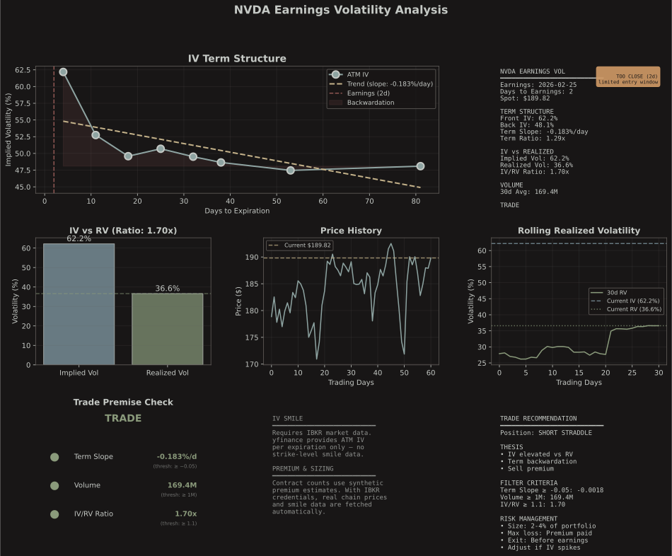
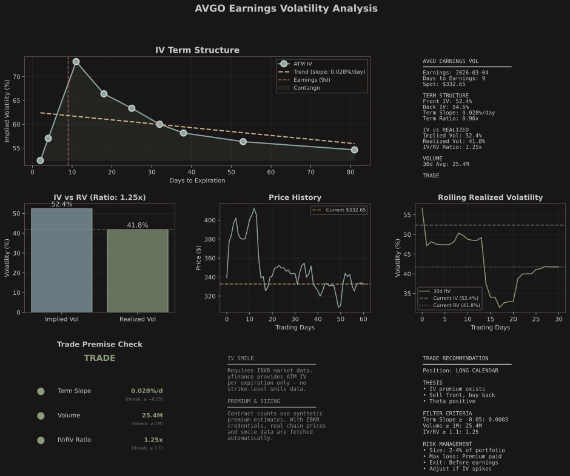

# Earnings Volatility Strategy

**Sell IV Crush**: Systematically profit from implied volatility overpricing around earnings events.





## Quick Links

- **[FORWARD_TESTING.md](./FORWARD_TESTING.md)** ← **START HERE** - Build verified historical data month-by-month
- **Live Scanner**: Run scanner on upcoming earnings (Phase 1)
- **Historical Backtest**: Verify strategy on accumulated data (Phase 2)

## Current Status

✅ **Phase 1 (Live Scanner)**: Complete
🔄 **Forward Testing**: Active - 1 scan logged, building database
⏳ **Phase 2 (Historical Backtest)**: Pending data collection

## Concept

This strategy exploits the **variance risk premium** around earnings by selling short-term volatility when:
1. **Term structure in backwardation** (front month IV > back month IV)
2. **Volume is high** (> 1M shares/day)
3. **IV elevated vs RV** (IV/RV ratio > 1.1)

## Edge Source

**Price-Insensitive Participants:**
- Institutions hedging long positions before earnings
- Retail speculators buying lottery ticket calls
- Funds with strict risk controls needing protection

These participants **overpay** for near-term options, creating our edge.

## Claimed Performance (NOT YET VERIFIED)

**Note**: The following stats are from external research (72,500 events). We have NOT independently verified these claims. See FORWARD_TESTING.md to build your own dataset.

**Long Calendar (Recommended):**
- Mean Return: **7.3%** per trade (claimed)
- Std Dev: 28%
- Win Rate: 66%
- Max Loss: 105%
- Full Kelly: 60%

**Short Straddle (Aggressive):**
- Mean Return: **9%** per trade (claimed)
- Std Dev: 48%
- Win Rate: 66%
- Max Loss: 130%
- Full Kelly: 6.5%

**To verify these claims, use the forward-testing system!**

## Filter Criteria

The model only trades when **ALL 3** conditions are met:

1. **Term Structure Slope** ≤ -0.05
   - Front month IV at least 5% higher than 45-day IV
   - Indicates backwardation (overpriced near-term vol)

2. **30-Day Avg Volume** ≥ 1,000,000 shares
   - More participants = more hedging demand
   - Higher liquidity = tighter spreads

3. **IV/RV Ratio** ≥ 1.1
   - Implied vol at least 10% higher than realized
   - Confirms historical overpricing pattern

**Filter Rate**: 88-90% of events filtered out → only trade best setups

## Trading Structures

### 1. Short Straddle (Aggressive)
- Sell ATM call + ATM put at front month expiration
- **Pros**: Higher potential returns
- **Cons**: Unlimited risk, high gamma exposure
- **Kelly**: 6.5% (use 30% fractional = 2% position size)

### 2. Long Calendar (Conservative) ✓ **Recommended**
- Sell front month ATM, buy back month ATM
- **Pros**: Capped risk, smoother equity curve
- **Cons**: Lower returns, higher commissions
- **Kelly**: 60% (use 10% fractional = 6% position size)

## Position Sizing

**Never trade full Kelly!** Use fractional Kelly:

- **Straddle**: 30% Kelly = ~2% of account per trade
- **Calendar**: 10% Kelly = ~6% of account per trade

Example with $10,000 account:
- Calendar @ 10% Kelly = $600 max debit
- Trade 1-2 contracts

## Daily Signal Pipeline

Three-stage automated pipeline: **collect** (after market close) → **scan** (after collection) → **notify** (before market open).

**What gets stored:**
- `data/snapshots/{TICKER}/{YYYY-MM-DD}.json` - Full snapshot archive per day
- `data/{TICKER}_earnings_vol.csv` - Append-only history of daily term structure metrics

#### Automated Cron Setup

All times below are UTC. Runs Tue-Sat to capture Mon-Fri market data.

**Native (uv installed on host):**

Cron runs with minimal PATH — add this line to the top of your crontab so `uv` is found:
```
PATH=/home/devusr/.local/bin:/usr/local/bin:/usr/bin:/bin
```

```bash
# 1. Collect earnings vol snapshots for all liquid tickers
15 6 * * 2-6 cd /path/to/atemoya && uv run pricing/earnings_vol/python/fetch/collect_snapshot.py --tickers all_liquid >> /tmp/earnings_vol_collect.log 2>&1

# 2. Run signal scanner after collection completes
30 7 * * 2-6 cd /path/to/atemoya && uv run pricing/earnings_vol/python/scan_signals.py --segments --quiet --output pricing/earnings_vol/output/signal_scan.csv >> /tmp/earnings_vol_scan.log 2>&1

# 3. Send morning trade notifications (before market open)
15 9 * * 1-5 cd /path/to/atemoya && uv run pricing/earnings_vol/python/notify_signals.py >> /tmp/earnings_vol_notify.log 2>&1
```

**Docker (from host crontab):**
```bash
15 6 * * 2-6 cd /path/to/atemoya && docker compose exec -w /app -T atemoya /bin/bash -c "uv run pricing/earnings_vol/python/fetch/collect_snapshot.py --tickers all_liquid" >> /tmp/earnings_vol_collect.log 2>&1
30 7 * * 2-6 cd /path/to/atemoya && docker compose exec -w /app -T atemoya /bin/bash -c "uv run pricing/earnings_vol/python/scan_signals.py --segments --quiet --output pricing/earnings_vol/output/signal_scan.csv" >> /tmp/earnings_vol_scan.log 2>&1
15 9 * * 1-5 cd /path/to/atemoya && docker compose exec -w /app -T atemoya /bin/bash -c "uv run pricing/earnings_vol/python/notify_signals.py" >> /tmp/earnings_vol_notify.log 2>&1
```

Notifications require `NTFY_TOPIC` set in `.env` at the project root.

#### Manual / Ad-hoc Usage

```bash
# Collect a single ticker
uv run pricing/earnings_vol/python/fetch/collect_snapshot.py --ticker AAPL

# Collect with wider entry window (default 18 days)
uv run pricing/earnings_vol/python/fetch/collect_snapshot.py --tickers all_liquid --entry-window 30

# Run scanner with z-score window (last ~4 earnings cycles)
uv run pricing/earnings_vol/python/scan_signals.py --segments --window 72

# Dry-run notification
uv run pricing/earnings_vol/python/notify_signals.py --dry-run
```

## Live Scanner Workflow (OCaml)

For the original single-ticker OCaml scanner:

**Docker:**
```bash
# 1. Fetch earnings data
docker compose exec -w /app atemoya /bin/bash -c "uv run pricing/earnings_vol/python/fetch/fetch_earnings.py --ticker AAPL"

# 2. Fetch IV term structure
docker compose exec -w /app atemoya /bin/bash -c "uv run pricing/earnings_vol/python/fetch/fetch_iv_term.py --ticker AAPL"

# 3. Run scanner
docker compose exec -w /app atemoya /bin/bash -c "eval \$(opam env) && dune exec earnings_vol -- \
  -ticker AAPL -account 10000 -kelly 0.10 -structure calendar"

# 4. Log to database (see FORWARD_TESTING.md)
docker compose exec -w /app atemoya /bin/bash -c "uv run pricing/earnings_vol/python/tracking/trade_logger.py ..."

# 5. After earnings, update results
docker compose exec -w /app atemoya /bin/bash -c "uv run pricing/earnings_vol/python/tracking/update_results.py --ticker AAPL ..."
```

**Native:**
```bash
# 1. Fetch earnings data
uv run pricing/earnings_vol/python/fetch/fetch_earnings.py --ticker AAPL

# 2. Fetch IV term structure
uv run pricing/earnings_vol/python/fetch/fetch_iv_term.py --ticker AAPL

# 3. Run scanner
eval $(opam env) && dune exec earnings_vol -- \
  -ticker AAPL -account 10000 -kelly 0.10 -structure calendar

# 4. Log to database (see FORWARD_TESTING.md)
uv run pricing/earnings_vol/python/tracking/trade_logger.py ...

# 5. After earnings, update results
uv run pricing/earnings_vol/python/tracking/update_results.py --ticker AAPL ...
```

Or use quickstart:
```bash
./quickstart.sh
# → Run → Pricing Models → 11) Earnings Volatility
```

## Recommendations

Scanner outputs:
- **Recommended** (GREEN): All 3 criteria met → TRADE
- **Consider** (YELLOW): Slope + 1 other → Maybe trade
- **Avoid** (RED): No slope or <2 criteria → SKIP

## Risk Management

1. **Only trade "Recommended" setups**
2. **Use fractional Kelly** (10-30%)
3. **Calendar structure preferred** for most traders
4. **Close 15min into session post-earnings** (IV crush happens immediately)
5. **Never hold through intraday** (post-earnings drift works against short vol)

## Forward Testing (Building Real Data)

Instead of trying to backtest historical data (yfinance has bugs), we're **building a verified dataset going forward**.

**See [FORWARD_TESTING.md](./FORWARD_TESTING.md) for complete workflow.**

**Quick summary:**
1. Scan tickers before earnings → log to database
2. After earnings → update with actual P&L
3. After 6-12 months → have 50-200 real trades
4. **Then** we can verify if the claimed 66% win rate / 7.3% returns are real

**Current Progress**: 1 scan logged (NVDA)

## Files

- `ocaml/` - Filter engine, term structure analyzer, Kelly sizer
- `python/fetch/collect_snapshot.py` - Daily cron collector (term structure + volume + RV)
- `python/fetch/fetch_earnings.py` - Single-ticker earnings calendar fetcher
- `python/fetch/fetch_iv_term.py` - Single-ticker IV term structure fetcher
- `python/scan_signals.py` - 3-gate signal scanner with z-score history
- `python/notify_signals.py` - ntfy.sh notification sender
- `python/tracking/` - Forward-testing database and updaters
- `data/{TICKER}_earnings_vol.csv` - Append-only daily snapshot history
- `data/snapshots/{TICKER}/{YYYY-MM-DD}.json` - Full daily snapshot archive
- `FORWARD_TESTING.md` - Complete documentation for data collection

## Classic Example

**NVDA** earnings on Feb 25, 2026 (scanned Jan 6):
- Term slope: +0.0397 ✗ (contango, not backwardation)
- Volume: 163M ✓
- IV/RV: 1.20 ✓
- **Result**: AVOID (failed term slope filter)

This is logged in the database. After Feb 25, we'll update with actual results to see if our filter was correct.

## Important Notes

- **IV Crush** happens within 15 minutes of market open post-earnings
- **Don't hold to close** - post-earnings drift degrades edge
- **Straddles are riskier** - one bad outlier can wipe out months of gains
- **Filter aggressively** - 88% rejection rate is GOOD, not bad
- **Position sizing is everything** - full Kelly will eventually bankrupt you
- **Build your own data** - Don't trust external claims, verify yourself

## Next Steps

1. ✅ Live scanner operational
2. ✅ Forward-testing system created
3. → Scan 5-10 more tickers this week
4. → Build dataset over 6-12 months
5. → Run verified backtest on YOUR data
