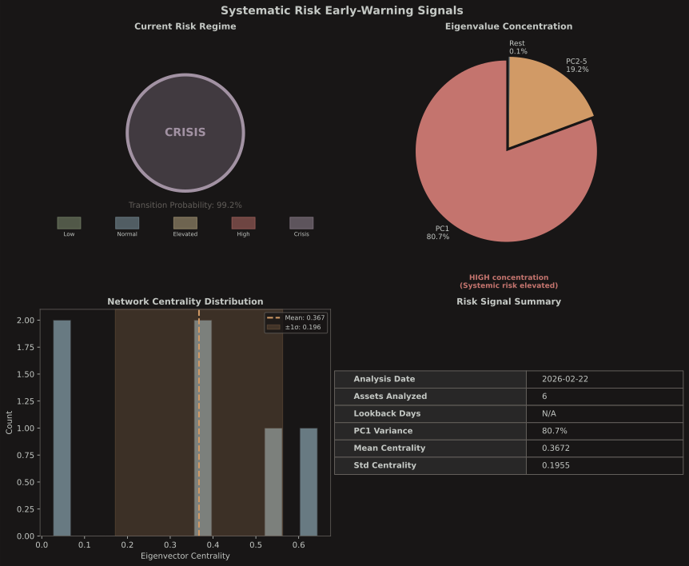

# Systematic Risk Early-Warning Signals

Early-warning framework for detecting systematic risk via **eigenvalue decomposition** of the covariance matrix and **graph theory** (minimum spanning tree centrality).

## What It Does

This model:
1. **Decomposes the return covariance matrix** via power iteration to extract eigenvalues
2. **Measures eigenvalue concentration** -- how much variance a single factor explains
3. **Builds a minimum spanning tree** from the correlation-distance matrix (Kruskal's algorithm)
4. **Computes eigenvector centrality** on the MST to detect network concentration
5. **Classifies the current risk regime** (Low Risk through Crisis) via composite scoring
6. **Estimates transition probability** to higher-risk states via logistic combination

### Why These Signals?

- **Eigenvalue concentration**: When one factor drives everything, diversification breaks down
- **MST centrality**: Hub-and-spoke networks propagate shocks faster than distributed ones
- **Regime scoring**: Composite of four independent signals avoids single-indicator false alarms
- **Leading indicators**: Correlation structure shifts before realized drawdowns materialize

## Core Concepts

### Covariance Matrix and Eigenvalue Decomposition

Given $N$ assets with return series $\{r_{i,t}\}$, the sample covariance matrix is:

```
Σ_ij = (1/(T-1)) · Σ_t (r_i,t - μ_i)(r_j,t - μ_j)
```

Eigenvalues $\lambda_1 \geq \lambda_2 \geq \cdots \geq \lambda_N$ are extracted via power iteration with Hotelling deflation:

1. **Power iteration**: Repeatedly multiply $\mathbf{v} \leftarrow \Sigma \mathbf{v}$ and normalize until convergence to find $(\lambda_k, \mathbf{v}_k)$
2. **Deflation**: Remove the found component: $\Sigma \leftarrow \Sigma - \lambda_k \mathbf{v}_k \mathbf{v}_k^\top$
3. Repeat for $k = 1, \ldots, \min(N, 6)$

### Signal 1: Variance Explained by First Eigenvalue

```
VEF = λ₁ / Σⱼ λⱼ
```

Measures correlation compression -- one factor driving everything. During crises, VEF spikes as assets move in lockstep.

### Signal 2: Variance Explained by Eigenvalues 2--5

```
VE₂₋₅ = (λ₂ + λ₃ + λ₄ + λ₅) / Σⱼ λⱼ
```

When secondary factors also concentrate, multiple systemic risk channels are active simultaneously.

### Correlation to Distance

The correlation matrix is converted to a distance metric:

```
d_ij = √(1 - ρ_ij²)
```

Where $\rho_{ij}$ is the Pearson correlation. This satisfies metric properties: highly correlated assets have small distance.

### Minimum Spanning Tree (MST)

Kruskal's algorithm builds the MST from the distance matrix:

1. Sort all $\binom{N}{2}$ edges by weight
2. Greedily add the lightest edge that doesn't form a cycle (Union-Find for cycle detection)
3. Stop after $N-1$ edges

The MST captures the backbone of the correlation network.

### Signal 3: Mean Eigenvector Centrality

Eigenvector centrality is computed on the MST adjacency matrix $A$ (with inverse-distance weights $a_{ij} = 1/d_{ij}$) via power iteration:

```
c_i = (1/λ) · Σⱼ a_ij · c_j
```

Where $\lambda$ is the largest eigenvalue of $A$. High mean centrality indicates a tightly connected network -- contagion pathways are dense.

### Signal 4: Std of Eigenvector Centrality

```
σ_c = √((1/(N-1)) · Σᵢ (cᵢ - c̄)²)
```

High dispersion means a few hub nodes dominate the network (too-connected-to-fail topology).

### Regime Classification

Each signal is scored 0--4 based on thresholds:

| Score | VEF | VE₂₋₅ | Mean Centrality | Std Centrality |
|-------|-----|--------|-----------------|----------------|
| 4 | > 0.60 | > 0.25 | > 0.25 | > 0.15 |
| 3 | > 0.50 | > 0.20 | > 0.20 | > 0.10 |
| 2 | > 0.40 | > 0.15 | > 0.15 | > 0.07 |
| 1 | > 0.30 | > 0.10 | > 0.10 | > 0.04 |
| 0 | ≤ 0.30 | ≤ 0.10 | ≤ 0.10 | ≤ 0.04 |

Total score (0--16) maps to regime:

| Score | Regime |
|-------|--------|
| 12--16 | Crisis |
| 9--11 | High Risk |
| 6--8 | Elevated |
| 3--5 | Normal |
| 0--2 | Low Risk |

### Transition Probability

Signals are normalized to [0, 1] and combined via a logistic function:

```
z = -2.0 + 2.0·x₁ + 1.5·x₂ + 2.5·x₃ + 1.5·x₄

P(transition) = 1 / (1 + e^(-z))
```

Where:
- x₁ = min(1, VEF / 0.7)
- x₂ = min(1, VE₂₋₅ / 0.35)
- x₃ = min(1, mean_centrality / 0.3)
- x₄ = min(1, std_centrality / 0.2)

Higher weights on VEF and mean centrality reflect their stronger predictive power.

## Quick Start

### 1. Fetch Returns Data

```bash
uv run pricing/systematic_risk_signals/python/fetch/fetch_returns.py \
  --tickers SPY,QQQ,IWM,EFA,VWO,AGG,TLT,HYG,GLD,DBC,VNQ,UUP \
  --lookback 504
```

Default tickers span asset classes:

| Ticker | Asset Class |
|--------|------------|
| SPY | US large cap equity |
| QQQ | US tech equity |
| IWM | US small cap equity |
| EFA | Developed international |
| VWO | Emerging markets |
| AGG | US aggregate bonds |
| TLT | Long-term treasuries |
| HYG | High yield bonds |
| GLD | Gold |
| DBC | Commodities |
| VNQ | REITs |
| UUP | US dollar index |

### 2. Run Analysis

```bash
dune exec systematic_risk_signals -- \
  --data pricing/systematic_risk_signals/data/returns.json \
  --json \
  --output pricing/systematic_risk_signals/output
```

**Output**: `pricing/systematic_risk_signals/output/risk_signals.json`

### 3. Visualize

```bash
uv run pricing/systematic_risk_signals/python/viz/plot_risk_signals.py \
  --input pricing/systematic_risk_signals/output/risk_signals.json
```

**Output**: `pricing/systematic_risk_signals/output/plots/risk_signals_dashboard.{png,svg}`

## Understanding Results

### What Drives Each Signal

| Signal | High reading means | Typical driver |
|--------|-------------------|----------------|
| VEF > 0.50 | One factor dominates returns | Risk-on/risk-off regime, flight to quality |
| VE₂₋₅ > 0.20 | Secondary factors also concentrated | Multiple stress channels (rates + credit + equity) |
| Mean centrality > 0.20 | Dense network connectivity | Cross-asset contagion, correlation breakdown |
| Std centrality > 0.10 | Hub nodes dominate | Single asset class driving everything |

### When to Trust the Model

- **Strong signal**: All 4 indicators elevated simultaneously
- **Weak signal**: Only 1--2 indicators elevated (may be sector-specific, not systemic)
- **Asset selection matters**: Include uncorrelated asset classes (bonds, commodities, FX) for meaningful readings
- **Lookback sensitivity**: Shorter lookbacks (60 days) react faster but produce noisier signals

## Configuration

| Parameter | Default | Effect |
|-----------|---------|--------|
| `--tickers` | SPY,QQQ,IWM,EFA,VWO,AGG,TLT,HYG,GLD,DBC,VNQ,UUP | Asset universe |
| `--lookback` | 504 | Trading days of return history |
| `--window` | 60 | Rolling window for signal series |

## Dashboard



---

**Model Type**: Systematic Risk Monitoring
**Signals**: Eigenvalue concentration + MST centrality
**Implementation**: OCaml (analysis) + Python (data/viz)
